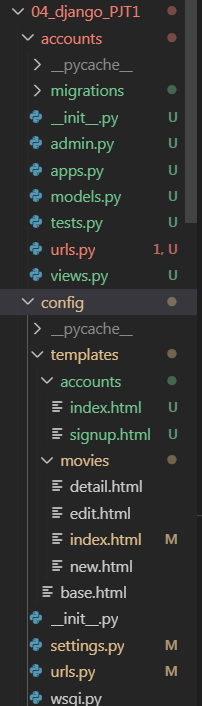

# movies 에 accounts 추가하기

- accounts 앱 생성




## 회원가입


- 회원가입 만들기

  ```python
  # accounts>view.py
  
  from django.shortcuts import render, redirect
  from django.contrib.auth.forms import UserCreationForm
  
  
  def index(request):
  
      return render(request, 'accounts/index.html')
  def signup(request):
      if request.method =='POST':
          form = UserCreationForm(request.POST)
          if form.is_valid():
              form.save()
              # auth_login(request,user)
              return redirect('movies:index')
      else:
          form = UserCreationForm
      
      context ={'form':form,}
      return render(request, 'accounts/signup.html', context)
  
  ```

  ```python
  #accounts>urls.py
  
  from django.urls import path
  from . import views
  
  app_name = 'accounts'
  
  urlpatterns = [
      path('index/', views.index, name='index'),
      path('signup/', views.signup, name='signup'),
  
  ]
  ```

  ```javascript
  #accounts>sign.up
  
  
  
  
  <form action="" method="POST">
  
  
  
  
  </form>
  
  
  
  ```

  

## 로그인

- 로그인만들기

  ```python
  view.py
  
  1. 기본로그인 폼 띄우기
  from django.contrib.auth import login as auth_login
  from django.contrib.auth.forms import UserCreationForm, AuthenticationForm
  
  def login(request):
      # form = AuthenticationForm(request, request.POST)
      # auth_login(request, form.get_user())
      form  = AuthenticationForm()
      context =  {'form':form,}
      return render(request, 'accounts/login.html', context)
  
  
  2. 로그인 함수 GET/POST 일때 다르게 처리
  
  ```

  

- load bootstrap4

- ```html
  base.html
  
  
  <!DOCTYPE html>
  <html lang="en">
  <head>
    <meta charset="UTF-8">
    <meta name="viewport" content="width={device-width}, initial-scale=1.0">
    <meta http-equiv="X-UA-Compatible" content="ie=edge">
    <title>장고 CRUD</title>
    
  
    
  
  </head>
  <body>
      <div class="container">
       <!--회원일 경우 -->
      
      어서오세요, {{user.username}}</h2>      
      
       <!-- 비회원일 경우 -->
      
      <h3>로그인 하셔야 서비스 이용이 가능합니다.</h3>
      <a href ="">회원가입</a>
      <a href ="">로그인</a>
      
      <hr>
      
      
    </div>
  
    
  
  </body>
  </html>
  ```

- 