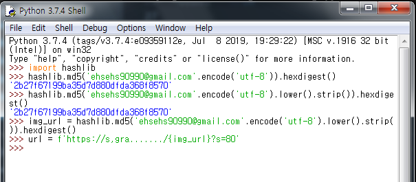
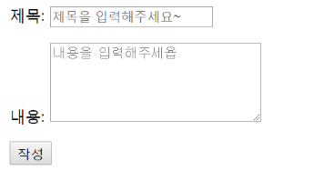

## Authentication(인증)

###### 장고에서 이미 Auth 관련 기능을 만들어 두었고, 우리는 자연스럽게 사용하고 있었다. `createsuperuser`를 통해 관리자 계정도 만들었고, 어드민 페이지에서 로그인 기능도 사용하고 있었다.

- Authentication(인증) -> 신원확인
- 자신이 누구라고 주장하는 신원을 확인하는 것

- 세션(Session)
  - 클라이언트가 서버에 접속하면, 서버가 특정한 session_id를 발급한다. 클라이언트는 session_id를 쿠키를 사용해 저장한다
  - 클라이언트가 서버측 여러 페이지에 이동할 때마다, 해당 쿠키(session_id)를 이용해서 서버에 sesssion_id 를 전달한다
  - 따라서 서버는 페이지가 바뀌더라도 같은 사용자임을 인지할 수 있다
- 쿠키 vs 세션
  - 쿠키 : 클라이언트 로컬에 파일로 저장
  - 세션 : 서버에 저장( session id 는 쿠키 형태로 클라이언트 로컬에 저장됨)


### 1. Accounts

- 기존 앱에서 구현해도 되지만, 장고에서 일반적으로 기능 단위로 애플리케이션을 나누는 것이 일반적이므로 accounts라는 새로운 앱을 만들어보자.

- accounts 앱 생성

  ```shell
  $ python manage.py startapp accounts
  ```

- `settings.py` 앱등록(출생신고)

- URL 분리

  ```python
  #config/urls.py
  urlpatterns = [
      path('accounts/', include('accounts.urls')),
  ]
  
  
  
  #accounts/urls.py
  from django.urls import path
  from . import views
  
  app_name = 'accounts'
  
  urlpatterns = [
      path('index/', views.index ,name ='index'), 
  ]
  ```

  

### 2. SignUp

- 회원가입 로직은 CRUD 중에 'CREATE' 에 가깝다
- `class User` 는 이미 장고가 만들어 두었고, User클래스와 연동되는 ModelForm 인 `UserCreationForm`도 이미 장고가 준비해 두었다

- django 가 가지고 있는 회원가입 Form 을 가져온다

  ```python
  from django.contrib.auth.forms import UserCreationForm
  ```

- `view.py`
  
  - `form = UserCreationForm(request.POST)` :django에서 제공하는 회원가입 Form 을 가져온다
  
- `form.is_valid()`를 통해 유효성 검사를 수행한다
  
    
  
 ```python
from django.shortcuts import render, redirect
  from django.contrib.auth.forms import UserCreationForm
  # Create your views here.
  
  
  # Auth CRUD : CREATE
  def signup(request):
      #사용자를 만드는 로직
      if request.method == 'POST':
          form = UserCreationForm(request.POST)
          if form.is_valid():
              form.save()
              #회원가입 후 바로 로그인 되어 메인페이지로 이동
              auth_login(request,user)
              return redirect('articles:index')
          
      #회원가입 Form을 던지는 로직
      else:
          form = UserCreationForm    
      context = {'form':form,}
      return render(request, 'accounts/signup.html', context)
  
 ```

- `urls.py`

  ```python
  urlpatterns = [    
      path('signup/', views.signup, name='signup'),    
  ]
  ```

  

- `signup.html`

  ```javascript
  
  
  
  
  <h1> 회원가입 </h1>
  
  
  <form action ="" method="POST">
  
  
  
  
  </form>
  
  ```

  - `{{form.as_p}}` 의 bootstrap 적용 

    ```javascript
    
    ```

  - `input type="submit" value="가입"` 의 bootstrap 적용

    ```javascript
    
    ```

    

### 3. Login

- 장고에서 로그인하는것은 session을 create하는 것과 같다.	
  
- (장고는 session에 대한 매커니즘을 생각하지 않아도 쉽게 사용할 수 있다)
  	- session 사용자가 로그인을 하면, 사용자가 로그아웃을 하거나 정해진 일정한 시간이 지나기 전까지는 계속 유지됨	
- User를 인증하는 ModelForm : `AuthenticationForm` 
  
- `AuthenticationForm(request, request.POST)`
  
- 로그인 하기

  - django에 내장된 login view 함수를 사용하기 위해 import 한다
  
    ```python
    from django.contrib.auth import login as auth_login
    ```
    
    
  
- 로그인 form 가져오기

  ```python
  from django.contrib.auth.forms import UserCreationForm, AuthenticationForm
  ```
  
- `view.py`

  - `form = AuthenticationForm(request, request.POST)`

    - django 에서 제공하는 로그인 Form 을 가져온다
    - POST 방식으로 제공되는 사용자 정보를 가져오기 위해 Form의 인자로 `request`와 `request.POST`를 제공한다
    
  - `form.is_valid()`를 통해 유효성 검사를 수행한다

  - `auth_login(request, form.get_user())`

    - 인증과정 마무리 단계를 담당
      - 로그인 양식을 토대로 이용자 정보를 가져와서 HTTP Request(request) 정보와 함께 사용해 서버세션 정보를 만든다. 세션 정보를 만들지 않으면 로그인 정보는 유지되지 않아서 다른 페이지에 방문할 때마다 매번 로그인을 해야한다
      - 장고의 미들웨어중에 `django.contrib.sessions.middleware.SessionMiddleware`와 `django.contrib.auth.middleware.AuthenticationMiddleware`는 사용자 인증에 관한 처리를 담당한다. `sessionMiddleware`는 로그인 함수(auth_login) 를통해 생성된 세션을 관리한다
      - 확인된 사용자는 `request.user` 객체에  해당 사용자의 모델 인스턴스를 저장한다.

    - `form.get_user()` : 인증에 성공한 사용자를 반환할 때 사용한다

  ```python
  from django.contrib.auth import login as auth_login
  from django.contrib.auth.forms import UserCreationForm, AuthenticationForm
  
  def login(request):
      #request에 user가 돌아다닌다
      #이미 로그인되어있는 친구가 get으로 로그인 들어오려고 하면 index로 redirect시켜버리자
      if request.user.is_authenticated:
          return redirect('articles:index')
  
      if request.method =='POST':
          # 세션 관련된 정보를 받기 위해 request를 받는다
          form = AuthenticationForm(request, request.POST)
          if form.is_valid(): #?
              auth_login(request, form.get_user())
              return redirect('articles:index')
      else:
          form = AuthenticationForm()
      context ={'form':form}
      return render(request, 'accounts/login.html', context)
  ```

  

- login.html

  ```javascript
  
  
  
  
  
  <h1>로그인</h1>
  <hr>
  <form action="" method="POST">
    
    
    
    
  </form>
  
  
  ```

### 로그인 심화

###### 로그인 이후, 로그인 로직과 회원가입 로직에 접근 불가능하도록 막아보자

- 로그인 한 사용자가 URL을 통해 로그인 혹은 회원가입 로직에 접근한다면, 다시 index 페이지로 이동시키자

- `request.user.is_authenticated`

  - 사용자인지 여부를 판단 -> Boolean 값 반환

    - True : 로그인한 사용자

    - False : 로그인하지 않은 사용자

      ```python
      if request.user.is_authenticated:
          return redirect('article:index')
      ```

- 
  views.py

  ```python
  def signup(request):
      
      if request.user.is_authenticated:
          return redirect('articles:index')
  
      # 사용자를 만드는 로직
      if request.method == "POST":
          form = UserCreationForm(request.POST)
          if form.is_valid():
              user = form.save()
              # 회원가입 후 바로 로그인 되어 메인페이지로 이동
              auth_login(request, user)
              return redirect('articles:index')
  
      # 회원가입 Form을 던지는 로직
      else:
          form = UserCreationForm
      
      context = {
          'form' : form,
      }
  
      return render(request, 'acounts/signup.html', context)
  
  def login(request):
  
      if request.user.is_authenticated:
          return redirect('articles:index')
  
      if request.method == "POST":
          form = AuthenticationForm(request, request.POST)
          if form.is_valid():
              auth_login(request, form.get_user())
              return redirect('articles:index')
      else : 
          form = AuthenticationForm()
  
      context = {
          'form' : form,
      } 
  
      return render(request, 'acounts/login.html', context)
  ```


### 4. Logout

###### 로그아웃 버튼을 생성하여 로그아웃 기능을 구현해보자!

- base.html

  - `user.is_authenticated`  : 로그인한 사용자 인지 판단

    - 로그인한 사용자 -> 로그아웃 버튼

      로그인하지 않은 사용자 -> 회원가입 / 로그인 버튼

      ```javascript
      
      <h2>어서오세요, {{user.username}}</h2>
      <a href="">로그아웃</a>    
      
      
      <h3>로그인 하셔야 서비스 이용이 가능합니다.</h3>
      <a href="">회원가입</a>    
      <a href="">로그인</a>    
      
      ```

  - User 모델 Class

    - username : 사용자의 ID

      ```javascript
      <h2>어서오세요, {{user.username}}</h2>
      ```

    - password : 비밀번호

      ```javascript
      
      <!DOCTYPE html>
      <html lang="en">
      <head>
        <meta charset="UTF-8">
        <meta name="viewport" content="width=device-width, initial-scale=1.0">
        <meta http-equiv="X-UA-Compatible" content="ie=edge">
        <title>Article</title>
        
      </head>
      <body>
        <div class="container">
          
            <h2>어서오세요, {{user.username}}</h2>
            <a href="">로그아웃</a>    
      
          
            <h3>로그인 하셔야 서비스 이용이 가능합니다.</h3>
            <a href="">회원가입</a>    
            <a href="">로그인</a>    
          
          <hr>
          
          
        </div>
        
      </body>
      </html>
      ```

- views.py

  ```python
  def logout(request):
      # 이 서버를 보고 있는 사용자의 정보가 자동으로 들어가서 로그아웃을 수행한다.
      auth_logout(request)
      return redirect('articles:index')
  ```

- `auth_logout(request)`

  -  현재 유지하고 있는 session을 DELETE하는 로직

    

#### `login_required` 데코레이터

- 로그인 하지 않은 사용자의 경우` settings.LOGIN_URL `에 설정된 절대 경로로 리다이렉트 된다.
  - LOGIN_URL의 기본 경로는  `accounts/login`이다
  - 우리가 앱 이름을 accounts라고 했던 이유들 중 하나
- login_required를 사용했을 경우, 주소창에 특이한 쿼리스트링이 붙는다.
  - **"`next`" 쿼리스트링 파라미터**
    - @login_required는 기본적으로 성공한 뒤에 사용자를 어디로 보낼(리다이렉트)에 대한 경로를 next라는 파라미터에 저장한다.
    - 사용자가 접근했던 페이지가 반드시 로그인이 필요한 페이지였기 떄문에 , 일단 로그인 페이지로 강제로 보낸 다음에 로그인을 끝내고 나면 **원래 요청했던 주소로 보내주기 위해 경로를 keep**해둔다.
    - 우리가 따로 설정해주지 않으면, view에 설정해둔 redirect 경로로 이동한다. next에 담긴 경로로 이동시키기 위해 코드를 바꾸어야 한다.

   ```python
def login(request):
    #request에 user가 돌아다닌다
    #이미 로그인되어있는 친구가 get으로 로그인 들어오려고 하면 index로 redirect시켜버리자
    if request.user.is_authenticated:
        return redirect('articles:index')

    if request.method =='POST':
        # 세션 관련된 정보를 받기 위해 request를 받는다
        form = AuthenticationForm(request, request.POST)
        if form.is_valid():
            auth_login(request, form.get_user())
            # return redirect('articles:index')
            # next에 파라미터 내용이 있으면 담겨있는 이 경로로 보내든					지 아니면 index로 보내
            return redirect(request.GET.get('next') or 'articles:index')
    else:
        form = AuthenticationForm()
    context ={'form':form}
    return render(request, 'accounts/login.html', context)
   ```


### 5. SignOut(회원탈퇴)

- CRUD 로직에서 User테이블에서 User레코드 하나를 삭제시키는 DELETE로직과 흡사하다.
- 로그인 된 상태에서만 회원 탈퇴 링크를 만들어서 접근할 수 있도록 한다


- 이미 로그인이 되어있기 때문에 request에 이미 로그인하고 있는 사람의 session, user정보가 들어가 있다.

   - `delete()` 만 해주면 끝
     	- 지금 접속하고 있는 user 삭제

  ```python
  @require_POST
  def delete(request):
      request.user.delete()
      return redirect('articles:index')
  ```

  

### 6. 회원정보 수정

- Django에서 제공하는 회원 정보 수정 폼 (UserChangeForm)을 가져다 사용한다.

```python
from django.contrib.auth.forms import UserCreationForm, AuthenticationForm, UserChangeForm
```

- 회원정보 폼에는 user 의 정보가 들어가 있어야 한다

  - instance로 request.user를 통해 사용자의 정보를 가져온다

  ```python
  # 회원정보 수정
  
  def update(request):
      if request.method =="POST":
          pass
      else:
          #회원정보 폼에는 user의 정보가 들어가 있어야 한다.
          #instance로 request.user를 통해 사용자의 정보를 가져온다.
          form = UserChangeForm(instance=request.user)
     context ={
         'form' : form
     }
  	return render(request, 'accounts/update.html', context)
  ```

문제발생

- 너무 많은 수정권한을 사용자에게 부여하게 된다


#### [ 회원정보수정 Form Customizing ]

###### 회원정보수정 Form 을 커스터마이징하여 사용자가 제한적으로 회원 정보를 수정하도록 한다

- django 깃허브 들어가서 사용자로 하여금 수정이 가능하도록 할 회원정보에 대한 field를 설정할 수 있다.

- django_form> accounts > forms.py

```python
from django import forms
from django.contrib.auth import get_user_model
from django.contrib.auth.forms import UserChangeForm, UserCreationForm

class CustomUserChangeForm(UserChangeForm):

    class Meta:
        # User 클래스를 바로 사용하는 것이 아니라, 
        # get_user_model() 을 사용해서  User 클래스를 참조한다
        model = get_user_model()

        # UserChangeForm -> User 클래스 -> AbstractUser 클래스
        # Django 공식문서 : user-model
        fields = ('email','last_name', 'first_name',)


class CustomUserCreationForm(UserCreationForm):

    class Meta:
        model = get_user_model()
        fields = ('username','password1','password2','email',)
```

- 새롭게 커스텀한 폼을 사용한다

```python
from .forms import CustomUserChangeForm
```

UserChangeForm import 한 것 제거

비회원은 수정페이지에 들어가지 못하게 막아준다 `@login_required`


### 7. 비밀번호 변경

```python
from django.contrib.auth.forms import UserCreationForm, AuthenticationForm, UserChangeForm
```


```python
#비밀번호 수정
def change_password(request):
    if request.method =='POST':
        form = PasswordChangeForm(request.user, request.POST)
        if form.is_valid():
            form.save()
            return redirect('articles:index')
    else:
        form = PasswordChangeForm(request.user)
    context = {'form':form}
    return render(request, 'accounts/change_password.html',context)
```


- 문제점 [ 자동으로 로그아웃 되어버린다? ]
  - 비밀번호 변경은 잘 되는데, 변경이 끝나면 로그인이 풀려버린다
  - 자동으로 로그아웃이 돼버린 이유는 비밀번호가 변경되면서 기존 세션과의 회원 인증 정보가 일치하지 않게 되었기 때문이다.

##### 자동 로그아웃 해제 update_session_auth_hash

###### 비밀번호 변경은 성공적으로 반영이 되지만, 변경이 끝나면 로그인이 풀려 자동으로 로그아웃됨

- 비밀번호가 변경되면서 기존 Session과 회원 인증정보가 불일치하기때문
- `update_session_auth_hash(request, user)` 로 **해결**

```python
from django.contrib.auth import update_session_auth_hash
```

- 비밀번호를 수정한 뒤, 수정한 값을 바로 session에 update하기 때문에 로그인이 풀리지 않는다.
- 

### 8. Auth Form 합치기

- templates > accounts > auth_form.html
  - 코드 재사용성을 높여보자
-  account_form.html

```python






  <h1>회원가입</h1>

  <h1>로그인</h1>

  <h1>회원정보수정</h1> 

  <h1>비밀번호　변경</h1>

  <h1> 회원가입 </h1>

<form action="" method="POST">
  
  
  
  
   <input type="submit" value="가입"  
</form> 

```

- 나머지 내용 같은 html 삭제


### 9. Gravatar - 프로필 이미지 만들기

- 이메일을 활용해서 프로필 사진을 만들어주는 서비스

- 한번 등록하면, 이를 지원하는 사이트에서는 모두 해당 프로필 이미지를 사용할 수 있다.

- 이메일 체크

  - `https://ko.gravatar.com/site/check/`

  - 이메일 주소를 해시(MD5) 로 바꾸고 URL으로 접속하면 이미지가 뜬다

    (`?s=80`으로 사이즈 조절 가능 )

- **Python으로 Hash 만들기**

   - md5 hash 생성 
     - `import hashlib`

  - 혹시 모를 공백, 대문자 등을 방지하기 위한 파이썬 문법들
    - `.strip()`, `lower()`

- Python Shell



