# 1. Hashtag

## 1. Hashtag

### 1.1 Model

```python
class hashtag(models.Model):
	content = models.TextField(unique=True)
class Article(models.Model):
	....
	#해시태그 안쓴사람도 유효성 통과할 수 있도록
	hashtags = models.ManyToManyField(Hashtag, blank=True)
```

- `unique=True`
  
  - True인 경우, 필드는 테이블을 전체에서 고유한 값이여야 한다
  - 유효성 검사 단계에서 실행되며, 중복값이 있는 모델을 저장하려고하면 `.save()` 메서드로 인해서 에러가 발생한다
  
- model 작성 후 migrate

- ```shell
  $ python manage.py makemigrations
  $ python manage.py migrate
  ```

- admin page에 보일 수 있도록 `admin.py`에 등록

- ```python
  from django.contrib import admin
  from .models import Hashtag
```
  
  - sqlite3 로 테이블 생성 확인
  
  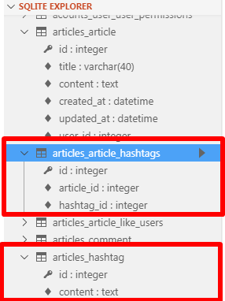

### 1.2 CREATE

> 사용자가 작성한 (title/content)에서 `#`로 시작하는 단어(해시태그)만 뽑아서 해시태그로 저장한다. 리스트 반복문을 돌려 앞자리가 '#'으로 시작하는 단어를 해시태그 테이블에 등록한다. 동시에 해당 해시태그 목록에 추가한다

````python
title : 출근
content str 타입

1. 사용자가 업로드한 content
"오늘 수능날 난 출근 #행복 하다 옛날생각나네..또..#감성 #추억 #뿌듯 #수능왕 .split(' ')

2. .split() 메소드로 리스트 형식으로 변환
['오늘' '수능날' '난' '출근' '#행복' '하다' '옛날생각나네'....'#감성','#추억','#뿌듯','#수능왕']

3.리스트 반복문 돌리기 : 앞자리가 '#'으로 시작하는 단어를 해시태그 테이블에 등록
    = 같은 해시태그가 오면 unique= True 옵션으로 인해 에러발생. 이를 방지하기 위해 get_or_create() 사용

4. 동시에 해당 게시글 해시태그 목록에 추가해줌
->article.hashtags.add(word)

````

- `unique =True` 이기때문에 같은 해시태그가 들어오면 에러발생

- `get_or_create()`
  - word와 같은 해시태그를 찾고 있으면 기존 객체 반환, 없으면 새로운 객체 생성
  - `hashtag, created = Hashtag.objects.get_or_create(content=word)`
    - 새로운 객체 생성되면 created = True
    - 기존 객체 반환 되면 created = False

- `views.py`

  - create 로직 수정

    - `article.content.split()`: 게시글 내용을 잘라 리스트로 만든다

    - `word.startwith('#')` : word 가 '#'로 시작하는지 확인한다

      - `#` 로 시작하면 해시태그 등록
      - 만약 기존에 있던 해시태그면 기존객체를 'hashtag'로 반환
      - 새로운 해시태그면 새로운 객체를 생성해 해당 게시글의 해시태그 목록에 추가한다

      ```python
      @login_required
      def create(request):
          if request.method=="POST":
              form = ArticleForm(request.POST)
              
              # 유효성 검증
              if form.is_valid():
                  article = form.save(commit=False)
                  article.user = request.user
                  article.save()
      
                  # hashtag
                  for word in article.content.split():
                      if word.startswith('#'):
                          hashtag, created = Hashtag.objects.get_or_create(content=word)
                          article.hashtags.add(hashtag)
      
                  return redirect('articles:detail', article.pk)
          
          else :
              form = ArticleForm()
          context = {
              'form' : form
          }
          return render(request, 'articles/form.html', context)
      ```

  

### 1.3 UPDATE 

  - update로직 수정

    > 사용자가 게시글 수정을 통해 해시태그를 변경할 수 있다. 따라서 update  후 기존의 해시태그와 비교해 삭제 및 추가 하는 로직보다 update 시 해시태그를 다시 등록하는 로직이 더 간단하므로 후자의 방법으로 구현한다.

    - `article.hashtag.clear()` : 해당 게식들의 해시태그 목록을 비운다.

    ```python
    @login_required
    def update(request, article_pk):
        article = get_object_or_404(Article, pk=article_pk)
        if request.user == article.user:
    
            if request.method == 'POST':
                form = ArticleForm(request.POST, instance=article)
    
                if form.is_valid():
                    article = form.save()
    
                    # hashtag
                    article.hashtags.clear()
                    for word in article.content.split():
                        if word.startswith('#'):
                            hashtag, created = Hashtag.objects.get_or_create(content=word)
                            article.hashtags.add(hashtag)
    
    
                            return redirect('articles:detail', article_pk)
    
                        else :
                            form = ArticleForm(instance=article)
    
                            else:
                                return redirect('articles:detail' , article_pk)
                            context = {
                                'form' : form,
                                'article' : article,
                            }
                            return render(request, 'articles/form.html', context)
    ```

    

### 1.5 READ 

####  1.5.1 해시태그 글 모아보기

> 특정 해시태그 (예: '#빵') 이 들어있는 게시글을 모아보자

- `views.py`

```python
#Hash tag 글 모아보기
def hashtag(request, hash_pk):
    hashtag = get_object_or_404(Hashtag, pk=hash_pk)
    articles= hashtag.article_set.order_by('-pk')
    context ={
        'hashtag':hashtag,
        'articles':articles,
    }
    return render(request, 'articles/hashtag.html' ,context)
```

- hashtag.html

  - `{{article.comment_set.all|length}}` : 게시글에 등록된 댓글 수
  - `{{aticle.like_users.all|length}}`: 게시글을 좋아하는 User의 수

  ```javascript
  
  
  
  
  
  <h1> {{hashtag.content}} 글 모아보기 </h1>
  
  <h3> {{articles|length}} 개의 글이 있습니다. </h3>
  
  <div class="container">
    <p>글 제목 : {{article.title}} </p>
    <p>글 내용 : {{article.content}} </p>
    <p> {{article.comment_set.all|length}} 개의 댓글이 있습니다.  </p>
    <p> {{article.like_users.all|length}}명이 이 글을 좋아합니다. </p>
  </div>
    <hr>
   <a href="">게시글바로가기</a>
  
  
  
  ```

- `urls.py`

  ```python
  from django.urls import path
  from . import views
  
  app_name="articles"
  urlpatterns = [
      .
      .
      .
      path('<int:hash_pk>/hashtag/', views.hashtag, name="hashtag"),
  ]
  ```

#### 1.5.2 해시태그에 a태그 붙이기

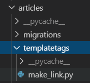

- templates 폴더/ make_link.py 생성

  - 링크를 만들어 주는 사용자 정의 템플릿 태그를 만들어준다
    - 서버를 껐다 켜야 반영 됨

- make_link.py

  - `f'<a href = "/articles/{hashtag.pk}/hashtag/">{hashtag.content}</a>  ' ` : 뒤에 띄어쓰기를 추가해줘야한다

  - `content = article.content + '  '`

    - 만약 게시글의 끝이 '#빵 ' 이 아닌 '#빵'으로해시태그가 되어있는 경우를 대비하여  ' '를 붙여준다

    - ```python
      from django import template
      
      register = template.Library()
      
      @register.filter
      def hashtag_link(article):
          content = article.content + ' '
          hashtags = article.hashtags.all()
      
          for hashtag in hashtags:
              content = content.replace(
                  hashtag.content + ' ', f'<a href="/articles/{hashtag.pk}/hashtag/">{hashtag.content}</a> '
              )
      
          return content
      ```

- detail.html

  - ` 과 {{article|hashtag_link}}를 통해 게시글의 내용 중 해시태그를 찾아 a태그를 적용한다.

  ```javascript
  
  
  
  
  
  <div class="container">
    <h2>{{article.title}}</h2>
    <div class="text-align mt-4">
      <p>내용  :  {{article|hashtag_link}}</p>
      <p>최초 업로드 날짜  :  {{article.created_at}}</p>
      <p>최종 수정 날짜  :  {{article.updated_at}}</p>
    </div>
  
  ```

  

### 1.6 Django Template Filter : safe

> Django Template Filter를 사용하자!

- `safe`를 추가
  - 내장 필터인 safe필터를 사용하여, tag escape 를 방지할 수 있다


# 2. Social Login

> 인증, 계정 등록 등을 다루는 여러가지 방법이 존재하는데, 우리는 `**django-allauth`라는 라이브러리를 사용해서 손쉽게 Social Login을 구현해보자**
>
> 대부분의 소셜 로그인을 지원하고 회원가입 시킬 수 있다.


## 2.1 사전준비

- allauth 설치

- ```shell
  $ pip install django-allauth
  ```

  

- `settings.py`

```python

AUTHENTICATION_BACKENDS = (    
    'django.contrib.auth.backends.ModelBackend',
)

INSTALLED_APPS = [
    'articles',
    'accounts',
    'bootstrap4',
    'allauth',
    'allauth.account',
    'allauth.socialaccount',
    'allauth.socialaccount.providers.kakao',
    'django.contrib.sites',
   ...
]

SITE_ID = 1
```

- `config` > `urls.py`

```python
urlpatterns = [
    path('accounts/', include('accounts.urls')),
    path('accounts/', include('allauth.urls')),
    path('articles/', include('articles.urls')),
    path('admin/', admin.site.urls),
]

```

- migrate

```shell
$ python manage.py migrate
```


## 2.2 KaKao Developers `OAuth`등록

### 2.2.1 앱만들기

- KakaoDevelopers_
  - <https://developers.kakao.com/>
- 앱 만들기
- 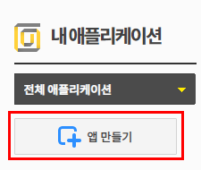
- 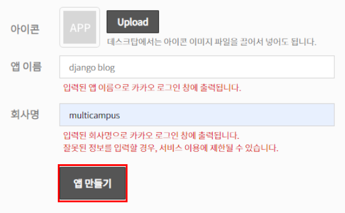


### 2.2.2 플랫폼추가

- 설정 > 일반 > 플랫폼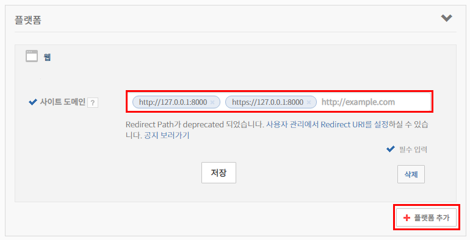

  - 사이트 도메인 추가 & 저장

  - 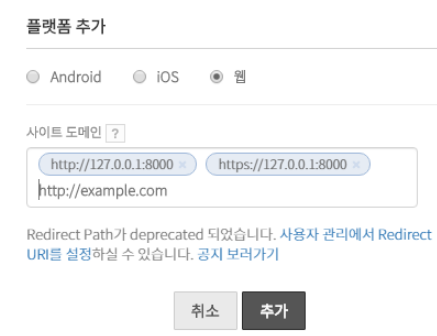

    ```python
    http://127.0.0.1:8000 
    https://127.0.0.1:8000
    http://example.com
    ```

### 2.2.3 사용자 관리

- 설정 > 사용자관리

  - 1. 사용자 관리 ON
    2. 설정
  - 로그인 Redirect URI
    - 


### 2.2.4 소셜 어플리케이션 추가

- <http://127.0.0.1:8000/admin/>
- 소셜 어플리케이션
- 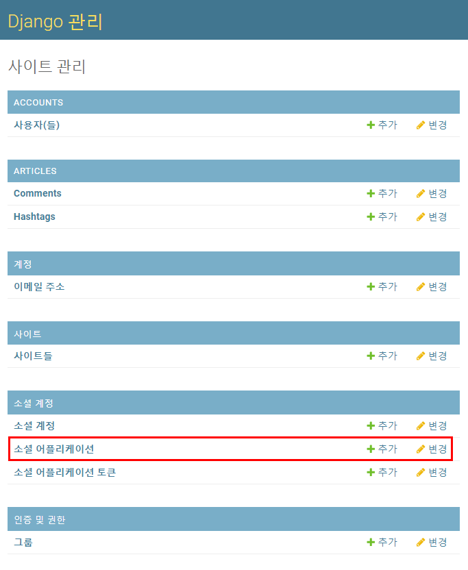
- 소셜 어플리케이션 추가

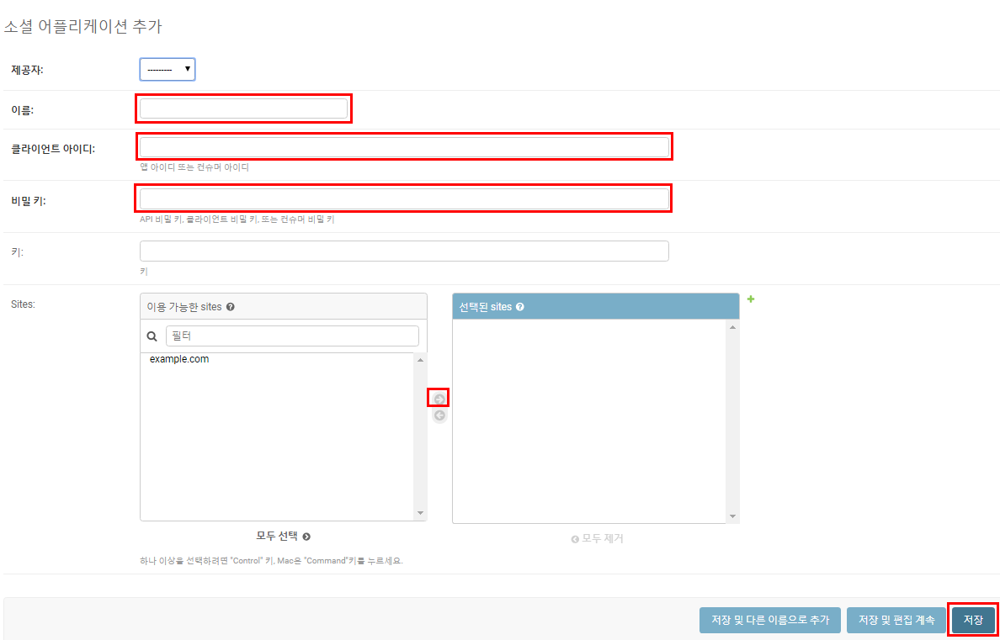

- 입력

  - 이름 : 카카오 로그인
  - 클라이언트 아이디 : 설정>일반> REST API키 `ctrl+c/v`
  - 비밀 키 : 설정 > 고급 > secret  키 발급 `ctrl+c/v`

  - sites : `example.com` 오른쪽으로 넘기고 
  - 저장


### 2.2.4 카카오톡 로그인 폼

- config > templates > accounts > login.html
  - 기존의 `auth_form.html` 코드를 복붙

```html






<!-- 4개를 합쳤다-->

  <h1>회원가입</h1>

  <h1>로그인</h1>

  <h1>회원정보수정</h1> 

  <h1>비밀번호　변경</h1>


<form action="" method="POST">
  
  
  
  
  <a href="" class="btn btn-warning">카카오 로그인</a>
</form> 

```

- 수정 코드
  - `% load socialaccount %}`
  - `<a href="" class="btn btn-warning">카카오 로그인</a>`

- accounts > views.py

```python
def login(request):
 
    if request.user.is_authenticated:
        return redirect('articles:index')

    if request.method =='POST':
        # 세션 관련된 정보를 받기 위해 request를 받는다
        form = AuthenticationForm(request, request.POST)
        if form.is_valid():
            auth_login(request, form.get_user())            
            return redirect(request.GET.get('next') or 'articles:index')
    else:
        form = AuthenticationForm()
    context ={'form':form}
    return render(request, 'accounts/login.html', context)
```

- settings.py

```python
# 로그인 이후 리다이렉트 경로
LOGIN_REDIRECT_URL = 'articles:index'
```

### 2.2.5 카카오 로그인 실행

- 127.0.0.1:8000/accounts/login/
  - 카카오 로그인 버튼 클릭

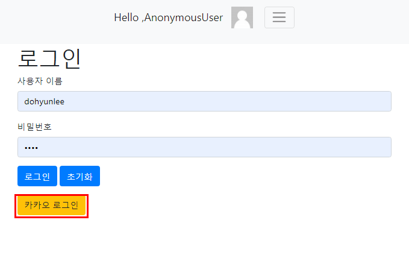

- 카카오 로그인 페이지로 이동
- 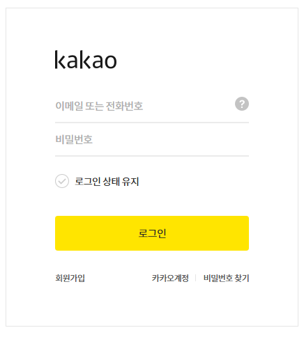

- 로그인 버튼 누르면 `settings.py`  에 로그인 경로 리다이렉트 해뒀던 articles/index로 오게된다.

- 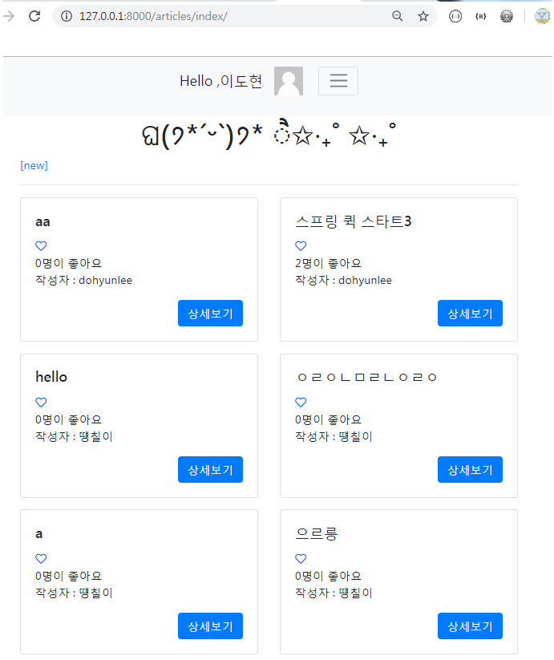