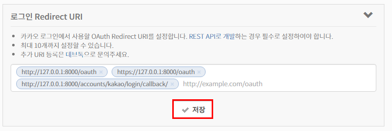

# 1. Hashtag

## 1. Hashtag

### 1.1 Model

```python
class hashtag(models.Model):
	content = models.TextField(unique=True)
class Article(models.Model):
	....
	#해시태그 안쓴사람도 유효성 통과할 수 있도록
	hashtags = models.ManyToManyField(Hashtag, blank=True)
```

- `unique=True`
  
  - True인 경우, 필드는 테이블을 전체에서 고유한 값이여야 한다
  - 유효성 검사 단계에서 실행되며, 중복값이 있는 모델을 저장하려고하면 `.save()` 메서드로 인해서 에러가 발생한다
  
- model 작성 후 migrate

- ```shell
  $ python manage.py makemigrations
  $ python manage.py migrate
  ```

- admin page에 보일 수 있도록 `admin.py`에 등록

- ```python
  from django.contrib
  ```

- 

````python
title : 출근
content str 타입

1. 사용자가 업로드한 content
"오늘 수능날 난 출근 #행복 하다 옛날생각나네..또..#감성 #추억 #뿌듯 #수능왕 .split(' ')

2. .split() 메소드로 리스트 형식으로 변환
['오늘' '수능날' '난' '출근' '#행복' '하다' '옛날생각나네'....'#감성','#추억','#뿌듯','#수능왕']

3.리스트 반복문 돌리기 : 앞자리가 '#'으로 시작하는 단어를 해시태그 테이블에 등록
    = 같은 해시태그가 오면 unique= True 옵션으로 인해 에러발생. 이를 방지하기 위해 get_or_create() 사용

4. 동시에 해당 게시글 해시태그 목록에 추가해줌
->article.hashtags.add(word)

````

- `get_or_create()`
  - word와 같은 해시태그를 찾고 있으면 기존 객체 반환, 없으면 새로운 객체 생성
  - `hashtag, created = Hashtag.objects.get_or_create(content=word)`
    - 새로운 객체 생성되면 created = True
    - 기존 객체 반환 되면 created = False

### 1.2 CREATE


### 1.3 UPDATE

### 1.4 UPDATE


### 1.5 READ


# 2. Social Login

> 인증, 계정 등록 등을 다루는 여러가지 방법이 존재하는데, 우리는 `**django-allauth`라는 라이브러리를 사용해서 손쉽게 Social Login을 구현해보자**
>
> 대부분의 소셜 로그인을 지원하고 회원가입 시킬 수 있다.


## 2.1 사전준비

- allauth 설치

- ```shell
  $ pip install django-allauth
  ```

  

- `settings.py`

```python

AUTHENTICATION_BACKENDS = (    
    'django.contrib.auth.backends.ModelBackend',
)

INSTALLED_APPS = [
    'articles',
    'accounts',
    'bootstrap4',
    'allauth',
    'allauth.account',
    'allauth.socialaccount',
    'allauth.socialaccount.providers.kakao',
    'django.contrib.sites',
   ...
]

SITE_ID = 1
```

- `config` > `urls.py`

```python
urlpatterns = [
    path('accounts/', include('accounts.urls')),
    path('accounts/', include('allauth.urls')),
    path('articles/', include('articles.urls')),
    path('admin/', admin.site.urls),
]

```

- migrate

```shell
$ python manage.py migrate
```


## 2.2 KaKao Developers `OAuth`등록

### 2.2.1 앱만들기

- KakaoDevelopers_
  - <https://developers.kakao.com/>
- 앱 만들기
- 
- 


### 2.2.2 플랫폼추가

- 설정 > 일반 > 플랫폼

  - 사이트 도메인 추가 & 저장

  - 

    ```python
    http://127.0.0.1:8000 
    https://127.0.0.1:8000
    http://example.com
    ```

### 2.2.3 사용자 관리

- 설정 > 사용자관리

  - 1. 사용자 관리 ON
    2. 설정
  - 로그인 Redirect URI
    - 


### 2.2.4 소셜 어플리케이션 추가

- <http://127.0.0.1:8000/admin/>
- 소셜 어플리케이션
- 
- 소셜 어플리케이션 추가


- 입력

  - 이름 : 카카오 로그인
  - 클라이언트 아이디 : 설정>일반> REST API키 `ctrl+c/v`
  - 비밀 키 : 설정 > 고급 > secret  키 발급 `ctrl+c/v`

  - sites : `example.com` 오른쪽으로 넘기고 
  - 저장


### 2.2.4 카카오톡 로그인 폼

- config > templates > accounts > login.html
  - 기존의 `auth_form.html` 코드를 복붙

```html






<!-- 4개를 합쳤다-->

  <h1>회원가입</h1>

  <h1>로그인</h1>

  <h1>회원정보수정</h1> 

  <h1>비밀번호　변경</h1>


<form action="" method="POST">
  
  
  
  
  <a href="" class="btn btn-warning">카카오 로그인</a>
</form> 

```

- 수정 코드
  - `% load socialaccount %}`
  - `<a href="" class="btn btn-warning">카카오 로그인</a>`

- accounts > views.py

```python
def login(request):
 
    if request.user.is_authenticated:
        return redirect('articles:index')

    if request.method =='POST':
        # 세션 관련된 정보를 받기 위해 request를 받는다
        form = AuthenticationForm(request, request.POST)
        if form.is_valid():
            auth_login(request, form.get_user())            
            return redirect(request.GET.get('next') or 'articles:index')
    else:
        form = AuthenticationForm()
    context ={'form':form}
    return render(request, 'accounts/login.html', context)
```

- settings.py

```python
# 로그인 이후 리다이렉트 경로
LOGIN_REDIRECT_URL = 'articles:index'
```

### 2.2.5 카카오 로그인 실행

- 127.0.0.1:8000/accounts/login/
  - 카카오 로그인 버튼 클릭


- 카카오 로그인 페이지로 이동
- 

- 로그인 버튼 누르면 `settings.py`  에 로그인 경로 리다이렉트 해뒀던 articles/index로 오게된다.

- 