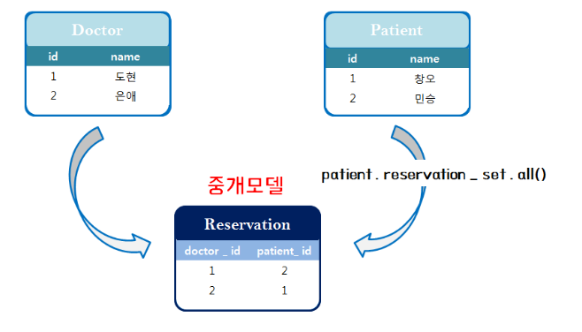

# 1. Many To One

**쿼리실습**

- manytoone APP 실행, 앱등록
  ```shell
  $ python manage.py startapp manytoone
  ```

- 실습을 위한 User, Article, Comment 정의  

  ```python
  from django.db import models
  
  # Create your models here.
  class User(models.Model):
      name = models.TextField()
  
      def __str__(self):
          return f'{self.name}'
  
  class Article(models.Model):
      title = models.TextField()
      user = models.ForeignKey(User, on_delete=models.CASCADE)
  
      def __str__(self):
          return f'{self.title}'
  
  class Comment(models.Model):
      content = models.TextField()
      article = models.ForeignKey(Article, on_delete=models.CASCADE)
      user = models.ForeignKey(User, on_delete=models.CASCADE)
  
      def __str__(self):
          return f'{self.content}'
  ```

  

- django-extension APP 등록

- ```shell
  $ python manage.py shell_plus 
  ```

- 현재 User 와 Article의 관계는 User : Article = 1 : N 이다.

  - [참조] `article.user`
  - [역참조] `user.article_set`

- 관점을 조금 바꿔, `User : Article = M : N ` 으로 설정해보자. User와 Article의 관계에서  서로 좋아요를 표현할 수 있다고 생각해보자

  - User 는 여러 개의 게시글에 Like (좋아요) 할 수 있다.
  - Article은 여러명의 User로부터 Like(좋아요)를 받을 수 있다.


[실습]

- 정보입력

- ```shell
  user1 = User.objects.create(name='Kim')
  user2 = User.objects.create(name='Lee')
  article1 = Article.objects.create(title='1글', user=user1)
  article2 = Article.objects.create(title='2글', user=user1)
  article3 = Article.objects.create(title='3글', user=user2)
  c1 = Comment.objects.create(content='1글1댓글', user=user1, article=article1)
  c2 = Comment.objects.create(content='1글2댓글', user=user2, article=article1)
  c3 = Comment.objects.create(content='1글3댓글', user=user1, article=article1)
  c4 = Comment.objects.create(content='1글4댓글', user=user2, article=article1)
  c5 = Comment.objects.create(content='2글1댓글', user=user1, article=article2)
  c6 = Comment.objects.create(content='!1글5댓글', user=user2, article=article1)
  c7 = Comment.objects.create(content='!2글2댓글', user=user2, article=article2)
  ```

  

  ORM 이 자동으로 DB에 요청해서 결과를 가져온다

  	- 결과 데이터가 유일한 값 : **get**
  	- 결과 데이터가 하나도 없을 수 있는 경우 : **filter**

  

  1. 1번사람이 작성한 게시글을 다 가져오면?

     ```shell
   $ user1.article_set.all()
     ```

  2. 1번 사람이 작성한 모든 게시글에 달린 댓글 가져오기

     ```shell
   In[2]: for article in user1.article_set.all()
     	   		for comment in article.comment_set.all()
  	 				print(comment.content)
     				
     Out[2]: 1글1댓글
           1글2댓글
           1글3댓글
           1글4댓글
           !1글5댓글
           2글1댓글
           !2글2댓글      
     ```
  ```
     
  3.  2번 댓글을 작성한  User는?
  
   ```shell
           In [] : c2.user
         Out[] : <User: Lee>
           
         In [] : c2.user.pk
           Out[] : 2
  ```

  4. 2번 댓글을 작성한 User의 이름은?

     ```shell
     $ c2.user.name
     ```
   ```
  
   ```

5.  2번 댓글을 작성한 사람의 모든 게시글은?
  
   ```python
     In[14]: c2.user.article_set.all()
     Out[14]: <QuerySet [<Article: 3글>]>
   ```

  6.  1번 글의 첫번째 댓글을 작성한 사람의 이름은?

     ```shell
      In []: article1.comment_set.all()[0].user.name
     Out[]: 'Kim'
     ```
  
     ```shell
      In[15]: article1.comment_set.first().user.name
     Out[15]: 'Kim'
     ```


  7.  1번 글의 2번째 부터 4번째 까지 댓글 가져오기
  
     ```shell
      In [19]: article1.comment_set.all()[0:2]
     Out[19]: <QuerySet [<Comment: 1글1댓글>, <Comment: 1글2댓글>]>
     ```


  8.  1번 글의 첫번째, 두번째 댓글 가져오기

     ```shell
      In [20]: article1.comment_set.all()[1:4]
     Out[20]: <QuerySet [<Comment: 1글2댓글>, <Comment: 1글3댓글>, <Comment: 1글4댓글>]>
     ```
   ```

  9.  1번 글의 두번째 댓글을 작성한 사람의 첫번째 게시물의 작성자 이름은?

   ```shell
     In [25]: article1.comment_set.all()   [1].user.article_set.all()[0].user.name
   Out[25]: 'Lee'
   ```

  10. 1번 댓글의 user정보만 가져오면?
  
      - `values`, `keys`, `items`
      
      ```shell
      In [33]: Comment.objects.values('user').get(pk=1)
        Out[33]: {'user': 1}
      
      ```
      
- 주의해야할 점


     In [34]: c1.user
     Out[34]: <User: Kim>
      
        이건 user객체를 전부 다 들고오기때문에 틀린 답

  11.  ​	2번 사람이 작성한 댓글을  pk내림차순으로 가져오면?
  
      ```powershell
      In [37]: user2.comment_set.order_by('-pk')
        Out[37]: <QuerySet [<Comment: !2글2댓글>, <Comment: !1글5댓글>, <Comment: 1글4댓글>, <Comment: 1글2댓글>]>
      ```


  12. 제목이 '1글' 이라는 게시글을 전부 가져오면?

      ```powershell
      In [41]: Article.objects.filter(title='1글')
      Out[41]: <QuerySet [<Article: 1글>]>
      ```


# 2. Many to Many

### 2.1 1:N의 한계

> 2명의 의사, 2명의 환자가 있고 1번 환자는 2번 의사에, 2번 환자는 1번 의사에 등록되어 있다고  하자. 만약 2번 환자가 1번 의사로 변경하려면 어떻게 해야할까?
>
> 	- 2번 환자의 doctor_id 가 2번으로 변경 (x)
> 	- 2번 환자의 doctor_id 에 2를 추가
> 	- Patient 테이블에 새로운 카디널리티(3(2)번 환자 2번 의사)를 추가한다.


### 2.2 중개 모델 생성

- 1 : N 으로만 구현하려니 예약 정보 시스템을 표현하기 어렵다

  - 예를들어 환자가 다른 의사에게 진료를 받고자 할 때, 기존 기록을 지우지 않으려면 새로운 Patient 인스턴스를 생성해야한다.

- 중개 모델(class Reservation)을 만들어서 Doctor와 Patient를 이어주는 예약 정보를 담아보자.

  - 의사와 환자의 관계만을 표현한다
  
  
  
  ```python
  # 중개모델
  class Reservation(models.Model):
      doctor = models.ForeignKey(Doctor, 
      on_delete=models.CASCADE)
      patient = models.ForeignKey(Patient, 
      on_delete=models.CASCADE)
  
      def __str__(self):
        return f'{self.doctor_id} 번 의사의 {self.patient_id}번 환자'
  ```
  
- Patients 클래스 수정
  
  - `doctors = models.ManyToManyField(Doctor)`
  
    ```python
    from django.db import models
    
    # Create your models here.
    class Doctor(models.Model):
        name = models.TextField()
    
        def __str__(self):
            return f'{self.pk}번의 의사 {self.name}'
        
    
    class Patient(models.Model):
        name = models.TextField()
        doctors = models.ManyToManyField(Doctor)
    
        def __str__(self):
            return f'{self.pk}번 환자 {self.name}'
    
    class Reservation(models.Model):
        doctor = models.ForeignKey(Doctor, on_delete=models.CASCADE)
        patient = models.ForeignKey(Patient, on_delete=models.CASCADE)
    ```
  
    
  


### 2.3 through 옵션

- Patient 입장에서 중개 모델을 거쳐서 `reservation_set`형태로 예약정보를 가져오는것은 너무 불편하다

  - 마찬가지로 Doctor도 reservation_set 형태로 예약정보를 먼저 불러온 뒤에 Patient 정보를 꺼내올 수 있다.

**Doctor 에 대한 정보를 중개 모델을 거치지 않고, `through` 옵션을 사용해 바로 가져오자!**

- Patients 클래스 수정
  
  - `through = 'Reservation' :
  
- through 옵션을 부여해 ManyToManyField가 사용할 model을 지정한다
  
  - ```python
    
    class Doctor(models.Model):
        name = models.TextField()
        
        def __str__(self):
            return f'{self.pk}번의사 {self.name}'
            
            
    class Patient(models.Model):
        name = models.TextField()
        doctors = models.ManyToManyField(Doctor, through='Reservation')
        
        def __str__(self):
            return f'{self.pk}번 환자 {self.name}'
        
    class Reservation(models.Model):
        doctor = models.ForeignKey(Doctor, 
        on_delete=models.CASCADE)
        patient = models.ForeignKey(Patient, 
        on_delete=models.CASCADE)
    
        def __str__(self):
            return f'{self.doctor_id} 번 의사의 {self.patient_id}번 환자'
    ```


- Doctor 정보를 중개모델을 거치지 않고, 다이렉트로 가져와보자

- ManyToManyField 의 `through` 옵션

  - `patient.doctors.all()`

    - patient로 등록된 Doctor에 대한 모든 정보가 바로 보인다.

      ```powershell
      # 기존의 중개 모델
      In [7]: patient1.reservation_set.all()
      Out[7]: <QuerySet [<Reservation: 1번 의사의  1번 환자>]>
          
      # through 옵션 추가한 중개 모델
      In [8]: patient1.doctors.all()
      Out[8]: <QuerySet [<Doctor: 1번의 의사 도현>]>
      ```

**through의 한계** -> 한쪽 방향만 가능

- Doctor에 `patients = models.ManyToManyField(Patient, through='Reservation')`를 추가하면 안된다.

  - Doctor보다 Patient가 먼저 선언 되었기 때문!

    **related_name** 옵션을 부여해 역참조가 가능하도록 구현 가능하다.

### 2.4 related_name 

##### 양방향으로 가능 -> 역참조 기능

- 이제 Patient 입장에서는 `patient.doctors.all()`과 같은 형태로 쉽게 Doctor 정보를 가져올 수 있다

- 마찬가지로 Doctor 입장에서도 `doctor.patients.all()`과 같은 형태로 Patient 정보를 가져올 수 있게끔, `related_name`옵션을 사용해보자.

- Patients 클래스 수정
  
  - `related_name='patients'`:
    
  - related_name옵션을 부여해 `patients` 라는 이름으로 해당 Doctor의 Patient 를 불러올 수 있도록 한다.
    
  - ```python
    from django.db import models
    
    # Create your models here.
    class Doctor(models.Model):
        name = models.TextField()
    
        def __str__(self):
            return f'{self.pk}번의 의사 {self.name}'
    
    class Patient(models.Model):
        name = models.TextField()
        doctors = models.ManyToManyField(Doctor, through='Reservation', related_name='patients')
    
    
        def __str__(self):
            return f'{self.pk}번 환자 {self.name}'
    
    ```
    
    
```python
# 중개모델 (M:N)
    class Reservation(models.Model):
        doctor = models.ForeignKey(Doctor, 
        on_delete=models.CASCADE)
        patient = models.ForeignKey(Patient, 
        on_delete=models.CASCADE)
    
        def __str__(self):
            return f'{self.doctor_id} 번 의사의 {self.patient_id}번 환자'
```

- related_name 으로 지정한 'patients'라는 이름으로 환자의 정보를 가져올 수 있다.

  - ```powershell
    In [1]: Doctor.objects.create(name='은애')
    Out[1]: <Doctor: 1번의사 은애>
    
    In [2]: Doctor.objects.create(name='도현')
    Out[2]: <Doctor: 2번의사 도현>
    
    In [6]: patient1= Patient.objects.create(name='세환')
    
    In [7]: patient2= Patient.objects.create(name='민승')
    
    In [9]: doctor1.patients.all()
    Out[9]: <QuerySet []>
    
    In [10]: doctor2.patients.all()
    Out[10]: <QuerySet []>
    
    In [11]: doctor1.patients.add(patient1)
    
    In [13]: doctor1.patients.all()
    Out[13]: <QuerySet [<Patient: 1번 환자 세환>]>
    
    In [14]: doctor2.patients.add(patient2)
    
    In [16]: doctor2.patients.all()
    Out[16]: <QuerySet [<Patient: 2번 환자 민승>]>
    
    ```
  
  - 

### 2.5 Many To Many

- 단순히 Doctor와 Patient를 이어줄 생각이라면, 굳이 중개모델이 필요 없다. ManyToManyField만 사용하면 장고가 자동으로 중개 테이블을 만들어준다

  - 중개모델 (Reservation 을 제거한다)
  - Patients 클래스에 부여한 through 옵션을 제거한다

  ```python
  from django.db import models
  
  # Create your models here.
  class Doctor(models.Model):
      name = models.TextField()
  
      def __str__(self):
          return f'{self.pk}번의 의사 {self.name}'
      
  
  class Patient(models.Model):
      name = models.TextField()
      doctors = models.ManyToManyField(Doctor, related_name='patients')
  
      def __str__(self):
          return f'{self.pk}번 환자 {self.name}'
  ```

  

- 중개 모델을 만들지 않았지만 DB를 확인해보면 임의의 테이블을 자동으로 생성해준 것을 확인할 수 있다.

  ```python
  db.sqlite3
  manytomany_doctor
  manytomany_patient
  manytomany_patient_doctors
  	- id
      - doctor_id
      - patient_id
  ```


#### add & remove

> Queryt Set 을 Python list로 활용할 수 있다는 점을 활용해 간편하게 예약을 처리해보자.


#### add

```
In [14]: doctor1.patients.all()
Out[14]: <QuerySet []>

In [15]: doctor2.patients.all()
Out[15]: <QuerySet []>

In [17]: doctor2.patients.add(patient1)

In [18]: doctor2.patients.add(patient2)

In [19]: doctor2.patients.all()
Out[19]: <QuerySet [<Patient: 1번 환자 세환>, <Patient: 2번 환자 민승>]>
```

#### remove

```
In [20]: doctor2.patients.remove(patient1)

In [21]: doctor2.patients.all()
Out[21]: <QuerySet [<Patient: 2번 환자 민승>]>

In [22]: doctor2.patients.remove(patient1)

In [23]: doctor2.patients.all()
Out[23]: <QuerySet [<Patient: 2번 환자 민승>]>

In [24]: doctor2.patients.remove(patient2)

In [25]: doctor2.patients.all()
Out[25]: <QuerySet []>
```