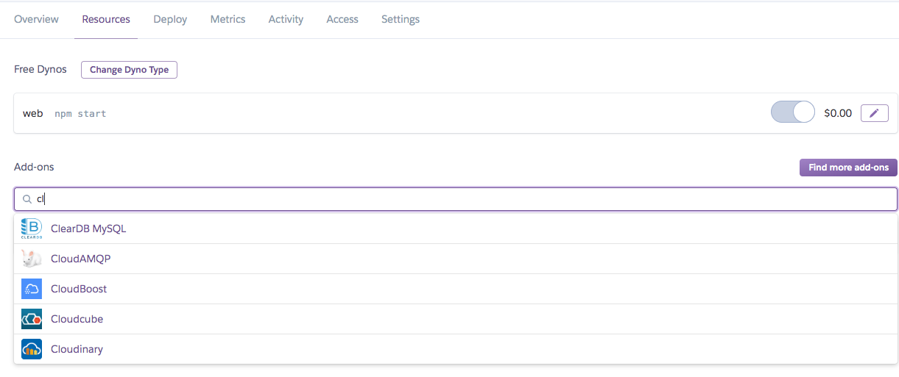

# [헤로쿠\] Heroku clearDB 연동해서 mysql 사용하기 1

Heroku와 mysql 연동하기

Heroku에서는 clearDB라는 애드온을 제공한다

 대시보드를 통해 디비를 설정할 앱 상세로 들어와서 Resources탭을 눌러보면 Add-ons라는 검색창이 보인다.

ClearDB를 검색한다

  

처음에 선택하면 우측 상단에 빨간색 경고창이뜨는데 결제정보를 입력하라는거다.

카드 등록해주고나면 (하지만 난 Free 사용 ) 등록됨.

 

터미널에가서 heroku addons라고 실행시켜본다.

그러면 cleardb를 확인할 수 있다.

 

  

터미널에 heroku addons:create cleardb:ignite 라고 쳐준다.

해당 앱 이름과 함께 결제정보가 뜬다.

그다음부터는 매뉴얼대로 하면됨.

사이트에서 Documentation에서 찾아도 되고, 상세히 찾아 들어가기 귀찮다면 터미널에서 heroku addons:docs cleardb라고 쳐주자.

이전 명령어 실행하면 거기서도 해당 명령어 치고 매뉴얼 참고하라고 문구가 뜰거다.

 

