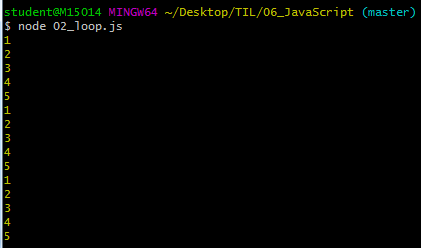
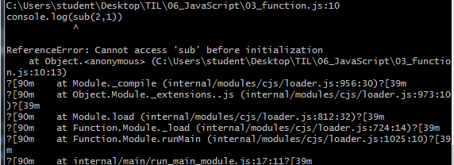

# JavaScript Syntax basics

## 0. 사전준비

> HTML 로 뼈대를 잡고 CSS로 꾸미고, JavaScript 로 활력을 불러 넣는다.
>
> JavaScript로 서버까지 구축할 수 있도록 Node.js 등장!
>
> - Node.js 발표와 동시에 JavaScript 가 브라우저 종속적인 언어가 아닌 서버 구축까지 가능해지면서 Hot한 언어로 급부상한다
> - `Express.js` (서버) , `React.js` (프론트) , `Vue.js` (프론트 ) 등 JavaScript 기반의 수많은 프레임 워크, 라이브러리들이 현재 웹 개발 트랜드를 주도하고 있다.

### 0.1 Node.js 설치

- node.js 공식 홈페이지에서 다운로드

  - LTS Version (안정적)
  - Windows Installer (.ms) 64bit

-  설치 확인

  ```shell
  $ node -v
  v12.13.0
  ```

  

### 0.2 VS Code Python & JavaScript Indenting 설정

- settings.py

  

  ```python
  {
      .
      .
      
      "editor.tabSize": 2,
      "[python]" : {
          "editor.tabSize": 4,
      }, 
  
      .
      .
  
  ```

-  VSCode 환경설정


### 0.3 Naming Convention

> lower Camel Case
>
> - 단봉 낙타 표기법
> - JavaScript의 기본 표기법
>
> #### Upper Camel Case
>
> - 쌍봉 낙타 표기번
>
> #### snake_case
>
> - 단어가 합쳐진 부분마다 중간에 언더라인(_) 을 붙여 주는 방법
>   - Train_Case
>     - 각 단어의 맨 앞글자를 대문자로 표기
>   - spinal_case
>     - 각 단어의 맨 앞글자를 소문자로 표기
>
> #### kebob-case
>
> - 단어가 합쳐진 부분마다 중간에 Dash(`-`) 들을 붙여 주는 방법


### 0.4 Extentions( 추천 )

> - auto close tag
> - rainbow brackets
> - indent-rainbow

### 0.5 .js 실행 방법

```shell
$ node [파일명]
```


## 1. Variable

### 1.1 let(변수)

- 값을 재할당 할 수 있는 변수를 선언하는 키워드

- 변수 선언은 한 번만 할 수 있다,

   - 변수 선언은 1번만

     ```javascript
     // let (변수)
     let x = 1
     let x = 4
     ```

  

  - 하지만 할당은 여러번 할 수 있다

    ```javascript
    // let 변수
    let x = 2
    x=3 #재 할당 가능
    console.log(x)
    
    >> 3
    ```

- 블록 유효 범위 (Block Scope)를 갖는 지역변수

  ```javaScript
  let x=1
  if (x===1){
    let x = 2
      #if문 만큼의 유효범위를 갖고 있다.
    console.log(x)     //2
  }
  console.log(x)       //1
  ```

  

### 1.2 const(상수)

> 변수 와 상수는 어디에 써야 할까?
>
> - 어디에 변수를 쓰고, 어디에 상수를 쓰는지에 대한 결정은 프로그래머의 몫
> - `파이 근삿값`과 같은 상수가 적절 (변할 일이 없는 값)
>
> `var` VS `let` VS `const`
> 
> 
>- `var` : 할당 및 선언 자유, 함수 스코프
> - `let` : 할당 자유, 선언은 한번만, 블록 스코프
> - `const` : 할당과 선언 한번만, 블록 스코프
> 
>`var`는 호이스팅과 같은 문제를 야기하기 때문에, 앞으로는 `let`과 `const`를 사용해서 개발을 진행하자!!!


- 값이 변하지 않는 상수를 선언하는 키워드

  - 상수의 값은 재할당을 통해 바뀔 수 없고, 재선언도 불가능하다

- let과 동일하게 `block Scope`를 가진다.

- 웬만하면 모든 선언에서 상수를 쓴다.

  - 일단 상수를 사용하고, 값이 바뀌는게 자연스러운 상황이면 그때 변수 (`let`)로 바꿔서 사용하는 것을 권장한다.

    
    
    **[실습]**
    
  - 초기값을 생략하면 ERROR 발생

    ```javascript
    //상수
    // 초기값을 생략하면 ERROR
    const MY_FAV
    ```

  - 상수 값 할당

    ```javascript
    #MY_FAV 를 const(상수) 로 정의하고 그 값을 7로 함
    const MY_FAV = 7
    console.log('My Fav number is ...' + MY_FAV)
    ```
  
  > My fav number is ...7
>
  >   ```
> 
  >   ```
  
  - 상수 재할당 에러 | 상수 재선언 에러
  
    ```javaScript
    //상수 재할당 에러 -> Assignment
    const MY_FAV = 7
    MY_FAV =10
    
    //상수 재선언 에러 -> already been decleard
    const MY_FAV = 7
  const MY_FAV = 20
    let MY_FAV =11
    ```
  ```
    

    
  
    
    
  
  
  
  - 상수도 블록 유효 범위 (`Block scope`) 를 갖는다.
    
    ```javascript
    const MY_FAV = 7
    console.log("My Favourite number is ... " + MY_FAV)
    
    if (MY_FAV === 7){
      const MY_FAV = 11
      console.log("My Favourite number is ... " + MY_FAV)
    }
    
    console.log("My Favourite number is ... " + MY_FAV
  ```
  
    

## 2. 조건문

### 2.1 `if`문

- 파이썬의 if문과 흡사 ! `elif`만 `else if`로 바꾸면 됨

  ```javascript
  const userName = prompt("What is your name?")
  
  message = ''
  
  if (userName === '도현'){
    message = '<h1>유단자... 까불지마요..</h1>'
      
  } else if (userName === '혁진'){ 	
    message = '<h1>감자 ...혁진 감자합니다.</h1>'
  } else {
    message = `<h1>${userName} .. 누구? ? </h1>`
  }
  
  document.write(message)	
  ```

  

## 3. 반복문

### 3.1 while 문

- ```python
  let i =0
  while(i<6){
    console.log(i)
    i++
  }
  ```

- 

### 3.2 for 문

- JavaScript 가장 기본적인 반복문.

  -  for문에서 사용할 변수 하나 정의하고, 그 변수가 특정 조건에 false값이 될때까지 계속 연산 -반복

- ```javascript
  for (let j =0; j<6; j++){
    console.log(j)
  }
  ```

- 

- 그 외 다른 for문

  -  Python 의 for in 문법과 비슷하게 사용 가능
  
  ```javascript
  const numbers = [1,2,3,4,5]
  for (let number of numbers){
    console.log(number)
  }
  ```
  
  - number 값 재 할당이 필요없으면 상수 사용 가능!
    - 직접 list를 지정하는것도 가능하다.
  
  ```javascript
  for (let number of [1,2,3,4,5]){
    console.log(number)
  }
  
  for (const number of [1,2,3,4,5]){
    console.log(number)
  }
  ```
  
    
  


## 4. 함수 (function)

> 함수 선언식(statement) :  코드가 실행되기 전에 로드됨
>
> 함수 표현식(expression) : 인터프리터가 해당 코드에 도달했을 때 로드됨


## 4.1 선언식

 - 인터프리터가 함수에 닿지 않았는데 위로 끌어올려 (호이스팅) 실행시킨다

   함수 호출과 함수 정의의 위치에 관계 없이 모두 정상적으로 실행된다.

   - 함수 정의 보다 함수 호출이 먼저 된 경우

     ```javascript
     console.log(add(2,1))
     function add(num1, num2){
       return num1 + num2
     }
     # ok
     ```

     

   - 함수 호출 보다 함수 정의 가 먼저 된 경우

     ```javascript
     function add(num1, num2){
       return num1 + num2
     }
     console.log(add(2,1))
     # ok
     ```

     

## 4.2 표현식

- 함수를 변수에 담는 모양

- 함수 정의되기 전에 함수가 호출되면 ERROR

  반 . 드 . 시 함수 정의가 호출보다 우선되어야 한다.

  - 함수 정의보다 함수 호출이 먼저 된 경우 ERROR

```javascript
//표현식
console.log(sub(2,1))
const sub = function sub(num1, num2){
  return num1 -num2
}
# error
```

- 에러발생 	

### 4.3 typeof

 - type 을 확인하면 둘다 function으로 동일

 - 작동 방법만 다르다

   ```shell
   console.log(typeof add)
   console.log(typeof sub)
   ```

   

## 5. 화살표 함수(Arrow function)

> - ES6 이후에 나왔으며, 기존의 function과 중괄호 숫자를 줄이려고 고안된 문법
>   1. `function` 키워드 생략 가능
>   2. 함수에 매개변수 하나 -> () 생략 가능
>   3. 함수 바디에 표현식 하나 -> `{}` `return` 생략 가능
> - 화살표 함수의 경우 function 키워드로 정의한 함수와 100% 동일하지 않다.
> - 화살표 함수는 항상 **익명함수**
>


### 5.1 기본 function

```javascript
//화살표 함수 ( Arrow function )
// 일반적인 function 키워드 함수를 짧게 바꿔보자.
const iot1 = function(name){
  return 'hello! ${name}!'
}
```


### 5.2 화살표 함수

1. `function` 키워드 생략 가능

   ```javascript
   // 1. function 키워드 삭제
   const iot1 = (name) => {  return 'hello! ${name}!'  }
   ```

   

2. 함수에 매개변수 하나인 경우 `()` 생략 가능

   ```javascript
   // 2. () 생략 (함수 매개변수 하나일 경우)
   const ioti = name => { return 'hello! ${name}' }
   ```

   

3. 함수 바디에 표현식 하나인 경우,  `{}` , `return` 생략

   ```javascript
   //3. {}, return 생략 (바디에 표현식 1개)
   const ioti = name => 'hello! ${name}'
   ```

4.  인자가 없는 경우 `()` 혹은 `_` 로 표시 가능!

   ```javascript
   let noArgs = () => {return 5}
   noArgs()
   
   let noArgs = _ => {return 5}
   noArgs()
   
   let noArgs = _ => 5
   noArgs()
   ```

   

5. 객체를 리턴 하는 경우

   1. `return` 키워드 있으면?

      - 객체를 return 할 때는 return 키워드를 명시적으로 적어준다

        ```javascript
        let returnObject = () => {return {key:'value'}}
        console.log(returnObject())
        console.log(typeof(returnObject()))
        ```

        

   2. `return` 키워드 없으면?

      - `return` 대신 `()` 를 붙인다.

        ```javascript
        returnObject = () => ({key : 'value'})
        console.log(returnObject())
        console.log(typeof(returnObject()))
        ```

        

6. 기본 인자 부여

   ```javascript
   const sayHello = (name='혁진') => `안녕! ${name} `
   console.log(sayHello('선아'))
   console.log(sayHello())
   ```

   

- [실습]

  ```javascript
  //[실습] 3단계에 걸쳐 화살표 함수로 바꿔보기
  let square = function(num){
    return num**2
    }
  
  // 1. function 키워드 생략
  square = (num) => {return num**2}
  // 2. ()생략 
  square = num => {return num**2}
  // 3. {}, return  생략 (바디 부분 표현식 1개)
  square = num => num**2
  ```


### 5.3 익명/ 1회용 함수( Anonymous function)

> JavaScript 에서는 1회용으로 사용하는 함수는 이름을 짓지 않을 수 있다.
>
> 일반적으로는 함수는 함수를 정의, 변수에 함수를 저장하는 과정 등을 거쳐서 실행한다. 하지만 `즉시실행함수`는 함수가 선언되자마자 즉시 실행된다.
>
> 사용이유?
>
> **초기화**에 사용한다.
>
> - 즉시실행함수는 선언되자마자 실행되기 때문에, 같은 함수를 다시 호출할 수는 없다. 그래서 초기화 함수에 주로 사용된다.

ERROR

- function 키워드를 활용해서 함수를 선엉할 때는, 이름을 지정하지 않으면 에러가 난다.

  ```javascript
  function (num) { return num ** 3 }
  ```

  

해결방법

  1. 기명 함수로 만들기 ( 변수 , 상수에 할당 )

     ```javascript
     const cube = function( num ) { return num **3 }
     
     // 화살표 함수는 기본적으로 익명함수지만, 변수및 상수에 할당해서 기명함수처럼 사용 가능
     const squreRoot = num => num ** 0.5
     ```

 	2.  익명 함수 바로 실행시키기

     ```javascript
     console.log(
     	(function( num ) { return num **3 })(2)
     )
     ```

     

## 6. 배열(array)

```javascript
const numbers = [1,2,3,4,5]
```

- 배열의 값

  ```
  // 배열의 첫번째 인덱스의 요소 값
  numbers[0] 
  // 1
  
  numbers[-1] 
  // undefined -> 정확한 양의 정수만 가능
  ```

- `length` : 길이

  ```
  numbers.length
  // 5
  ```

- `reverse()`

  - 배열을 거꾸로 출력하여 저장

  - **원본 파괴**

    ```
    // 원본 파괴 
    numbers.reverse()
    numbers 
    // [5,4,3,2,1]
    
    numbers.reverse()
    numbers
    // [1,2,3,4,5]
    ```

- `push`

  - 배열에 새로운 요소 추가

  - 기본적으로 push 이후에는 배열의 길이를 return

    ```
    numbers.push('a')
    // 6
    numbers
    // [1,2,3,4,5,'a']
    ```

- `pop`

  - 배열의 가장 마지막 요소 제거

  - 배열의 가장 마지막 요소를 제거한 이후의 배열 return

    ```
    numbers.pop()
    // 'a'
    numbers
    // [1,2,3,4,5]
    ```

- `unshift`

  - 배열 가장 앞에 요소 추가

  - 추가된 이후에 length를 return

    ```
    numbers.unshift('a')
    // 6 
    numbers
    // ['a', 1,2,3,4,5]
    ```

- `shift`

  - 배열의 가장 앞의 요소 제거

  - 배열의 가장 앞의 요소를 제거한 이후의 배열 return

    ```
    numbers.shift('a')
    // 'a'
    numbers
    // [1,2,3,4,5]
    ```

- `push` & `shift`

  ```javascript
  numbers.push('a', 'b')
  numbers
  // [1,2,3,4,5, 'a', 'b']
  
  numbers.unshift('a')
  numbers
  // ['a', 1,2,3,4,5, 'a', 'b']
  ```

- `indexOf`

  - 인자로 주어진 값이 배열 중 가장 먼저 있는 값의 인덱스를 return

    ```javascript
    // 가장 먼저 있는 'a'의 인덱스를 return 
    numbers.indexOf('a')
    // 0
    
    // 가장 먼저 있는 'b'의 인덱스를 return 
    numbers.indexOf('b')
    // 8
    ```

  - 만약, 찾고자 하는 요소가 Array에 없는 경우 -1을 return

    ```javascript
    // 만약, 찾고자 하는 요소가 Array에 없는 경우 -1을 return 
    numbers.indexOf('c')
    // -1
    ```

- `join`

  - 배열의 요소를 join 함수 인자를 기준으로 묶어서 문자열로 return

    ```javascript
    // ','를 기준으로 문자열을 return 한다. 
    numbers.join()
    // 'a,1,2,3,4,5,a,b' (기본값은 ',')
    
    // 각 요소를 '-'로 붙여 문자열을 return 한다. 
    numbers.join('-')
    // 'a-1-2-3-4-5-a-b'
    
    // 모든 요소가 다 붙어서 문자열을 return 한다. 
    numbers.join('')
    // 'a12345ab'
    ```

## 7. 객체 (Object)

> JavaScript 또한 객채지향 ! 객체를 생성해보자

### 7.1 Object 생성

```javascript
const me = {
  // key 가 한 단어일 때
  name : '선호', 

  // key가 여러 단어일 때, ' '로 감싸준다.
  'phone number' : '01012345678',

  appleProducts : {
    iphone : 'xs', 
    watch : 'series5', 
    macbook : 'pro2019'
  }
}
```

### 7.2 Object 접근

```
// key가 한단어일 때 
console.log(me.name)
// "선호"

// key가 여러단어일 때는 []를 통해 접근
console.log(me['name'])
// "선호"
console.log(me['phone number'])
// "01012345678"

console.log(me.appleProducts)
// { iphone : 'xs', watch : 'series5',  macbook : 'pro2019' }

console.log(me.appleProducts.iphone)
// "xs"
```


### 7.3 ES5 방식

```
// ES5

var books = ['자바스크립트 입문', '장고 웹 프로그래밍']
var comics = {
  'DC' : ['Aquaman', 'Jocker'],
  'Marvel' : ['Avengers', 'Spider Man']
}

var magazines = null
var bookShop = {
  books : books,
  comics : comics,
  magazines : magazines
}

console.log(bookShop)
console.log(typeof bookShop)
console.log(bookShop.books)
console.log(bookShop.books[0])
```


### 7.4 ES6 이후

- 객체의 Key와 Value가 똑같으면, 마치 배열처럼 한번만 작성 가능

  ```
  var books = ['자바스크립트 입문', '장고 웹 프로그래밍']
  var comics = {
    'DC' : ['Aquaman', 'Jocker'],
    'Marvel' : ['Avengers', 'Spider Man']
  }
  
  var magazines = null
  var bookShop = {
    books,
    comics,
    magazines
  }
  
  console.log("ES6")
  console.log(bookShop)
  console.log("")
  console.log(typeof bookShop)
  console.log("")
  console.log(bookShop.books)
  console.log("")
  console.log(bookShop.books[0])
  console.log("")
  ```


### 7.5 JSON

> JavaScript Object Notation - JavaScript  객체 표기법

- **웹에서 데이터 주고 받을 때 형식**으로 대표적으로 JSON, XML, YAML 등이 있다. **주로 JSON**을 사용한다.
- Key - Value  형태의 자료구조를 JavaScript Object와 유사한 모습으로 표현하는  표기법
- 하지만 JSON은 모습만 비슷할 뿐이고, 실제로 Object처럼 사용하려면 다른 언어들 처럼 Parsing(구문 분석)하는 작업이 필요하다.


## 8. Array Helper Method

> Helper란 자주 사용하는 로직을 재활용할 수 있게 만든 일종의 Library
>
> ES6 부터 본격적으로 사용되기 시작했다.

- 더욱 자세한 사용법은 `MDN` 문서 참고

### 8.1`forEach`

- `arr.forEach(callback(element, index, array))`
- 주어진 callback을 배열에 있는 각 요소에 대해 한번씩 실행.

### 8.2 map

- `arr.map(callback(element))`
- 배열 내의 모든 요소에 대하여 주어진 콜백 함수를 호출한 결과를 모아 새로운 배열 return
- `map`, `filter` 둘 다 사본을 return하는 거고, 원본은 바뀌지 않는다. 만약 return을 안적으면 undefined가 배열에 담김!

### 8.3` filter`

- `arr.filter(callback(element))`

- 주어진 콜백 함수의 테스트를 통과하는 모든 요소를 모아서 새로운 배열로 반환한다. (콜백 함수에 조건을 적어서 원하는 요소들만 filtering한다)

  ```javascript
  // filter Helper 를 사용해서 numbers 배열 중 50보다 큰 값만 필터링해서 새로운배열에 저장하기
  const numbers = [15,35,13,36,69,3,61,55,99,5]
  const newNumbers = numbers.filter( number => number>50 )
  
  
  
  console.log(numbers)
  console.log(newNumbers)
  ```

  - 

### 8.4 `reduce`

- `arr.reduce(callback(acc, element, index))`
  - 첫 번째 매개변수 : 누적 값(전 단계의 결과물)
  - 두 번째 매개변수 : 현재 배열 요소 값
  - 세 번째 매개변수 : 배열 순서 (인덱스 번호)

- 배열의 각 요소에 대해 주어진 콜백 함수를 실행하고 하나의 결과 값을 반홚나다. **배열 내의 숫자 총합, 평균 계산 등 배열의 값을 하나로 줄이는 동작**을 한다.

- map은 배열의 각 요소를 변형, reduce는 배열 자체를 변형한다.
- map. filter 등 여러 메소드들의 동작을 대부분 대체 가능


### 8.5 `find`

- `arr.find(callback(elem, index, array))`
- 주어진 **판별 함수를 만족하는 첫 번째 요소의 값**을 반환.
  
- 값이 없으면 `undefined`
  
- 조건에 맞는 인덱스가 아니라 **요소 자체를 원할** 때 사용

  ```javascript
  //find Helper
  var STUDENTS = [
    {name : '서혁진', age: 26}, 
    {name : '오은애', age: 26}, 
    {name : '공선아', age: 25}, 
    {name : '이도현', age: 26}, 
    {name : '최주현', age: 27}, 
  ]
  
  const students = STUDENTS.find(function(student){return student.age==27})
  // 화살표 함수로 바꿔보기
  // const students = STUDENTS.find( student => student.age==27 )
  console.log(students)
  ```

  

