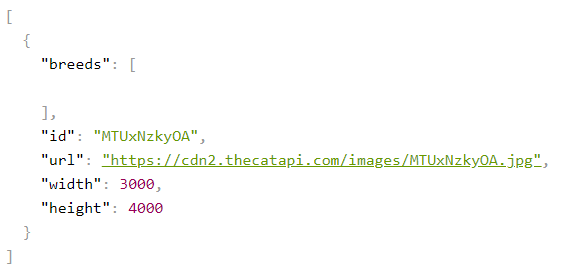
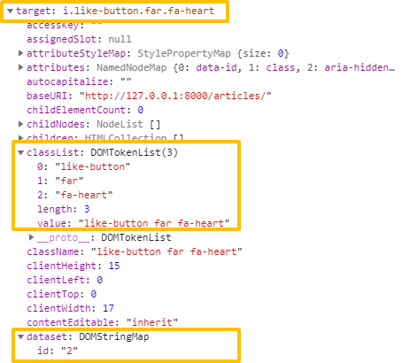
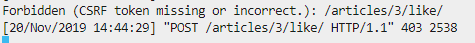

# 비동기처리

HTTP -> Ajax(HTTP를 효과적으로 활용) -> WebSocket

## Axios

- 브라우저와 Node.js에서 사용할 수 있는 Promise 기반의 HTTP 클라이언트 라이브러리
  - 비동기 방식
  - HTTP 데이터 요청을 실행한다
- 내부적으로는 직접적으로 XMLHttpRequest를 다루지 않고 Ajax 호출을 보낼 수 있다.
  
- `Promise` (ES6)
  
  -  비동기 요청을 보내고 응답을 받았을 때, 그 응답 결과를 어떻게 처리하자고 약속(Promise)하는 것
  - `.then` : 응답이 정상적으로 왔을 경우 -> 이제 어떻게 처리할지 결정
  - `.catch` : 응답이 잘 안나왔을 경우 -> 에러 처리 
  
- Ajax

  - XMLHttpRequest 를 사용해서 본인이 원하는 부분을 일부분만 바꿀 수 있다.

  - 새로운 통신 규약이 아닌, 기존의 HTTP 를 효과적으로 사용하기 위한 방법 중 하나일 뿐

    HTTP -> Ajax -> WebSocket


## 1. Dog and Cat

### 1.1 DOG API

#### 1.1.1 설치

- Node.js

  ```shell
  $ npm install axios
  ```

  - 설치가 완료되면, 폴더가 생긴다.

  - jsonplaceholder 

    - 가상의 데이터를 제공하여 테스트시 용이하게 사용할 수 있다.

    - Axios GET 요청해보기

      - 01_axios.js

        ```javascript
        const axios = require('axios')
        
        // axios를 통해 GET 요청
        axios.get('https://jsonplaceholder.typicode.com/posts/1')
        .then(response => {
          console.log(response)
        })
        .catch(error => {
          console.log(error)
        })
        ```

        

### 1.1.2 Dog and Cat

> 강아지 API 
>
> - `axios`를 이용하여 강아지 API 로부터 랜덤으로 강아지 사진을 가져온다


#### [기본]

- img url 찾기

  `response.data.message`

  ```javascript
  <div class="animals"></div>
  <script src="https://unpkg.com/axios/dist/axios.min.js"></script>
  <script> axios.get('https://dog.ceo/api/breeds/image/random')
      .then(response => {
      console.log(response.data.message)
  })
      .catch(error => {
      console.log(error)
  })
  </script>
  ```

- img URL 을 변수에 담는다.

  ```javascript
  const imgUrl = response.data.message
  ```

- img 태그를 만든다.

  ```javascript
  const imgTag = document.createElement('img')
  ```

- src 속성을 추가한다

  ```javascript
  imgTag.src = imgUrl
  ```

- HTML 문서에 요소를 위치시킨다

  ```javascript
  document.querySelector('.animals').appendChild(imgTag)
  ```

- 코드

  ```javascript
  <div class="animals"></div>
  <script src="https://unpkg.com/axios/dist/axios.min.js"></script>
  <script>
      axios.get('https://dog.ceo/api/breeds/image/random')
      .then(response => {
      // 1. img URL 을 변수에 담는다.
      const imgUrl = response.data.message
  
      // 2. img 태그를 만든다.
      const imgTag = document.createElement('img')
  
      // 3. src를 추가한다.
      imgTag.src = imgUrl
  
      // 4. HTML 문서에 요소를 위치시킨다.
      document.querySelector('.animals').appendChild(imgTag)
  })
      .catch(error => {
      console.log(error)
  })
  
  </script>
  ```

#### [ 콜백함수 ] 

- 함수로 작성하여, 함수를 호출할 때마다 강아지 사진이 랜덤으로 추가된다.

  - script코드

    `const getDogImage = () => {} `안의 위의 script 코드를 작성한다.

    ```javascript
    <script>
        const getDogImage = () => {
            axios.get('https://dog.ceo/api/breeds/image/random')
                .then(response => {
                // 1. img URL 을 변수에 담는다.
                const imgUrl = response.data.message
    
                // 2. img 태그를 만든다.
                const imgTag = document.createElement('img')
    
                // 3. src를 추가한다.
                imgTag.src = imgUrl
    
                // 4. HTML 문서에 요소를 위치시킨다.
                document.querySelector('.animals').appendChild(imgTag)
            })
                .catch(error => {
                console.log(error)
            })
        }
    </script>
    ```

    - console 창에 `getDogImage()` 함수를 호출할 때마다 강아지 사진이 추가된다.

#### [ 버튼 + 콜백함수 ]

- 버튼을 선택하고, 버튼을 클릭하면 만둘어 둔 콜백 함수가 실행되도록 수정

  - script 코드 : 버튼에 콜백함수를 이벤트로 지정한다

    ```javascript
    const dogButton = document.querySelector('#dog')
    	dogButton.addEventListener('click', getDogImage)
    ```

    ```javascript
    <button id="dog">댕댕이 나와라</button>
    <script src="https://unpkg.com/axios/dist/axios.min.js"></script>
    <script>
        const getDogImage = () => {
            axios.get('https://dog.ceo/api/breeds/image/random')
                .then(response => {
                // 1. img URL 을 변수에 담는다.
                const imgUrl = response.data.message
    
                // 2. img 태그를 만든다.
                const imgTag = document.createElement('img')
    
                // 3. src를 추가한다.
                imgTag.src = imgUrl
                imgTag.style.width = '200px'
                imgTag.style.height = '200px'
    
                // 4. HTML 문서에 요소를 위치시킨다.
                document.querySelector('.animals').appendChild(imgTag)
            })
                .catch(error => {
                console.log(error)
            })
        }
    
        axios.get('https://api.thecatapi.com/v1/images/search')
            .then(response => {
            console.log(response.data[0].url)
        })
            .catch(error => {
            console.log(error)
        })
    
        // 버튼을 선택하고, 버튼을 클릭하면 만들어둔 콜백함수가 실행된다. 
        const dogButton = document.querySelector('#dog')
        dogButton.addEventListener('click', getDogImage)
    </script>
    ```

    - 버튼을 누를 때마다 강아지사진이 추가된다.

### 1.2 Cat

> 고양이 버튼을 만들어, 고양이 사진을 가져온다.
>
> [고양이 API 바로가기](https://docs.thecatapi.com/)

#### [ 버튼 + 콜백 함수 ]

`response.data` 구조

[](https://github.com/Sunaaaa/TIL/blob/master/JavaScript/tpassets/1574215778452.png)

- script 코드

  ```javascript
  <script src="https://unpkg.com/axios/dist/axios.min.js"></script>
  <script>
      .
  	.
      const getCatImage = () => {
          axios.get('https://api.thecatapi.com/v1/images/search')
              .then(response => {
  
              const imgUrl = response.data[0].url
              const imgTag = document.createElement('img')
  
              imgTag.src = imgUrl
              imgTag.style.width = '200px'
              imgTag.style.height = '200px'
  
              document.querySelector('.animals').appendChild(imgTag)
          })
              .catch(error => {
              console.log(error)
          })
      }
  
      // 버튼을 선택하고, 버튼을 클릭하면 만들어둔 콜백함수가 실행된다. 
      const catButton = document.querySelector('#cat')
      catButton.addEventListener('click', getCatImage)
  </script>
  ```


## 2. Like (GET 요청)

- `Ajax`
  - Asynchronous JavaScript and XML
  - 브라우저에서 웹페이지를 요청하거나 링크를 클릭하면 화면갱신(새로고침) 이 일어났다. 이는 브라우저와 서버 간의 통신이 일어났다는 이야기다.
  - **JavaScript 를 활용해서 비동기적으로 서버와 브라우저가 데이터를 교환할 수 있는 통신방식**이다.
  - 페이지 전체를 다시 로드하는것이 아니라, **페이지에서 갱신이 필요한 일부분만 로드**함으로써 빠른 퍼포먼스와 부드러운 화면 표시가 가능하다
    - 사용자 경험(UX) 향상 + 서버 자원 이용 절감 -> 두 마리 토끼 다 잡기!
- `XHR(XMLHttpRequest)`
  - 브라우저는 XHR 객체를 요청해서 AJAX 요청을 생성하고 전송한다
  - 서버가 브라우저 요청에 응답 내용을 반환하면, 마찬가지로 XHR 객체가 그 결과를 처리한다.

### 2.1 좋아요 버튼을 부 - 드럽게

- 이전에 우리가 구현해둔 장고 코드에서는 좋아요 버튼을 누르면 페이지 전환(요청)을 통해 좋아요 기능이 이루어진다.
- **하지만 `axios`를 사용하면 페이지 전환 없이 좋아요 기능을 구현할 수 있다.**

수정 전 '좋아요' 기능 코드

```javascript
<!-- article/_article.html -->

<a href="">
    <!-- 사용자가 좋아요 누른 상태 -> 꽉찬 하트 -->
    
    <i class="fas fa-heart"></i>
    <!-- 안 누른 상태 -> 빈 하트 -->
    
    <i class="far fa-heart"></i>
    
</a>
```

#### 2.1.1 a태그 삭제, i태그 수정

- base.html에 Axios CDN을 넣는다.

```javascript
<!-- Axios CDN -->
<script src="https://unpkg.com/axios/dist/axios.min.js"></script>
```

- `i` 태그에 class를 지정한다.

  - querySelector Class로 선택하기 위해

    ```javascript
    <i class="like-button fas fa-heart"></i>
    ```

- `i` 태그에 `data-id`를 새로 추가한다.

  - `data-id` : JavaScript가 데이터를 처리할 때 해당 요소가 어떤 article의 번호인지를 구분하기 위해서 지정한다.

    ```javascript
    
    <i data-id="{{article.pk}}" class="like-button fas fa-heart"></i>
    <!-- 안 누른 상태 -> 빈 하트 -->
    
    <i data-id="{{article.pk}}" class="like-button far fa-heart"></i>
    
    ```

#### 2.1.2. Template 수정

index.html에 script 코드를 추가한다.

- event (e) 의 `Target`

  - classList : 이벤트가 발생한 좋아요 버튼에 설정된 `class` 목록들이 들어있다.

  - dataset : 이벤트가 발생한 좋아요 버튼의 `data-id` 로 설정해준 article의 id값이 들어간다.

    [](https://github.com/Sunaaaa/TIL/blob/master/JavaScript/tpassets/1574226885171.png)

- script 코드

  ```javascript
  <script>
  
      // 1. 모든 좋아요 버튼 가져오기
      const likeButtons = document.querySelectorAll('.like-button')
  
  // 2. forEach 함수 활용 -> 각각의 버튼 하나하나를 꺼내서 특정 동작을 추가한다.
  likeButtons.forEach(button => {
      button.addEventListener('click', function(e){
          console.log(e)
  
          // event.target.classList, event.target.dataset.id
          // 1. data-id에 article.pk가 들어있다. ==> 동적 라우팅 활용
          const articleId = e.target.dataset.id
  
          // 2. 해당 게시글의 '좋아요' 요청 보내기
          axios.get(`/articles/${articleId}/like/`)
          // 3. 응답 결과 확인
              .then( response => {
              console.log(response)
          })
              .catch(error => {console.log(error)})
      })
  })
  
  </script>
  ```

#### 2.1.3 View 수정

- 좋아요 버튼의 `articleId`를 찾아서 좋아요 요청을 보냈을 때, View 로직에서 보내준 boolean 값에 따라 클래스를 지우거나 추가한다.

- redirect 응답에 대한 결과로 `index.html` 을 받는게 아니라, JSON형태로 응답 결과를 반환받는다.
  - 좋아요 취소 -> `liked = False`
  - 좋아요 하면 -> `liked = True`

- Django 에서 제공하는 JsonResponse 를 사용해서 JSON형태로 결과를 반환 해보자.

  ```python
  # 공식문서 사용법
  from django.http import JsonResponse
  response = JsonResponse({'foo': 'bar'})
  response.content
  b'{"foo": "bar"}'
  ```

- views.py

  - '좋아요' 취소인 경우, `liked = False`로 설정해준다.

  - '좋아요' 인 경우, `liked = True`로 설정해준다.

    ```javascript
    from django.http import JsonResponse
    
    @login_required
    def like(request, article_pk):
        # 좋아요 누른 게시글 가져오기
        article = get_object_or_404(Article, pk=article_pk)
        # 현재 접속하고 있는 User
        user = request.user
        
        # 좋아요 취소
        if user in article.like_users.all():
            article.like_users.remove(user)
            liked = False
        
        # 좋아요 
        else : 
            article.like_users.add(user)
            liked = True
    
        context = {'liked' : liked}
    
        return JsonResponse(context)
    ```

- index.html

  - `event.target.dataset.id` : 이벤트가 발생한 좋아요 버튼의 게시글 pk 값

  - `event.target.classList` : 이벤트가 발생한 좋아요 버튼에 설정된 class 값들의 목록

    ```javascript
    <script>
        // 1. 모든 좋아요 버튼 가져오기
        const likeButtons = document.querySelectorAll('.like-button')
    
    	// 2. forEach 함수 활용 -> 각각의 버튼 하나하나를 꺼내서 특정 동작을 추가한다.
        likeButtons.forEach(button => {
        button.addEventListener('click', function(e){
            console.log(e)
    
            // 1. data-id에 article.pk가 들어있다. ==> 동적 라우팅 활용
            const articleId = e.target.dataset.id
    
            // 2. 해당 게시글의 '좋아요' 요청 보내기
            // like view 함수로 이동
            axios.get(`/articles/${articleId}/like/`)
            // 3. 응답 결과 확인
                .then( response => {
                if (response.data.liked){
                    e.target.style.color = 'crimson'
                } else {
                    e.target.style.color = "gray"
                }
            })
                .catch(error => {console.log(error)})
        })
    })
    
    </script>
    ```

### 2.2 좋아요 Count

#### 2.2.1 View

- views.py

  - `'count' : article.like_users.count(),`를 함께 전달한다.

    새로운 화면을 rendering하는게 아니라 수정되는 부분만 변경된다.

    ```javascript
    @login_required
    def like(request, article_pk):
        article = get_object_or_404(Article, pk=article_pk)
        user = request.user
    
        # 좋아요 취소
        if user in article.like_users.all():
            article.like_users.remove(user)
            liked = False
    
        # 좋아요 
        else : 
            # article.like_users.add(user)
            article.like_users.add(user)
            liked = True
    
        context = {
            'liked' : liked,
            'count' : article.like_users.count(),    
        }
        return JsonResponse(context)
    ```

#### 2.2.2 Template

- _article.html

  ```javascript
  <span id="like-count-{{article.pk}}"> {{ article.like_users.all|length }} </span>명이 이 글을 좋아합니다. <br>
  ```

- index.html의 script 코드 작성

  - 알맞은 id 값을 가진 span 태그를 선택해서, 사용자가 '좋아요' 누를 때마다 response.data.count 값으로 갱신시킨다.

    ```javascript
    <script>
        const likeButtons = document.querySelectorAll('.like-button')
        likeButtons.forEach(button => {
        button.addEventListener('click', function(e){
            console.log(e)
    
            const articleId = e.target.dataset.id
    
            axios.get(`/articles/${articleId}/like/`)
                .then( response => {
    
                // span 태그 찾기.넘겨 받은 count 값으로 갱신      
                document.querySelector(`#like-count-${articleId}`).innerHTML = response.data.count
    
                if (response.data.liked){
                    e.target.style.color = 'crimson'
                } else {
                    e.target.style.color = "gray"
                }
            })
                .catch(error => {console.log(error)})
        })
    })
    
    </script>
    ```

- _article.html

  - '좋아요' 아이콘과 style 수정

    - 빈 하트 -> gray 색으로 꽉 찬 하트

      - '좋아요'가 된 경우 'crimson' 색으로 style 변경

      - '좋아요'가 취소된 경우 'gray' 색으로 style 변경

        ```javascript
        
        <i data-id="{{article.pk}}" class="like-button fas fa-heart"  style="color : crimson; cursor : pointer; "></i>
        
        <i data-id="{{article.pk}}" class="like-button fas fa-heart"  style="color : gray; cursor : pointer; "></i>
        
        ```


## 3. Like(POST 요청)

[Django-AJAX](<https://docs.djangoproject.com/en/2.2/ref/csrf/#setting-the-token-on-the-ajax-request>)

#### 3.1 POST 요청

- like 요청은 데이터베이스에 조작을 가하는 로직이기 때문에 GET 요청이 아니라 POST 요청이 적절하다

- POST 요청

  - `axios.get()` -> `axios.post()`

    ```javascript
    axios.post(`/articles/${articleId}/like/`)
    ```

- 실행하면 403  ( Forbidden ) Error

  [](https://github.com/Sunaaaa/TIL/blob/master/JavaScript/tpassets/1574228696945.png)

- 지금 요청에선 Django Form 을 통해 CSRF TOKEN을 넘겨줄 수 없으므로 **Cookie** 에 담아서 직접 요청을 진행하자

  ```javascript
  likeButtons.forEach(button => {
    button.addEventListener('click', function(event) {
        const articleId = event.target.dataset.id
        axios.defaults.xsrfCookieName = 'csrftoken'
        axios.defaults.xsrfHeaderName = 'X-CSRFToken'
        ...
  ```

- index.html

  ```javascript
  <script>
  
      // 1. 모든 좋아요 버튼 가져오기
      const likeButtons = document.querySelectorAll('.like-button')
  
      // 2. forEach 함수 활용 -> 각각의 버튼 하나하나를 꺼내서 특정 동작을 추가한다.
      likeButtons.forEach(button => {
      button.addEventListener('click', function(e){
          console.log(e)
  
          // event.target.classList, event.target.dataset.id
          // 1. data-id에 article.pk가 들어있다. ==> 동적 라우팅 활용
          const articleId = e.target.dataset.id
          axios.defaults.xsrfCookieName = 'csrftoken'
          axios.defaults.xsrfHeaderName = 'X-CSRFToken'
          // 2. 해당 게시글의 '좋아요' 요청 보내기
          axios.post(`/articles/${articleId}/like/`)
          // 3. 응답 결과 확인
              .then( response => {
  
              // 알맞은 id 값을 가진 span 태그를 선택해서,
              // 사용자가 '좋아요' 누를 때마다 response.data.count 값으로 갱신시킨다. 
              // span 태그 찾기                                   // 넘겨 받은 count로 갱신        
              document.querySelector(`#like-count-${articleId}`).innerHTML = response.data.count
  
              if (response.data.liked){
                  e.target.style.color = 'crimson'
              } else {
                  e.target.style.color = "gray"
              }
          })
              .catch(error => {console.log(error)})
      })
  })
  
  </script>
  ```

  

#### 3.2 `is_ajax()` 분기

- ajax 요청이면 좋아요 기능수행, 아니면 400 ERROR

  ```python
  from django.http import JsonResponse, HttpResponseBadRequest
  ```

- view.py

  ```python
  # articles/views.py
  @login_required
  def like(request, article_pk):
      if request.is_ajax():
          article = get_object_or_404(Article, pk=article_pk)
          ...
      else:
          return HttpResponseBadRequest
  ```

- 하지만 지금은 Django 가 들어온 요청이 Ajax 인지 구분할 방법이 없다. 요청을 보낼 때 XHR 객체를 담아서 함께 보내주자.

  ```javascript
  // articles/index.html
  likeButtons.forEach(button => {
      button.addEventListener('click', function(event) {
          const articleId = event.target.dataset.id
          // XHR 객체를 담아서 보내준다.
          axios.defaults.headers.common['X-Requested-With'] = 'XMLHttpRequest'
          ...
  ```

**회원인 경우에만 Ajax 요청이 가능**

- index.html의 script 코드

  - DTL을 이용해 alert 창으로 로그인이 필요한 서비스임을 알린다.

    ```javascript
    <script>
        .
        .
    	<!-- 로그인을 한 경우 -->
        
        
        axios.post(`/articles/${articleId}/like/`)
            .then( response => {
            document.querySelector(`#like-count-${articleId}`).innerHTML = response.data.count
    
            if (response.data.liked){
                e.target.style.color = 'crimson'
            } else {
                e.target.style.color = "gray"
            }
        })
            .catch(error => {console.log(error)})
    
    	<!-- 로그인을 하지 않은 경우 -->
         
         
         alert('로그인을 해야 좋아요를 사용할 수 있습니다. ')
    
         
         })
    
     </script>
    ```

- views.py

  ```javascript
  # 좋아요 기능
  @login_required
  def like(request, article_pk):
      if request.is_ajax():
          article = get_object_or_404(Article, pk=article_pk)
      
          .
          .
          
          return JsonResponse(context)
      else:
          return HttpResponseBadRequest
  ```

