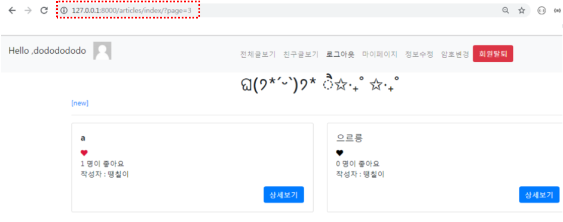

# Pagination & Search

## 1. Pagination

- 페이지 버튼 달아주기

- bootstrap - Components - Pagination

  - ```html
    <nav aria-label="Page navigation example">
      <ul class="pagination justify-content-center">
        <li class="page-item disabled">
          <a class="page-link" href="#" tabindex="-1" aria-disabled="true">Previous</a>
        </li>
        <li class="page-item"><a class="page-link" href="#">1</a></li>
        <li class="page-item"><a class="page-link" href="#">2</a></li>
        <li class="page-item"><a class="page-link" href="#">3</a></li>
        <li class="page-item">
          <a class="page-link" href="#">Next</a>
        </li>
      </ul>
    </nav>
    ```

    

### 1.1 GET 방식으로 페이지 보기

#### 1.1.1 view.py

- import 

  ```python
  from django.core.paginator import Paginator
  ```

  

 1. articles.를 Paginator 에 넣기

    ```python
     # - Paginator (전체 리스트, 보여줄 개수)
        paginator = Paginator(articles, 2)
    ```

    

 2. 사용자가 요청한 page 가져오기

    ```python
    page =request.GET.get('page') 
    ```

    

 3. 해당하는 page의 article 만 가져오기

    ```python
     articles = paginator.get_page(page)
    ```

    

- 전체 코드

  ```python
  # Create your views here.
  
  def index(request):
      if request.user.is_authenticated:
          gravatar_url = hashlib.md5(request.user.email.encode('utf-8').lower().strip()).hexdigest()
      else:
          gravatar_url = None
  
      articles = Article.objects.all()[::-1]
      # 1. articles를 Paginator 에 넣기
      # - Paginator (전체 리스트, 보여줄 개수)
      paginator = Paginator(articles, 2)
      # 2. 사용자가 요청한 page 가져오기
      page =request.GET.get('page') 
      # 3. 해당하는 page의 article 만 가져오기
      # print(dir(paginator(dir)))
  
      articles = paginator.get_page(page)
      context =  {'articles': articles,'gravatar_url':gravatar_url,}
      return render(request, 'articles/index.html', context)
  
  ```

  

- 실행화면

  - GET 방식으로 쿼리스트링을 통해 페이지 보기 가능 

    

#### 1.1.2 Template

### 1.2 POST 로 바꿔보기

  

  - articles
    - ['__abstractmethods__', '__class__', '__contains__', '__delattr__', '__dict__', '__dir__', '__doc__', '__eq__', '__format__', '__ge__', '__getattribute__', '__getitem__', '__gt__', '__hash__', '__init__', '__init_subclass__', '__iter__', '__le__', '__len__', '__lt__', '__module__', '__ne__', '__new__', '__reduce__', '__reduce_ex__', '__repr__', '__reversed__', '__setattr__', '__sizeof__', '__slots__', '__str__', '__subclasshook__', '__weakref__', '_abc_impl', 'count', 'end_index', 'has_next', 'has_other_pages', 'has_previous', 'index', 'next_page_number', 'number', 'object_list', 'paginator', 'previous_page_number', 'start_index']
  - print(dir(articles.paginator))
    - ['__class__', '__delattr__', '__dict__', '__dir__', '__doc__', '__eq__', '__format__', '__ge__', '__getattribute__', '__gt__', '__hash__', '__init__', '__init_subclass__', '__le__', '__lt__', '__module__', '__ne__', '__new__', '__reduce__', '__reduce_ex__', '__repr__', '__setattr__', '__sizeof__', '__str__', '__subclasshook__', '__weakref__', '_check_object_list_is_ordered', '_get_page', 'allow_empty_first_page', 'count', 'get_page', 'num_pages', 'object_list', 'orphans', 'page', 'page_range', 'per_page', 'validate_number']
    - 
  - 
  - 

  

- 휴 
  - 휴
- 휴
- 휴
- 휴

### 


## 2. Search

### 2.1 검색창 

#### 2.1.1 Template

- 검색 창 기능을 할 form 을 bootstrap 으로 구현하기
- Bootstrap > Components > Forms > Form row

- `index.html`

  - 이 코드를 게시글 띄우는 코드 위에 넣는다

  ```html
  <form class="mb-4" action = " ">
    <div class="form-row justify-content-end">
      <div class="col-12 col-sm-9 col-md-10">
        <input type="text" name="query" class="form-control" placeholder="검색어를 입력해주세요">
      </div>
      <div class="col-3 col-sm-3 col-md-2">
        <input type="submit" class="form-control btn btn-success" value="검색">
      </div>
    </div>
  </form>
  
  ```

- [실행화면]

  

### 2.2 검색 기능 


#### 2.2.1 search함수 구현

- `views.py`

  ```python
  def search(request):
      #1. 사용자가 입력한 검색어 가져오기
      query=request.GET.get('query')
      #2. DB에서 query가 포함된 제목을 가진 article 가져오기
      # __contains : 지정한 문자열 포함하는 자료검색
      # __icontains : 지정한 문자열 포함하는 자료검색  ( 대소문자 구별 x )
      articles = Article.objects.filter(title__icontains=query)
      # 3. context 로 템플릿에 전달
      context = {
          'articles' : articles,
       }
      return render(request, 'articles/search.html', context)
  ```

- `search.html`

  - 검색 결과 화면
  - With badges 을 통해 띄워준다
    - Bootstrap> Components >  List group > With badges
  -  검색결과에 해당하는 게시글 for문으로 띄우고 각 게시글에 달려있는 댓글도 가져온다

  ```html
  
  
  
  
  
  
  
  <ul class="list-group">
  
  <a href="" class="mb-2">
    <li class="list-group-item d-flex justify-content-between align-items-center">
      [{{forloop.counter}}] {{ article.title }}
      <span class="badge badge-warning badge-pill">
      {{article.comment_set.all|length}}
      </span>
    </li>
  </a>
  
  </ul>
  
  
  ```

- `urls.py`

  - 검색 form 이 이동할 url 

  ```python
  path('search/', views.search, name='search'),
  ```

- `index.html`

  - 검색 form 에 생성한 search url 을 연결

  ```html
  <form class="mb-4" action = "">
    <div class="form-row justify-content-end">
      <div class="col-12 col-sm-9 col-md-10">
        <input type="text" name="query" class="form-control" placeholder="검색어를 입력해주세요">
      </div>
      <div class="col-3 col-sm-3 col-md-2">
        <input type="submit" class="form-control btn btn-success" value="검색">
      </div>
    </div>
  </form>
  
  ```

- [실행결과]

  

  

