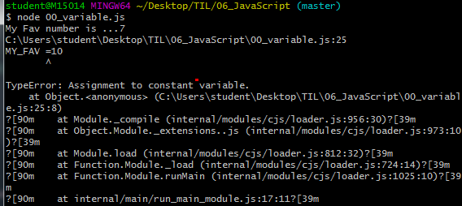
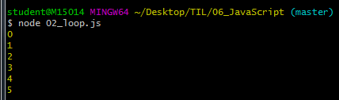
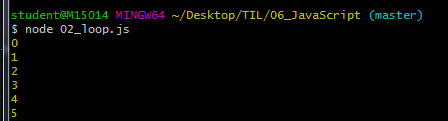
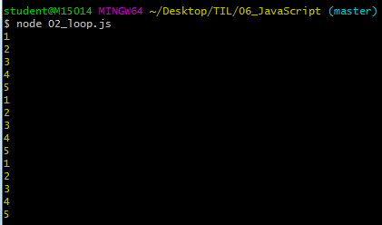
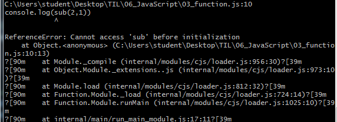

# JavaScript Syntax basics

## 0. 사전준비

### 0.1 Node.js


### 0.4


## 1. Variable

### 1.1 let(변수)

- 값을 재할당 할 수 있는 변수를 선언하는 키워드

- 변수 선언은 한 번만 할 수 있다,

  - 하지만 할당은 여러번 할 수 있다

    ```javascript
    let x = 2
    x=3 #재할당가능
    console.log(x)
    
    ```

- 블록 유효 범위 (Block Scope)를 갖는 지역변수

  ```javaScript
  let x=1
  if (x===1){
    let x = 2
      #if문 만큼의 유효범위를 갖고 있다.
    console.log(x)  
  }
  console.log(x)
  ```

  

### 1.2 const(상수)

- 값이 변하지 않는 상수를 선언하는 키워드

  - 상수의 값은 재할당을 통해 바뀔 수 없고, 재선언도 불가능하다

- let과 동일하게 `block Scope`를 가진다.

- 웬만하면 모든 선언에서 상수를 쓴다.

  - 일단 상수를 사용하고, 값이 바뀌는게 자연스러운 상황이면 그때 변수 (let)로 바꿔서 사용하는 것을 권장한다.

    ```javascript
    #const(상수)
    const MY_FAV = 7
    console.log('My Fav number is ...' + MY_FAV)
    
    
    ```

  - 상수 재할당 에러 | 상수 재선언 에러

    ```javaScript
    //const(상수)
    const MY_FAV = 7
    console.log('My Fav number is ...' + MY_FAV)
    # 출력 : My fav number is ...7
    
    //상수 재할당 에러 -> Assignment
    const MY_FAV = 7
    MY_FAV =10

    //상수 재선언 에러 -> already been decleard
const MY_FAV = 7
    const MY_FAV = 20
    let MY_FAV =11
    ```
    
    
    

- 변수와 정수는 어디에 써야할까?
  - 어디에 변수를 쓰고, 어디에는 상수를 쓰고 하는 등의 결정은 프로그래머 몫
  - 파이 근삿값과 같은 값은 상수가 적절(변할 일이 없는 값)
- `var` vs `let` vs `const`
  - `var` : 할당 및 선언 자유, 함수 스코프
  - `let` : 할당 자유, 선언은 한번만, 블록 스코프
  - `const` : 할당 한번만 , 선언도 한번만, 블록 스코프
- var는 호이스팅과 같은 여러 문제를 야기하기 때문에, 앞으로 let과 const를 이용해서 개발을 진행하자.


## 2. 조건문

### 2.1 `if`문

- 파이썬의 if문과 흡사!`elif`만 `else if`로 바꾸면 됨

## 3. 반복문

### 3.1 while

- ```python
  let i =0
  while(i<6){
    console.log(i)
    i++
  }
  ```

- 

### 3.2 for loop

-  JavaScript 가장 기본적인 반복문. for문에서 사용할 변수 하나 정의하고, 그 변수가 특정 조건에 false값이 될때까지 계속 연산 -반복

- ```javascript
  for (let j =0; j<6; j++){
    console.log(j)
  }
  ```

- 

- 그 외 다른 for문

  ```javascript
  const numbers = [1,2,3,4,5]
  for (let number of numbers){
    console.log(number)
  }
  
  for (let number of [1,2,3,4,5]){
    console.log(number)
  }
  
  for (const number of [1,2,3,4,5]){
    console.log(number)
  }
  ```

  


# 4. 함수 (function)

> 함수 선언식(statement) :  코드가 실행되기 전에 로드됨
>
> 함수 표현식(expression) : 인터프리터가 해당 코드에 도달했을 때 로드됨


## 4.1 선언식

```javascript
//선언식
console.log(add(1,2))
function add(num1, num2){
  return num1 +num2
}
console.log(add(1,2))
# ok
```


## 4.2 표현식

```javascript
//표현식
console.log(sub(2,1))
const sub = function sub(num1, num2){
  return num1 -num2
}
console.log(sub(2,1))
# error
```

- 에러발생 


# 5. 화살표 함수(Arrow function)

- ES6 이후
- function과 중괄호 숫자를 줄이려고 고안된 문법
  1. function 키워드 생략 가능
  2. 함수에 매개변수 하나 -> () 생략 가능
  3. 함수 바디에 표현식 하나 -> `{}` `return` 생략 가능
- 화살표 함수의 경우 function 키워드로 정의한 함수와 100% 동일하지 않다.

- 화살표 함수는 항상 **익명함수**

  ```javascript
  //화살표 함수 ( Arrow function )
  // 일반적인 function 키워드 함수를 짧게 바꿔보자.
  const iot1 = function(name){
    return 'hello! ${name}!'
  }
  
  // 1. function 키워드 삭제
  const iot1 = (name) => {  return 'hello! ${name}!'  }
  
  // 2. () 생략 (함수 매개변수 하나일 경우)
  const ioti = name => { return 'hello! ${name}' }
  
  //3. {}, return 생략 (바디에 표현식 1개)
  const ioti = name => 'hello! ${name}'
  ```

- [실습]

  ```javascript
  //[실습] 3단계에 걸쳐 화살표 함수로 바꿔보기
  let square = function(num){
    return num**2
    }
  
  // 1. function 키워드 생략
  square = (num) => {return num**2}
  // 2. ()생략 
  square = num => {return num**2}
  // 3. {}, return  생략 (바디 부분 표현식 1개)
  square = num => num**2
  ```

  