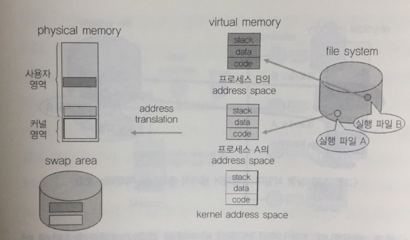
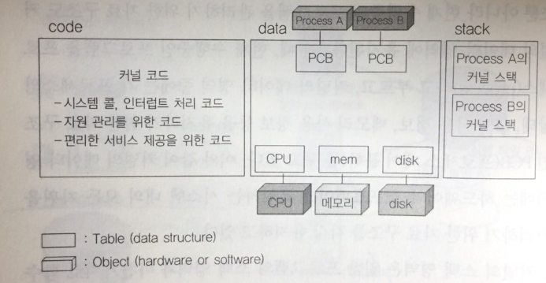

# 1. 컴퓨터 시스템의 구조

- 프로그램이 CPU 에서 명령을 수행하려면 수행하려는 주소 영역이 메모리에 올라가 있어야 한다. 이때 프로그램의 주소 영역은 크게 **코드, 데이터, 스택 영역** 으로 구분된다
- 코드 영역은 우리가 작성한 프로그램 함수들의 코드가 기계어 명령으로 변환되어 저장되는 부분이다.
- 데이터 영역은 전역 변수 등 프로그램이 사용하는 데이터를 저장하는 부분이다
- 스택영역은 함수가 호출될 때 호출된 함수의 수행을 마치고 복귀할 주소 및 데이터를 임시로 저장하는데 사용되는 공간이다.
- 일반적으로 프로그램 내에서 발생되는 함수 호출에 필요한 복귀 주소는 각 프로그램의 주소 공간 중 스택 영역에 보관한다.
- 반면, 인터럽트 때문에  CPU를 선점당한 위치를 저장하기 위한 공간은 OS 커널 부분에 존재하게 된다.
- OS는 현재 실행중인 모든 프로그램을 관리하기 위한 자료구조를 유지하고 있다.

```python
예를 들어 A,B 두 개의 프로그램이 현재 수행중이라면 
커널 어딘가에 이 두 프로그램을 관리하기 위한 자료 구조가 존재한다. 

이 자료 구조를 "프로세스 제어 블록(PCB)"라 부른다.
```

- PCB에는 인터럽트가 발생했을 때 그 프로그램의 어느 부분까지 수행했는지를 저장하기 위한 영역이 존재한다.

```python
프로그램 A가 수행중에 인터럽트가 발생하면
현재 실행중이던 지점을 A의 프로세스 제어 블록에 저장한 후,
인터럽트 처리 루틴으로 가서 인터럽트 발생관련 일 처리를 한다.

인터럽트 처리를 모두 마치면 
프로그램 A의 프로세스 제어 블록에 저장된 주소를 복원시켜 원래 수행하던 일을 재개하게 된다.
```


# 2. 컴퓨터 시스템의 작동 개요

- CPU 를 컴퓨터의 두뇌라고 부르지만 CPU 는 인간의 뇌 처럼 스스로 생각하고 판단하는 능력을 갖추고 있지는 못하다. 이는 CPU 가 빠른 속도로 처리하는 계산 능력은 가지고 있지만, 어떠한 작업을 수행해야 하는지에 대해 스스로 결정하는 능력은 없기 때문이다.

- CPU 는 현재 수행해야할 메모리 주소의 명령을 있는 그대로 처리할 뿐이다. 이 때, CPU 가 수행해야할 메모리 주소를 담고 있는 레지스터를 프로그램카운터라고 부른다. 즉. CPU 는 매번 프로그램 카운터가 가리키는 메모리 영역의 명령을 처리하게 된다.

- 일반적을 조건문, 반복문, 함수 호출 등에 의한 주소 이동이 없는 이상 프로그램 카운터는 바로 다음 주소의 명령을 가리키게되어 코드의 순차적인 수행이 이루어진다.

- 메모리에는 사용자 프로그램 + OS  같이 올라가 수행된다. 이 때 CPU 는 프로그램 카운터가 가리키는 메모리 위치의 프로그램을 수행하게 된다.

  ```python
  if 프로그램 카운터가 메모리 주소 중 OS가 존재하는 부분을 가리킨다면 
      CPU가 커널 모드에서 수행중이라고 이야기한다.
  else
      CPU가 사용자 모드에서 수행중이라고 이야기한다.
  ```


- CPU  가 수행하는 명령에는 일반 명령과 특권 명령이 있다.
- 일반 명령은 메모리에서 자료를 읽어와서 CPU 에서 계산하고 결과를 메모리에 쓰는 일련의 명령들을 말한다. 이러한 일반 명령은 모든 프로그램이 수행할 수 있는 명령이다.
- 특권 명령은 **보안**이 필요한 명령으로 입출력 장치, 타이머 등 각종 **장치를 접근**하는 명령이다.
- 컴퓨터 시스템에서는 CPU 내에 모드 비트를 두어 특권 명령을 항상 OS만이 수행할 수 있도록 제한하고 있다.
- 사용자 프로그램이 특권 명령의 수행이 필요한 경우 OS 에게 특권 명령의 대행을 요청한다. 이와 같은 서비스 요청을 시스템 콜 이라고 한다.
- 사용자 프로그램이 시스템 콜을 하게 되면 OS 는 자신의 커널 영역에 정의된 시스템 콜 처리 코드를 수행하게 된다.
- 프로그램이 아닌 주변 장치가 CPU 에게 서비스를 요청할 떄에도 시스템 콜과 비슷한 방식을 사용한다
- CPU 는 프로그램 카운터가 가리키는 메모리 위치의 명령만 계속 수행하기 때문에 주변 장치의 상태를 지속적으로 파악할 수 없다. 따라서 주변 장치는 CPU 의 도움이 필요한 경우 인터럽트를 사용해 CPU 에게 서비스를 요청하게 된다.
- 인터럽트를 발생시키기 위해 주변 장치는 인터럽트 라인을 세팅하고 CPU 는 매번 명령을 수행한 후 인터럽트 라인을 체크해 서비스 요청이 있는지 체크한다.
- 인터럽트가 발생하면 CPU 는 해당 인터럽트를 처리하기 위한 루틴으로 넘어가서 커널 내의 인터럽트 처리 코드를 수행한다.


# 3. 프로그램의 실행

- "프로그램이 실행되고 있다" 는 것은 컴퓨터 시스템 차원에서 볼 때 크게 두가지 중요한 의미를 갖는다.
- 첫째는 디스크에 존재하던 **실행 파일**이 메모리에 적재 됨을 의미한다
- 두번째는 프로그램이 CPU 를 할당받고 기계 명령을 수행하고 있는 상태를 의미한다
- 일반적인 컴퓨터 시스템의 경우 CPU 는 하나밖에 없으므로 매 시점 CPU 에서 명령을 수행하는 프로그램은 하나 뿐이다. 하지만, 여러 프로그램이 짧은 시간 단위로 CPU 를 나누어 쓰고, 이들 프로그램이 메모리에 동시에 적재되어 있을 수 있으므로 여러 프로그램이 동시에 실행된다는 말을 보편적으로 사용하는 것이다.

- 실행 파일이 메모리에 적재 될 때 실행 파일 전체가 메모리에 한꺼번에 올라가기보다는 일부분만 메모리에 올라가고 나머지는 디스크의 특정 영역에 내려가 있는 것이 일반적이다. 이는 여러 프로그램이 공유하는 메모리 공간을 효율적으로 사용하기 위한 방법이다.
- 프로그램의 주소 공간 중 당장 CPU 의 수행에 필요한 부분은 메모리에 올려놓고 그렇지 않은 부분은 디스크 중 메모리의 연장 공간으로 사용되는 스왑 영역에 내려놓는 방식으로 운영된다.
- 

- 프로세스의 주소 공간은 코드, 데이터, 스택 등으로 구성된다. 각각의 프로그램마다 이러한 주소 공간을 별도로 가지며, 각 프로그램마다 독자적으로 존재하는 이와 같은 주소 공간을 가상 메모리 또는 논리적 메모리라 부른다.
- 

주소 변환에 의해  프로세스의 논리적 주소 공간이 물리적 메모리에 적재되는 모습


- OS 도 하나의 프로그램이므로 OS 커널 역시 코드, 데이터, 스택의 주소 공간 구성을 갖는다
- 커널의 코드
  - OS의 기능 : 아랫단의 HW 자원을 효율적으로 관리하는 일 + 윗단의 응용 프로그램 및 사용자에게 편리한 서비스 제공
  - CPU, 메모리 등의 자원을 관리하기 위한 부분 + 사용자에게 편리한 인터페이스를 제공하기 위한 부분이 주를 이룬다.
  - 이 밖에도 시스템 콜 및 인터럽트를 처리하기 위한 부분을 포함한다.
- 커널의 데이터 영역
  - 각종 자원을 관리하기 위한 자료구조가 저장된다
  - CPU, 메모리와 같은 HW 자원을 관리하기 위한 자료 구조 뿐만 아니라 현재 수행중인 프로그램을 관리하기 위한 자료 구조도 커널의 데이터 영역에 유지된다.
  - 이 떄, 현재 수행중인 프로그램을 프로세스라고 부른다.
  - 각 프로세스의 상태, CPU 사용 정보, 메모리 사용 정보 등을 유지하기 위한 자료구조 PCB가 존재한다. 
  - 즉 HW + SW 를 포함하는 시스템 내의 모든 자원을 관리하기 위한 자료 구조를 각각 유지한다.


- 커널의 스택 영역

  - 함수 호출 시 복귀 주소를 저장하기 위한 용도로 사용된다.

  - 커널의 스택은 일반 사용자 프로그램의 스택과 달리 현재 수행중인 프로세스마다 별도의 스택을 두어 관리한다.

  - 즉, 프로그램이 실행되어 자기 자신의 코드 내에서 함수 호출 및 복귀 주소를 유지하기 위해서는 자기 주소 공간 내의 스택을 사용하고, 시스템 콜 등 커널 내의 함수를 호출하는 경우에는 커널의 주소공간에 존재하는 커널 스택을 사용하게 된다.

    ```python
    Q. 프로세스마다 별도의 스택을 두는 이유
    
    프로세스가 함수를 호출할 때 자기 주소 영역 내부에 정의된 함수를 호출하면 
    자신의 스택에 복귀 주소를 저장하지만,
    프로세스가 특권 명령을 수행하려고 커널에 정의된 시스템 콜을 호출하고
    시스템 콜 내부에서 다른 함수를 호출하는 경우
    그 복귀 주소는 커널 내의 주소가 되어
    사용자 프로그램의 스택과는 별도의 저장 공간이 필요하기 때문이다.
    
    또한, 커널은 일종은 공유 코드로서
    모든 사용자 프로그램이 시스템 콜을 통해 커널의 함수를 접근 할 수 있으므로 
    일관성 유지를 위해 각 프로세스마다 커널 내에 별도의 스택을 두게 된다.
    ```

    



 운영 체제의 주소 공간 구조


# 4. 사용자 프로그램의 사용 함수

- 프로그램이 사용하는 함수는 크게 **사용자 정의 함수**와 **라이브러리 함수**, **커널 함수** 세 가지로 구분할 수 있다.
- 사용자 정의 함수란 프로그래머가 직접 작성한 함수를 뜻한다.
- 라이브러리 함수란 누군가가 작성해 놓은 함수를 호출만 하여 사용하는 경우를 뜻한다.
- 사용자 정의 함수와 라이브러리 함수는 모두 **컴파일**하여 실행 파일을 만들게 되면 
   프로그램의 코드 부분에 **기계어 명령** 형태로 삽입된다. 
   따라서 이 두 함수는 프로그램이 실행될 때에 해당 프로세스의 주소 공간에 포함된다. 
   또한, 함수 호출시에도 자신의 주소 공간에 있는 **스택**을 사용하게 된다.
- 한편 커널 함수는 OS 커널의 정의된 함수를 뜻한다.
- **커널 함수**의 종류에는 사용자 프로그램이 OS의 서비스를 요청하기 위한 **시스템 콜 함수**와 
   HW / SW가 CPU의 서비스를 요청하기 위한 **인터럽트 처리 함수**가 있다.
- 이와 같은 커널 함수는 OS 커널의 주소 공간에 코드가 정의된다. 
   즉, OS 있는 함수를 사용자 프로그램이 호출해서 사용하는 것이다.


# 5. 인터럽트

- 인터럽트와 관련된 주요 용어로는 **인터럽트 벡터**와 **인터럽트 핸들러**가 있다.

- 인터럽트 벡터

  - 여러가지 인터럽트에 대해 해당 인터럽트 발생시 처리해야 할 루틴의 주소를 보관하고 있는 테이블을 의미한다.
  - 일종의 함수를 가리키는 **포인터**라고도 할 수 있다.

- 인터럽트 핸들러

  - 실제 인터럽트를 처리하기 위한 루틴으로 **인터럽트 서비스 루틴**이라고도 부른다.

  - OS 코드 부분에는 각종 인터럽트별로 처리해야 할 내용이 이미 프로그램되어 있으며, 
     이 부분을 **인터럽트 서비스 루틴** 또는 **인터럽트 핸들러**라고 부른다.

    

# 6. 시스템 콜

- 컴퓨터 시스템에서는 HW 및 SW 자원의 보안을 위해 CPU가 실행할 수 있는 명령을 **일반 명령**과 **특권 명령**으로 나누어 관리한다.
- 사용자 프로그램이 CPU의 제어권을 가지고 프로그램을 수행하다 보면, 입출력 등 특권 명령을 수행해야 할 필요가 있다. 
   이 경우 사용자가 프로그램은 OS에게 **시스템 콜**을 통해 **특권 명령의 대행**을 요청하게 된다. 
   사용자 프로그램이 이와 같이 특권 명령을 수행하는 커널 함수를 호출하게 되면 CPU의 제어권이 OS에게 넘어가게 된다. 
   이 때 하드웨어적으로 모드 비트가 1에서 0으로 자동 세팅되기 때문에 OS는 특권 명령을 수행할 수 있다.

- 모든 프로그램은 **자신의 독자적인 주소 공간**을 가지고 있으며,  프로그램이 함수 호출을 하는 경우 자신의 주소 공간 내에서 호출이 이루어지게 된다.  그러나 **시스템 콜**은 비록 함수 호출이긴 하지만 자신의 주소 공간을 거스르는 영역에 존재하는 함수를 호출하는 것이다.  **커널**이라는 다른 프로그램의 주소 공간에 존재하는 함수를 호출하는 일이기 때문이다.
- 시스템 콜은 주소 공간 자체가 다른 곳으로 이동해야 하므로 일반 함수 호출과는 **상이한 방법**을 사용한다.  프로그램 자신이 인터럽트 라인에 인터럽트를 세팅하는 명령을 통해 이루어진다.

- 떤 프로그램이 CPU를 할당받고 명령을 수행하다 중간에 CPU를 선점당하는 경우는 크게 두 가지 경우가 있다.

1. 타이머에 의해 인터럽트 발생    
   - 특정 프로그램이 CPU를 독점하는 것을 방지하기 위한 하드웨어로  CPU 할당 시간이 만료되면 인터럽트를 발생시킨다.
   - 이러한 는 여러 프로세스가 CPU를 나누어 사용하는 **시분할 시스템**의 구현을 위한 필수적인 요소이다.
2. 입출력 요청을 위한 시스템 콜    
   - 오래 걸리는 입출력 작업이 완료되기까지 그 프로세스에게 CPU를 다시 할당하더라도  당장 다음 명령을 수행하지 못하는 경우가 일반적이므로 CPU를 다른 프로세스에게 이양하게 된다.
   - 입출력을 요청했던 프로세스는 입출력 요청이 완료되어 컨트롤러가 인터럽트를 발생시킨 시점부터  다시 CPU를 얻을 수 있는 기회가 생기며 CPU를 기다리는 큐에 삽입하여 CPU 할당을 기다린다.


# 7. 프로세스의 상태

- 프로세스의 상태는 **실행**, **준비**, **봉쇄**의 세 가지로 크게 나누어 볼 수 있다.

  

- 실행

  - CPU를 할당받고 **기계어 명령**을 수행하고 있는 프로세스의 상태이다.

    

- 준비 상태

  - CPU만 할당받으면 당장 명령을 수행할 수 있지만 CPU가 하나밖에 없어 현재 CPU를 할당받지 못한 프로세스의 상태이다.

    

- 봉쇄 상태

  - CPU를 할당받더라도 명령을 수행할 수 없는 프로세스의 상태이다. 
     프로세스가 요청한 입출력 작업이 진행중인 경우 CPU를 할당받더라도 입출력이 끝나기전까지 작업을 진행할 수 없기 때문에 CPU를 할당하지 않는다.

- **준비 상태**에 있는 프로세스가 **실행 상태**로 변경되는 경우는 
   실행 상태에 있던 프로세스가 입출력 요청 등으로 **봉쇄 상태**가 되거나 또는 실행 상태에 있던 프로세스의 CPU 할당 시간이 만료되어 **타이머 인터럽트**가 발생한 경우를 들 수 있다.
- OS는 준비 상태에 있는 프로세스들을 줄 세우기 위해 **준비 큐(Ready Queue)**를 두고 
   준비 큐의 제일 앞에 있는 프로세스에게 CPU를 할당한다. 
   준비 큐에 프로세스를 줄 세우는 방법은 CPU 스케줄링 방법에 따라 달라진다.

- OS는 **특정 자원**을 기달리는 프로세스들을 줄 세우기 위해 **자원별**로 **큐**를 두고 있다.