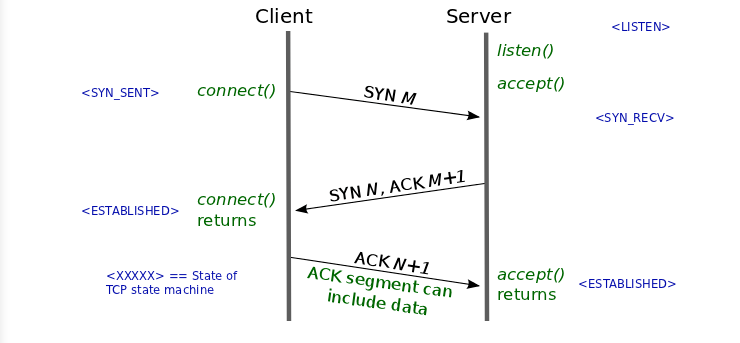

# 네트워크

## HTTP의 GET과 POST 비교

둘 다 HTTP 프로토콜을 이용해서 서버에 무엇인가를 요청할 때 사용하는 방식이다. 하지만 둘의 특징을 제대로 이해하여 기술의 목적에 맞게 알맞은 용도에 사용해야한다.

### GET

우선 GET 방식은 요청하는 데이터가 `HTTP Request Message`의 Header 부분의 url 에 담겨서 전송된다. 때문에 url 상에 `?` 뒤에 데이터가 붙어 request 를 보내게 되는 것이다. 이러한 방식은 url 이라는 공간에 담겨가기 때문에 전송할 수 있는 데이터의 크기가 제한적이다. 또 보안이 필요한 데이터에 대해서는 데이터가 그대로 url 에 노출되므로 `GET`방식은 적절하지 않다. (ex. password)

### POST

POST 방식의 request 는 `HTTP Message의 Body` 부분에 데이터가 담겨서 전송된다. 때문에 바이너리 데이터를 요청하는 경우 POST 방식으로 보내야 하는 것처럼 데이터 크기가 GET 방식보다 크고 보안면에서 낫다.(하지만 보안적인 측면에서는 암호화를 하지 않는 이상 고만고만하다.)

*그렇다면 이러한 특성을 이해한 뒤에는 어디에 적용되는지를 알아봐야 그 차이를 극명하게 이해할 수 있다.*
우선 GET 은 가져오는 것이다. 서버에서 어떤 데이터를 가져와서 보여준다거나 하는 용도이지 서버의 값이나 상태 등을 변경하지 않는다. SELECT 적인 성향을 갖고 있다고 볼 수 있는 것이다. 반면에 POST 는 서버의 값이나 상태를 변경하기 위해서 또는 추가하기 위해서 사용된다.

부수적인 차이점을 좀 더 살펴보자면 GET 방식의 요청은 브라우저에서 Caching 할 수 있다. 때문에 POST 방식으로 요청해야 할 것을 보내는 데이터의 크기가 작고 보안적인 문제가 없다는 이유로 GET 방식으로 요청한다면 기존에 caching 되었던 데이터가 응답될 가능성이 존재한다. 때문에 목적에 맞는 기술을 사용해야 하는 것이다.

## [TCP]3-way-handshake & 4-way-handshake

##### 연결 성립 (Connection Establishment)

1)클라이언트는 서버에 접속을 요청하는 SYN(a) 패킷을 보낸다.

2) 서버는 클라이언트의 요청인 SYN(a)을 받고 클라이언트에게 요청을 수락한다는 ACK(a+1)와 SYN(b)이 설정된 패킷을 발송한다

3) 클라이언트는 서버의 수락 응답인 ACK(a+1)와 SYN(b) 패킷을 받고 ACK(b+1)를 서버로 보내면 연결이 성립된다.

##### 연결 해제 (Connection Termination)

1) 클라이언트가 연결을 종료하겠다는 FIN플래그를 전송한다

2) 서버는 클라이언트의 요청(FIN)을 받고 알겠다는 확인 메세지로 ACK를 보낸다.

2-1)그리고 나서는 데이터를 모두 보낼 때 까지 잠깐 TIME_OUT 이 된다

3) 데이터를 모두 보내고 통신이 끝났으면 연결이 종료되었다고 클라이언트에게 FIN 플래그를 전송한다

4) 클라이언트는 FIN메세지를 확인했다는 메세지(ACK)를 보낸다.

5) 클라이언트의 ACK메세지를 받은 서버는 소켓 연결을 close 한다.

6) 클라이언트는 아직 서버로부터 받지 못한 데이터가 있을 것을 대비해 일정 시간 동안 세션을 남겨놓고 잉여 패킷을 기다리는 과정을 거친다 (TIME_WAIT)

##### What is the SYN Packet ? ACK packet?

일단 두 용어는 다음의 약자이다

> SYN :: synchronize sequence number
>
> ACK :: acknowledgement

TCP Header에는 Code Bit(Flag bit)라는 부분이 존재한다. 이 부분은 총 6Bit로 이루어져 있으며 각각 한 bit 들이 의미를 갖고 있다. Urg - Ack - Psh - Syn - Fin 순서로 되어 있으며 해당 위치의 비트가 1이면 해당 패킷이 어떠한 내용을 담고 있는 패킷인지를 나타낸다. SYN 패킷일 경우엔 000010이 되고 ACK 패킷일 경우에는 010000 이 되는 것이다.

Why two types of packets?

일단 연결을 성립하려면 서로 통신이 가능한지를 먼저 파악하기 위해 패킷을 먼저 주고받아야 한다는 것까지는 이해가 쉽다. 그런데 두 종류의 패킷을 주고 받는다. 요청과 응답에 대한 패킷을 주고받아야 하기 때문에 두 종류인 것이다.

Why 3-way? Is not enough 2-way?

비유를 들어보자. 일단 클라이언트가 자신의 목소리가 들리느지 물어본다(SYN) 서버는 클라이언트의 목소리가 들린다고 말한다 (SYN+1) 그리고 자신의 목소리가 들리는지 물어본다 (ACK) 클라이언트는 서버의 목소리가 들린다고 말한다. (ACK+1) 

TCP connection 은 양방향성(bidirectional) connection 이다. 클라이언트에서 서버에게 존재를 알리고 패킷을 보낼 수 있다는 것을 알리듯, 서버에서도 클라이언트에게 존재를 알리고 패킷을 보낼 수 있다는 신호를 보내야 한다. 그렇기 때문에 2-way-handshake로는 부족하다.

Why randomized sequence number?

처음 클라이언트에서 SYN 패킷을 보낼 때 Sequence Number에는 랜덤한 숫자가 담겨진다. 초기 sequence number를 ISN이라고 한다. ISN이 0 부터 시작하지 않고 난수를 생성해서 number를 설정하는 이유는 무엇인가?

Connection 을 맺을 때 사용하는 포트(port) 는 유한 범위 내에서 사용하고 시간이 지남에 따라 재사용된다. 따라서 두 통신 호스트가 과거에 사용된 포트 번호 쌍을 사용하는 가능성이 존재한다. 서버 측에서는 패킷의 SYN을 보고 패킷을 구분하게 되는데 난수가 아닌 순차적인 number가 전송된다면 이전의 connection으로부터 오는 패킷으로 인식할 수 있다. 이러한 문제가 발생할 가능성을 줄이기 위해서 난수로 ISN을 설정하는 것이다.

## TCP 와 UDP 의 비교

#### UDP

`UDP(User Datagram Protocol, 사용자 데이터그램 프로토콜)`는 비연결형 프로토콜이다. IP 데이터그램을 캡슐화하여 보내는 방법과 연결 설정을 하지 않고 보내는 방법을 제공한다. UDP 는 흐름제어, 오류제어 또는 손상된 세그먼트의  수신에 대한 재전송을 하지 않는다. 이 모두가 사용자 프로세스의 몫이다. UDP 가 행하는 것은 포트들을 사용하여 IP 프로토콜에 인터페이스를 제공하는 것이다.

종종 클라이언트는 서버로 짧은 요청을 보내고, 짧은 응답을 기대한다. 만약 요청 또는 응답이 손실된다면 클라이언트는 time out 되고 다시 시도할 수 있으면 된다. 코드가 간단할 뿐만 아니라 TCP 처럼 초기설정 (initial setup)에서 요구되는 프로토콜보다 적은 메시지가 요구된다,

UDP를 사용한 것들에는 DNS가 있다. 어떤 호스트 네임의 IP 주소를 찾을 필요가 있는 프로그램은 , DNS서버로 호스트 네임을 포함한 UDP 패킷을 보낸다.  이 서버는 호스트의 IP 주소를 포함한 UDP ㅐ패킷으로 응답한다. 사전에 설정이 필요하지 않으며 그 후에 해제가 필요하지 않다.

#### TCP

대부분의 인터넷 응용 분야들은 신뢰성과 순차적인 전달을 필요로 한다. UDP로는 이를 만족시킬 수 없으므로 다른 프로토콜이 필요하여 탄생한것이 TCP 이다. `TCP( Transmission Control Protocal, 전송제어 프로토콜)` 는 신뢰성이 없는 인터넷을 통해 종단간에 신뢰성 있는 **바이트 스트림을 전송**하도록 특별히 설계되었다. TCP서비스는 송신자와 수신자 모두가 소켓이라고 부르는 종단점을 생성함으로써 이루어진다. TCP에서 연결설정 (connection establishment)는 3-way-handshake 를 통해 행해진다.

모든 TCP 연결은 전이중(full-duplex), 점대점(point to point)방식이다. 전이중이란 전송이 양방향으로 동시에  일어날 수 있음을 의미하며 점대점이란 각 연결이 정확히 2개의 종단점을 가지고 있음을 의미한다. TCP는 멀티캐스팅이나 브로드캐스팅을 지원하지 않는다.

## HTTP와 HTTPS

### HTTP 의 문제점

- HTTP 는 평문 통신이기 때문에 도청이 가능하다.
- 통신 상대를 확인하지 않기 때문에 위장이 가능하다.
- 완전성을 증명할 수 없기 때문에 변조가 가능하다.

*위 세 가지는 다른 암호화하지 않은 프로토콜에도 공통되는 문제점들이다.*

### TCP/IP 는 도청 가능한 네트워크이다.

TCP/IP 구조의 통신은 전부 통신 경로 상에서 엿볼 수 있다. 패킷을 수집하는 것만으로 도청할 수 있다. 평문으로 통신을 할 경우 메시지의 의미를 파악할 수 있기 때문에 암호화하여 통신해야 한다.

#### 보안 방법

1. 통신 자체를 암호화
   `SSL(Secure Socket Layer)` or `TLS(Transport Layer Security)`라는 다른 프로토콜을 조합함으로써 HTTP 의 통신 내용을 암호화할 수 있다. SSL 을 조합한 HTTP 를 `HTTPS(HTTP Secure)` or `HTTP over SSL`이라고 부른다.
2. 콘텐츠를 암호화
   말 그대로 HTTP 를 사용해서 운반하는 내용인, HTTP 메시지에 포함되는 콘텐츠만 암호화하는 것이다. 암호화해서 전송하면 받은 측에서는 그 암호를 해독하여 출력하는 처리가 필요하다.

### 통신 상대를 확인하지 않기 때문에 위장이 가능하다.

HTTP 에 의한 통신에는 상대가 누구인지 확인하는 처리는 없기 때문에 누구든지 리퀘스트를 보낼 수 있다. IP 주소나 포트 등에서 그 웹 서버에 액세스 제한이 없는 경우 리퀘스트가 오면 상대가 누구든지 무언가의 리스폰스를 반환한다. 이러한 특징은 여러 문제점을 유발한다.

1. 리퀘스트를 보낸 곳의 웹 서버가 원래 의도한 리스폰스를 보내야 하는 웹 서버인지를 확인할 수 없다.
2. 리스폰스를 반환한 곳의 클라이언트가 원래 의도한 리퀘스트를 보낸 클라이언트인지를 확인할 수 없다.
3. 통신하고 있는 상대가 접근이 허가된 상대인지를 확인할 수 없다.
4. 어디의에서 누가 리퀘스트 했는지 확인할 수 없다.
5. 의미없는 리퀘스트도 수신한다. —> DoS 공격을 방지할 수 없다.

#### 보완 방법

위 암호화 방법으로 언급된 `SSL`로 상대를 확인할 수 있다. SSL 은 상대를 확인하는 수단으로 **증명서** 를 제공하고 있다. 증명서는 신뢰할 수 있는 **제 3 자 기관에 의해** 발행되는 것이기 때문에 서버나 클라이언트가 실재하는 사실을 증명한다. 이 증명서를 이용함으로써 통신 상대가 내가 통신하고자 하는 서버임을 나타내고 이용자는 개인 정보 누설 등의 위험성이 줄어들게 된다. 한 가지 이점을 더 꼽자면 클라이언트는 이 증명서로 본인 확인을 하고 웹 사이트 인증에서도 이용할 수 있다.

### 완전성을 증명할 수 없기 때문에 변조가 가능하다

여기서 완전성이란 **정보의 정확성** 을 의미한다. 서버 또는 클라이언트에서 수신한 내용이 송신측에서 보낸 내용과 일치한다라는 것을 보장할 수 없는 것이다. 리퀘스트나 리스폰스가 발신된 후에 상대가 수신하는 사이에 누군가에 의해 변조되더라도 이 사실을 알 수 없다. 이와 같이 공격자가 도중에 리퀘스트나 리스폰스를 빼앗아 변조하는 공격을 중간자 공격(Man-in-the-Middle)이라고 부른다.

#### 보완 방법

`MD5`, `SHA-1` 등의 해시 값을 확인하는 방법과 파일의 디지털 서명을 확인하는 방법이 존재하지만 확실히 확인할 수 있는 것은 아니다. 확실히 방지하기에는 `HTTPS`를 사용해야 한다. SSL 에는 인증이나 암호화, 그리고 다이제스트 기능을 제공하고 있다.

### HTTPS

> HTTP 에 암호화와 인증, 그리고 완전성 보호를 더한 HTTPS

`HTTPS`는 SSL 의 껍질을 덮어쓴 HTTP 라고 할 수 있다. 즉, HTTPS 는 새로운 애플리케이션 계층의 프로토콜이 아니라는 것이다. HTTP 통신하는 소켓 부분을 `SSL(Secure Socket Layer)` or `TLS(Transport Layer Security)`라는 프로토콜로 대체하는 것 뿐이다. HTTP 는 원래 TCP 와 직접 통신했지만, HTTPS 에서 HTTP 는 SSL 과 통신하고 **SSL 이 TCP 와 통신** 하게 된다. SSL 을 사용한 HTTPS 는 암호화와 증명서, 안전성 보호를 이용할 수 있게 된다.

HTTPS 의 SSL 에서는 공통키 암호화 방식과 공개키 암호화 방식을 혼합한 하이브리드 암호 시스템을 사용한다. 공통키를 공개키 암호화 방식으로 교환한 다음에 다음부터의 통신은 공통키 암호를 사용하는 방식이다.

#### 모든 웹 페이지에서 HTTPS 를 사용하지 않는 이유

평문 통신에 비해서 암호화 통신은 CPU 나 메모리 등 리소스가 많이 필요하다. 통신할 때마다 암호화를 하면 많은 리소스를 소비하기 때문에 서버 한 대당 처리할 수 있는 리퀘스트의 수가 줄어들게 된다. 그렇기 때문에 민감한 정보를 다룰 때만 HTTPS 에 의한 암호화 통신을 사용한다.