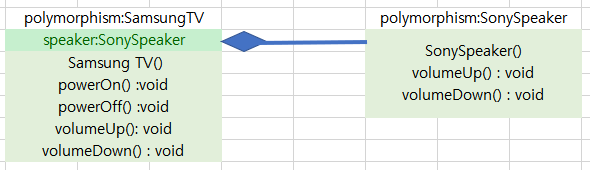
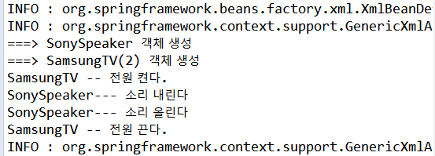

### 의존성 주입

#### 스프링의 의존성 관리 방법

스프링프레임워크의 가장 중요한 특징 - 객체의 생성과 의존관계를 컨테이너가 자동으로 관리

스프링은 IoC(제어의 역행)을 다음 두 가지 형태로 지원

- Dependency Lookup
  - 지금까지 컨테이너를 사용했던 방법
- Dependency Injection
  - 객체 사이의 의존관계를 스프링 설정파일에 등록된 정보를 바탕으로 컨테이너가 자동으로 처리
  - 따라서 의존성 설정을 바꾸고 싶을 때 프로그램 코드를 수정하지 않고 스프링 설정 파일 수정만으로 변경사항을 적용할 수 있다.
  - Setter 메소드를 기반으로 하는 세터인젝션 과 생성자를 기반으로 하는 생성자 인젝션으로 나뉜다


#### 의존성 관계

의존성 관계란 객체와 객체의 결합관계이다.

즉, 하나의 객체에서 **다른 객체의 변수나 메소드를 이용해야 한다**면 객체에 대한 **객체 생성**과 생성된 객체의 **레퍼런스 정보**가 필요하다.



- SamsungTV 는 SonySpeaker의 메소드를 이용해서 기능을 수행한다.
  - 따라서 SamsungTV는 SonySpeaker 타입의 speaker 변수를 멤버변수로 갖고 있다
  - speaker 변수는 SonySpeaker 객체를 참조하고 있어야 한다.
  - 따라서 **SamsungTV 클래스에 SonySpeaker 클래스에 대한 객체 생성코드가 반드시 필요**하다 


```java
//SamsungTV.java
package polymorphism;

public class SamsungTV implements TV {

	private SonySpeaker speaker;
	
	public SamsungTV() {
		System.out.println("==> SamsungTV 객체 생성");
	}
	public void powerOn() {
		System.out.println("SamsungTV -- 전원 켠다.");
	}
	public void powerOff() {
		System.out.println("SamsungTV -- 전원 끈다.");
	}
	public void volumeUp() {
		speaker = new SonySpeaker();
		speaker.volumeUp();
	}
	public void volumeDown() {
		speaker = new SonySpeaker();
		speaker.volumeDown();
	}
}
```

[문제점]

- SonySpeaker 객체가 쓸데없이 2개나 생성된다.
- SonySpeaker 를 다른 Speaker로 변경하고자 할때, volumeUp(), volumeDown() 두개의 메소드를 모두 수정해야한다.
  - 이러한 문제는 Speaker 객체에 대한 객체 생성코드를 직접 SamsungTV소스에 명시했기 때문
  - **스프링은 이 문제를 의존성주입(Dependency Injection)을 이용해 해결한다**


#### 생성자 인젝션 이용하기

- 스프링컨테이너는 XML 설정파일에 등록된 설정파일을 찾아서 객체 생성할 때 기본적으로 매개변수가 없는 기본(Default) 생성자를 호출한다.

- 하지만 컨테이너가 기본 생성자 말고 매개변수를 가지는 다른 생성자를 호출하도록 설정할 수 있다. 이 기능을 이용하여 생성자 인젝션을 처리한다.
- 생성자 인젝션을 사용하면 생성자의 매개변수로 의존관계에 있는 객체의 주소를 전달할 수 있다.

```java
package polymorphism;

public class SamsungTV implements TV {
	private SonySpeaker speaker;	
    
	public SamsungTV() {
		System.out.println("==> SamsungTV(1) 객체 생성");
	}
	public SamsungTV(SonySpeaker speaker) {
		System.out.println("===> SamsungTV(2) 객체 생성");
		this.speaker = speaker;
	}
	public void powerOn() {
		System.out.println("SamsungTV -- 전원 켠다.");
	}
	public void powerOff() {
		System.out.println("SamsungTV -- 전원 끈다.");
	}
	public void volumeUp() {		
		speaker.volumeUp();
	}
	public void volumeDown() {		
		speaker.volumeDown();
	}
}
```

- SamsungTV 클래스에 추가된 두번째 생성자는 SonySpeaker 객체를 매개변수로 받아 멤버변수로 선언된 speaker를 초기화한다.


[이를 위한 XML 설정파일]

```xml
<beans xmlns="http://www.springframework.org/schema/beans"
	xmlns:xsi="http://www.w3.org/2001/XMLSchema-instance"
	xsi:schemaLocation="http://www.springframework.org/schema/beans http://www.springframework.org/schema/beans/spring-beans.xsd">
    
	<bean id="tv" class="polymorphism.SamsungTV">
		<constructor-arg ref="sony"></constructor-arg>
	</bean>		
    
	<bean id="sony" class="polymorphism.SonySpeaker"
    </bean>
</beans>
```

- 사용자인젝션 - SamsungTV 클래스 <bean>등록 설정 안  <constructor-arg> 엘리먼트 추가
- 생성자 인자로 전달할 객체의 아이디를 <constructor-arg>엘리먼트에 **ref 속성**으로 참조



- 실행결과
  - 1. SamsungTV 객체가 생성될 떄, 기본 생성자가 아닌 두 번째 생성자가 사용됐다.
    2. 스프링 설정파일에 SonySpeaker가 SamsungTV 클래스 밑에 등록되어있는데도 먼저 생성되고 있다.
- 스프링 컨테이너는 기본적으로 bean등록된 순서대로 객체를 생성하며, 모든 객체는 기본 생성자 호출을 원칙으로 한다.
- 그런데 생성자 인젝션으로 의존성 주입 될 SonySpeaker 가 먼저 객체 생성되었으며, SonySpeaker 객체를 매개변수로 받아들이는 생성자를 호출하여 객체를 생성하였다.


#### 다중 변수 매핑

생성자 인젝션에서 초기화 해야 할 변수가 여러개이면, 여러개 값을 한꺼번에 전달해야한다. 이때는 생성자를 적절히 추가하면 된다.

```java
// SamsungTV.java
package polymorphism;

public class SamsungTV implements TV {
	private SonySpeaker speaker;
	private int price;
	
	public SamsungTV() {
		System.out.println("==> SamsungTV(1) 객체 생성");
	}
	public SamsungTV(SonySpeaker speaker) {
		System.out.println("===> SamsungTV(2) 객체 생성");
		this.speaker = speaker;
	}
	public SamsungTV(SonySpeaker speaker, int price) {
		System.out.println("===> SamsungTV(3) 객체 생성");
		this.speaker =speaker;
		this.price = price;
	}
	public void powerOn() {
		System.out.println("SamsungTV -- 전원 켠다.(가격:" + price + ")");
	}
	
	public void powerOff() {
		System.out.println("SamsungTV -- 전원 끈다.");
	}
	public void volumeUp() {		
		speaker.volumeUp();
	}
	public void volumeDown() {		
		speaker.volumeDown();
	}
}
```

```xml
<!-- applicationContext.xml -->
<?xml version="1.0" encoding="UTF-8"?>
<beans xmlns="http://www.springframework.org/schema/beans"
	xmlns:xsi="http://www.w3.org/2001/XMLSchema-instance"
	xsi:schemaLocation="http://www.springframework.org/schema/beans http://www.springframework.org/schema/beans/spring-beans.xsd">

	<bean id="tv" class="polymorphism.SamsungTV">
		<constructor-arg ref="sony"></constructor-arg>
		<constructor-arg value="2700000"></constructor-arg>
	</bean>
		
		<bean id="sony" class="polymorphism.SonySpeaker"></bean>
	</beans>
```

- <constructor-arg> 엘리먼트
  - ref 와 value 속성을 사용해 생성자 매개변수로 전달할 값을 지정할 수 있다.
    - ref : 인자로 전달될 데이터가 <bean> 등록된 다른 객체인 경우
    - value : 고정된 문자열이나 정수 같은 기본형 데이터일 때
  -  index  속성
    - 생성자가 여러 개 오버로딩 되어 있어 어떤 생성자를 호출해야할지 분명하지 않을 경우 


#### Setter 인젝션 이용하기

- 생성자 인젝션 - 생성자를 이용하여 의존성 주입을 처리

- Setter 인젝션 - Setter 메소드를 호출하여 의존성 주입을 처리

```java
package polymorphism;

public class SamsungTV implements TV {
	private Speaker speaker;
	private int price;
	
	public SamsungTV() {
		System.out.println("==> SamsungTV(1) 객체 생성");
	}

	public void setSpeaker(Speaker speaker) {
		System.out.println("===>setSpeaker() 호출");
		this.speaker = speaker;
	}
	public void setPrice(int price) {
		System.out.println("===> setPrice() 호출");
		this.price = price;
	}
	public void powerOn() {
		System.out.println("SamsungTV -- 전원 켠다.(가격:" + price + ")");
	}	
	public void powerOff() {
		System.out.println("SamsungTV -- 전원 끈다.");
	}
	public void volumeUp() {		
		speaker.volumeUp();
	}
	public void volumeDown() {		
		speaker.volumeDown();
	}
}
```

- Setter 메소드는 스프링 컨테이너가 자동으로 호출한다
- 호출 시점은 <bean> 객체 생성 직후다
  - 따라서 Setter 인젝션이 동작하려면 Setter 메소드 뿐만아니라 기본 생성자도 반드시 필요하다
- Setter 인젝션을 이용하려면 스프링 설정파링일 <constructor-arg> 엘리먼트 대신 <property> 엘리먼트를 사용해야한다.

```xml
<!--applicationContext.xml -->

<bean id="tv" class="polymorphism.SamsungTV">
		<property name="speaker" ref="apple"></property>
		<property name="price" value ="27000000"></property>
	</bean>
```

- Setter 인젝션을 이용하려면 <property> 엘리먼트 사용

- name 속성값이 호출하고자 하는 메소드 이름이다.
  - 즉, name 속성 값이 "speaker" 라고 설정되어있으면 호출되는 메소드는 setSpeaker() 이다
    - 변수 이름에서 첫 글자를 대문자로 바꾸고 앞에 "set"을 붙인것이 호출할 메소드이름.