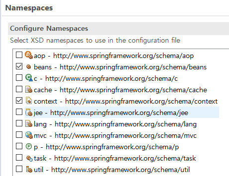
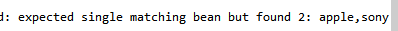

# 어노테이션 기반 설정

### 어노테이션 설정 기초

> 스프링프레임워크 - XML 설정이 매우 중요하다. 그만큼 XML 파일의 과도한 설정에 부담이된다
>
> 따라서 어노테이션을 이용한 설정을 지원하고 있다.


#### Context 네임스페이스 추가

어노테이션 설정을 추가하려면 `<beans>`에 Context 관련 네임스페이스와 스키마 문서 위치등록필요

[Namespaces] - 'context' 항목체크




#### 컴포넌트 스캔(component-scan) 설정

스프링 설정 파일에 애플리케이션에서 사용할 객체들을 `<bean>`등록 하지 않고 자동으로 생성하려면 `<context:component-scan>` 이란 엘리먼트를 정의해야 한다.

- 이 설정을 추가하면 스프링컨테이너는 클래스 패스에 있는 클래스를 스캔해 @Component 가 설정된 클래스들을 자동으로 객체 생성한다.

  ```xml
  <context:component-scan base-package="polymorphism"></context:component-scan>
  ```

  - 이 설정을 제외한 나머지 `<bean>` 설정은 모두 삭제하거나 주석으로 처리한다
  - base-package 속성 : 스캔 대상 패키지


#### @Component

- `<context:component-scan>` 를 설정했으면 스프링 설정 파일에 클래스들을 일일이 `<bean>` 엘리먼트로 등록할 필요가 없다

- @Component 만 클래스 선언부 위에 설정하면 된다.

- 기본 생성자가 있어야만 컨테이너가 객체를 생성할 수 있다.

- 클라이언트가 스프링 컨테이너가 생성한 객체를 요청하려면, 요청할 때 사용할 아이디나 이름이 반드시 설정되어 있어야 한다.

- 따라서 클라이언트의 요청을 위해서라도 다음과 같이 아이디 설정이 필요하다.

  ```java
  //XML 설정
  <bean id="tv" class="polymorphism.LgTV"></bean>
  
  //Annotation 설정
  @Component("tv")
  ```

  

### 의존성 주입 설정

#### 의존성 주입 어노테이션

스프링에서 의존성 주입을 지원하는 어노테이션으로는 @Autowired, @Inject, @Qualifier, @Resource 가 있다.

| 어노테이션 | 설명                                                         |
| ---------- | ------------------------------------------------------------ |
| @Autowired | 주로 변수 위에 설정하여 해당 타입의 객체를 찾아서 자동으로 할당 |
| @Qualifier | 특정 객체의 이름을 이용하여 의존성 쥐입할 때 사용            |
| @Inject    | @Autowired와 동일한 기능 제공                                |
| @Resource  | @Autowired 와 @Qualifier 의 기능을 결합한 어노테이션         |


#### @Autowired

- 생성자나 메소드, 멤버변수 위에 모두 사용 가능
- 주로 멤버변수 위에 선언해 사용
- 변수위에 붙은 @Autowired를 확인하는 순간 해당 변수의 타입을 체크

```java
//SonySpeaker.java
package polymorphism;

import org.springframework.stereotype.Component;

@Component("sony")
public class SonySpeaker implements Speaker{

		public SonySpeaker() {
			System.out.println("===> SonySpeaker 객체 생성");			
		}
		public void volumeUp() {
			System.out.println("SonySpeaker--- 소리 올린다");			
		}
		public void volumeDown() {
			System.out.println("SonySpeaker--- 소리 내린다");
		}
}
```

- SonySpeaker 객체가 메모리에 없으면 에러가 발생하므로 반드시 SonySpeaker객체가 메모리에 생성되어 있어야 한다.


#### @Qualifier

- 문제점 - 의존성 주입 대상이 되는 Speaker타입의 객체가 두 개 이상일 때
- 만약 AppleSpeaker 객체와 SonySpeaker가 모두 메모리에 생성되어 있는 상황이라면 컨테이너는 어떤 객체를 할당할지 스스로 판단할 수 없어 에러가 발생



- @Autowired 대상이 되는 Speaker 타입의 객체가 AppleSpeaker, SonySpeaker로 두 개이고 둘 다 메모리에 생성되어 있으므로 어떤 객체를 의존성 주입할지 모르기 때문에 발생한 예외
- 해결방법 - **@Qualifier**
  - @Qualifier 어노테이션을 이용하면 의존성 주입 될 객체의 아이디나 이름을 지정할 수 있다.
  - 이 때 Speaker 객체의 이름 (sony,apple)중 하나를 지정하면 간단하게 처리할 수 있다.


#### @Resource

- @Resource는 객체의 이름을 이용해 의존성 주입을 처리한다
- @Resource는 name 속성을 사용할 수 있어서 스프링 컨테이너가 해당 이름으로 생성된 객체를 검색해 의존성 주입을 처리한다.

```java
@Resource(name="apple")
```


#### 어노테이션과 XML 설정 병행하여 사용하기

XML - 자바코드를 직접 수정하지 않는다는 장점

어노테이션 - XML 설정에 대한 부담이 없고, 의존관계에 대한 정보가 자바 소스에 들어있어 편하다

서로의 장점을 조합해보자

- **변경되지 않는 객체**는 **어노테이션**으로 설정하여 사용
- **변경**될 가능성이 있는 객체는 **XML**설정으로 사용

