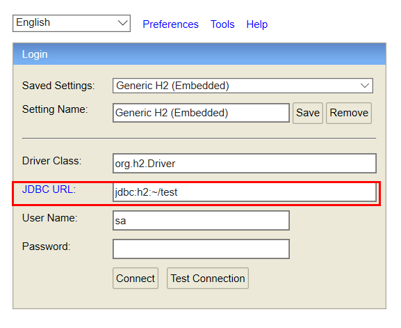
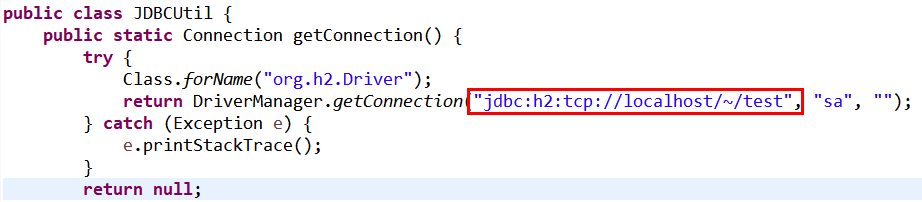
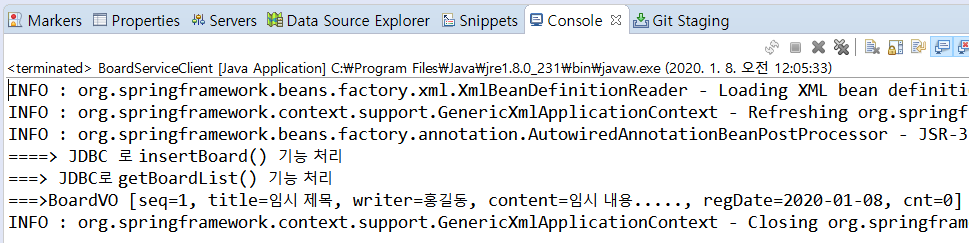

## 비즈니스 컴포넌트1

### BoardService 컴포넌트 구조

일반적으로 비즈니스 컴포넌트는 네 개의 자바 파일로 구성된다. 그리고 각 자바 파일을 작성하는 순서와 이름 규칙도 어느 정도는 정해져 있는 것이 일반적이다.


### Value Object  클래스 작성

> - VO(Value Object) 클래스는 레이어와 레이어 사이에서 관련된 데이터를 한꺼번에 주고받으 목적으로 사용하는 클래스이다. DTO(Data Transfer Object)라 하기도 하는데, 데이터 전달을 목적으로 하는 객체이므로 결국 같은 의미의 용어다.
>
> - VO 클래스를 작성하려면 가장 먼저 데이터베이스에 생성되어 있는 테이블의 구조를 확인해야 한다.


- BoardVO

```java
public class BoardVO {
    private int seq;
    private String title;
    private String writer;
    private String content;
    private Date regDate;
    private int cnt;    
    // 코드 제너레이션 기능을 통해 getter/setter/toString() 메소드 생성    
}
```


### DAO 클래스 작성

> - DAO(Data Access Object) 클래스는 **데이터베이스 연동**을 담당하는 클래스이다. 
>
> - DAO 클래스 - **CRUD**(Create, Read, Update, Delete)기능의 메소드 구현 필요
>
> - 우리가 사용할 H2 데이터베이스에서 제공하는 **JDBC 드라이버**가 필요하다


- 드라이버 내려받기

BoardWeb 프로젝트에 있는 pom.xml 파일을 열고 다음 코드를 추가한다.

<dependencies> 태그 바로 밑에 추가

```xml
<dependencies>
		<!--  H2 데이터베이스  -->
		<dependency>
			<groupId>com.h2database</groupId>
			<artifactId>h2</artifactId>
			<version>1.4.200</version>
		</dependency>
</dependencies>
```

'Libraries'>'Maven Dependencies' 에 .jar파일이 추가된 것을 확인할 수 있다.


- JDBC Utility 클래스

  모든 DAO클래스에서 공통으로 사용할 JDBCUtil 클래스를 작성하여 Connection 획득과 해제 작업을 공통으로 처리하도록 한다.


- DAO  클래스 작성

  - BoardVO 객체를 매개변수와 리턴타입으로 사용하면서 BOARD 테이블과 CRUD 기능을 처리할 BoardDAO() 클래스를 작성한다
  - 이 클래스 객체를 스프링 컨테이너가 생성할 수 있도록 클래스 선언부에 @Repository 어노테이션을 설정한다
    - 물론 @Component를 사용한다고 해서 문제가 발생하지는 않는다
    
    - 다만 DAO 기능의 클래스 에서는 @Component 보다 @Repository 를 사용하는 것이 여러모로 적합하다
    
      

### Service 인터페이스 작성

- DAO 클래스를 작성했으면 이제 DAO 클래스에서 BoardService 인터페이스를 작성한다. 

  

### Service 구현 클래스 작성

- 마지막으로 BoardService 인터페이스를 구현한 BoardServiceImpl 클래스를 구현하면 비즈니스 컴포넌트는 마무리된다.
- BoardServiceImpl 클래스의 비즈니스 메소드를 구현할 때, 멤버변수로 사용된 BoardDAO 를 이용하면 된다.
  - BoardService 인터페이스를 구현한 BoardServiceImpl 클래스는 **BoardService 인터페이스의 모든 `추상 메소드`를 재정의(Overriding)하여 구현**해야한다. 
  - 클래스 선언부에 **객체 생성**을 위한 `@Service` 가 선언되어 있으며, 클라이언트 프로그램에서 `boardService`라는 이름으로 **객체를 요청**할 수 있도록 **아이디도 설정**했다.
  - BoardServiceImpl는 데이터베이스 연동이 포함된 비즈니스 로직처리를 위해서 **BoardDAO 타입의 객체를 멤버변수**로 가지고 있다. 그리고 이 변수에 BoardDAO 타입의 객체를 **의존성 주입** 하기 위해서 변수 위에 `@Autowired`를 설정했다.

### BoardService 컴포넌트 테스트

#### 스프링 설정 파일 수정

> 작성된 BoardService 컴포넌트를 스프링 기반으로 테스트하려면 우선 스프링 설정 파일에` <context:component-scan> `설정을 수정한다.

- applicationContext.xml
  - 컴포넌트 스캔의 범위를 "com.springbook.biz" 패키지로 지정했으므로 BoardServiceImpl 클래스와 BoardDAO 클래스가 스캔 범윙 포함되어 객체가 생성될 것이다.

#### 클라이언트 작성 및 실행

> 클라이언트 프로그램을 작성해 글 등록기능과 글 목록 검색 기능을 테스트한다.


후... JDBC 와 H2 db 설정방법

- JDBC URL을 `jdbc:h2:tcp://localhost/~/test` 설정



- JDBCUtil.java

  

  - 여기랑 URL 경로를 맞춘다.

- 성공

  

