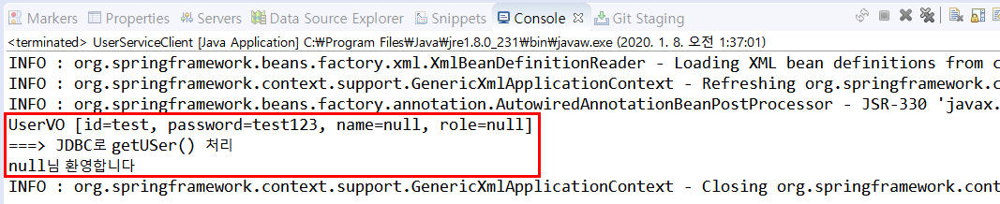
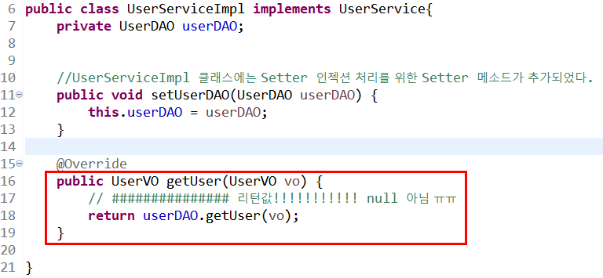

## 비즈니스 컴포넌트 실습 2

- 회원정보를 관리하는 UserService 컴포넌트를 추가로 개발하자

- 이번에는 어노테이션을 사용하지 않고, Setter 인젝션으로 의존성 주입을 처리하고 난 후 어노테이션으로 변경해보자

### UserService 컴포넌트 구조

클래스 다이어그램


### VO(Value Object) 클래스 작성

> USER 테이블의 칼럼 이름과 매핑되는 변수를 가진 UserVO 클래스를 작성한다. 그리고 public Getter/Setter 메소드와 toString( ) 메소드를 만든다.

- SQL

  - ##### CREATE

  -  ```sql
     CREATE TABLE USERS(
    ID VARCHAR2(8) PRIMARY KEY,
    PASSWORD VARCHAR2(8),
    NAME VARCHAR2(20),
    ROLE VARCHAR(5)
    );
    ```

  - ##### INSERT

  - ```sql
    INSERT INTO USERS(ID,PASSWORD) VALUES('test','test123');
    ```

  - ##### COMMIT

  - ```sql
    COMMIT;
    ```

  


### DAO(Data Access Object) 클래스 작성

> JDBCUtil 클래스를 이용하여 USerDAO 클래스의 메소드를 구현한다. 회원 정보 하나를 검색하는 getUser( ) 메소드만 구현한다.

### Service 인터페이스 작성

> getUser( ) 추상 메소드 구현

### Service 구현 클래스 작성

> - UserServiceImpl 클래스의 비즈니스 메소드를 구현할 때, 멤버변수로 선언된 UserDAO 객체를 이용하여 DB연동을 처리하면 된다. 
> - UserServiceImpl 클래스는 Setter 인젝션 처리를 위한 Setter 메소드가 추가되었다.

### UserService 컴포넌트 테스트

1. 작성된 UserService 컴포넌트를 테스트하기 위해서 우선 스프링 설정파일인 applicationContext.xml 에 UserServiceImpl와 UserDAO 클래스를 각각 `<bean>` 등록한다.

2.  UserServiceImpl클래스에서 UserDAO 객체를 의존성주입하기 위한 `<property>` 설정을 추가한다

- applicationContext.xml

  ```java
  <bean id="userService" class="com.springbook.biz.user.impl.UserServiceImpl">
      <property name="userDAO" ref="userDAO"></property>
  </bean>
  <bean id= "userDAO" class="com.springbook.biz.user.impl.UserDAO" />
  </bean>
  ```

- UserServiceClient.java

  ```java
  package com.springbook.biz.user;
  import org.springframework.context.support.AbstractApplicationContext;
  import org.springframework.context.support.GenericXmlApplicationContext;
  public class UserServiceClient {
  	public static void main(String[] args) {		
  		//1.Spring 컨테이너 구동
  		AbstractApplicationContext container = new GenericXmlApplicationContext("applicationContext.xml");
          
  		// 2. Spring 컨테이너로부터 UserServiceImpl 객체를 Lookup 한다
  		UserService userService = (UserService)container.getBean("userService");
          
  		// 3. 로그인 기능 테스트
  		UserVO vo= new UserVO();
  		vo.setId("test");
  		vo.setPassword("test123");		
  		System.out.println(vo.toString());		
  		UserVO user = userService.getUser(vo);
  		if(user !=null) {
  			System.out.println(user.getName()+"님 환영합니다");
  		} else {
  			System.out.println("로그인실패");
  		}
  		//4. Spring 컨테이너를 종료한다.
  		container.close();
  	}
  }
  ```

  

- 하... 안 됐었다.. 자꾸 null이 떴다.. 

  - 

  - 빨간 네모에서 자꾸 로그인 에러가 떴었다
  - 이유는?
  - UserServiceImpl.java에서  getUser(UserVO vo) 리턴 값이 null 이였다..-  return 값을 userDAO.getUser(vo); 로 바꾸면서 성공

### 어노테이션 적용

> Setter 인젝션 설정으로 테스트한 UserService 컴포넌트를 어노테이션 설정으로 변경해보자
>
> 1. 스프링 설정파일에 Setter 인젝션 관련 설정을 모두 주석처리
> 2. UserServiceImpl 와 UserDAO 클래스에 각각 관련된 어노테이션 추가


- applicationContext.xml

  ```java
  bean 주석 처리
  ```

- UserServiceImpl.java

  ```java
  import org.springframework.beans.factory.annotation.Autowired;
  import org.springframework.stereotype.Service;
  
  @Service("userService")
  public class UserServiceImpl implements UserService{
  	@Autowired
  	private UserDAO userDAO;
  ```

- UserDAO.java

  ```java
  import org.springframework.stereotype.Repository;
  
  @Repository("userDAO")
  ```

  

