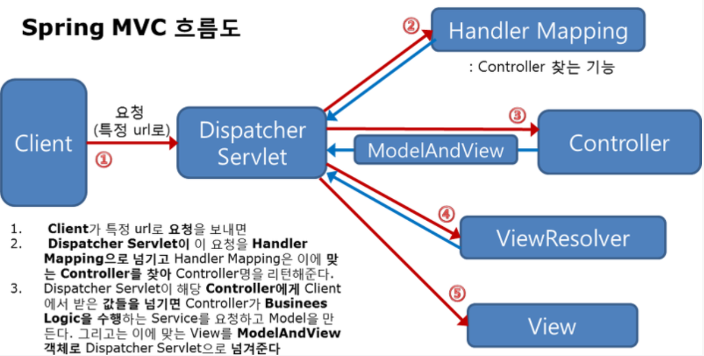

## Spring MVC 구조

> 우리는 앞에서  Spring MVC와 구조가 같은 Controller를 만들어 게시판 프로그램에 적용했다. 따라서 지금부터 살펴볼 SpringMVC 구조가 전혀 새롭지 않을 것이다.

### Spring MVC 의 수행 흐름

1. 클라이언트로부터 모든 ".do" 요청을 DispatcherServlet이 받는다
2. DispatcherServlet 은 HandlerMapping을 통해 요청을 처리할 Controller 를 검색한다
3. DispatcherServlet 은 검색된 Controller 를 실행하여 클라이언트의 요청을 처리한다
4. Controller 는 비즈니스 로직의수행결과로 얻어낸 Model 정보와 Model을 보여줄 View 정보를 ModelAndVidw 객체에 저장하여 리턴한다
5. DispatcherServlet은 ModelAndView 로부터 View정보를 추출하고, ViewResolver를 이용해 응답으로 사용할 View를 얻어낸다
6. DispatherServlet은 ViewResolver를 통해 찾아낸 View를 실행하여 응답을 전송한다.

이전에 SprigMVC 개발에서 유일하게 다른점은 Controller의 리턴타입이 String이 아니라 ModelandView이다.

### DispatcherServlet 등록 및 스프링 컨테이너 구동

#### DispatcherServlet등록

#### 스프링 컨테이너 구동

#### 스프링 설정파일 등록

#### 스프링 설정파일 변경

#### 인코딩 설정

