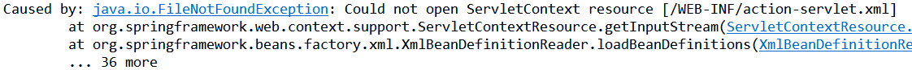

## Spring MVC 구조

> 우리는 앞에서  Spring MVC와 구조가 같은 Controller를 만들어 게시판 프로그램에 적용했다. 따라서 지금부터 살펴볼 SpringMVC 구조가 전혀 새롭지 않을 것이다.


### Spring MVC 의 수행 흐름


1. 클라이언트로부터 모든 ".do" 요청을 DispatcherServlet이 받는다
2. DispatcherServlet 은 HandlerMapping을 통해 요청을 처리할 Controller 를 검색한다
3. DispatcherServlet 은 검색된 Controller 를 실행하여 클라이언트의 요청을 처리한다
4. Controller 는 비즈니스 로직의수행결과로 얻어낸 Model 정보와 Model을 보여줄 View 정보를 ModelAndVidw 객체에 저장하여 리턴한다
5. DispatcherServlet은 ModelAndView 로부터 View정보를 추출하고, ViewResolver를 이용해 응답으로 사용할 View를 얻어낸다
6. DispatherServlet은 ViewResolver를 통해 찾아낸 View를 실행하여 응답을 전송한다.

이전에 SprigMVC 개발에서 유일하게 다른점은 Controller의 리턴타입이 String이 아니라 ModelandView이다.

---


### DispatcherServlet 등록 및 스프링 컨테이너 구동

#### DispatcherServlet등록

Spring MVC 에서 가장 중요한 요소가 모든 클라이언트의 요청을 가장 먼저 받아들이는 DispatcherServlet 이다. 따라서 Spring MVC 적용에서 가장 먼저 해야할 일은 WEB - INF/web.xml 파일에 등록된 DispatcherServlet 클래스를 스프링프레임워크에서 제공하는 DispatcherServlet으로 변경하는 것이다.

```java
<servlet>    
    <servlet-name>action</servlet-name>
    <servlet-class>org.springframework.web.servlet.DispatcherServlet</servlet-class>
  </servlet>
```

- DispatcherServlet 클래스를 스프링에서 제공하는 DispatcherServlet으로 변경한다.

- 이제 로그인 정보를 적절히 입력하고 로그인버튼을 클릭하면 다음과 같은 내용이 콘솔에 출력된다



> 클라이언트가 로그인버튼을 클릭해 "login.do" 요청을 서버에 전달하면 서블릿 컨테이너는 web.xml 파일에 action 이라는 이름으로 등록된 DispatcherServlet 클래스의 객체를 생성한다.

#### 스프링 컨테이너 구동

클라이언트의 요청으로 DispatcherServlet 객체가 생성되고 나면 DispatcherServlet 클래스에 재정의된 init() 메소드가 자동으로 실행되어 XmlWebApplicationContext 라는 스프링 컨테이너가 구동된다. XmlWebApplicationContext 는 Application Context를 구현한 클래스 중 하나이다. 하지만 XmlWebApplicationContext는 우리가 직접 생성하는 것이 아니라 DispatcherServlet이 생성한다.

#### 스프링 설정파일 등록

현재 상태 에서는 DispatcherServlet 이 스프링 컨테이너를 구동할 때 무조건 /WEB-INF/action-servlet.xml 파일을 찾아 로딩한다. 그런데 해당 위치에 action -servlet.xml파일이 없어서 FileNotFoundException 이 발생한다. DispatcherServlet은 Spring 컨테이너를 구동할 때, web.xml 파일에 등록된 서블릿 이름 뒤에 '-servlet.xml'을 붙여서 스프링 설정파일을 찾는다. 따라서 web.xml 파일에 등록된 DispatcherServlet이름이 dispatcher였다면 '/WEB-INF/dispatcher-servlet.xml' 파일을 찾았을 것이다.

- WEB-INF 폴더 마우스 오른쪽버튼
  - [New]-> [Order] - 'Spring Bean configuration file' -> [Next] 
  - 파일명 'action-servlet.xml' 


#### 스프링 설정파일 변경

> DispatcherServlet 은 자신이 사용할 객체들을 생성하기 위해서 스프링 컨테이너를 구동한다. 이 때 스프링 컨테이너를 위한 설정 파일의 이름과 위치는 서블릿 이름을 기준으로 자동으로 결정된다. 
>
> - 하지만 필요에 따라서는 설정 파일의 이름을 바꾸거나 위치를 변경할 수도 있다. 이때 서블릿 초기화 파라미터를 이용한다

```java
 <init-param>
    	<param-name>contextConfigLocation</param-name>
    	<param-value>/WEB-INF/config/presentation-layer.xml</param-value>
</init-param>
```

- 이렇게 DispatcherServlet을 설정하면 스프링 컨테이너가 DispatcherServlet 객체를 생성한 후, 다음과 같이 init() 메소드를 호출한다. 

#### 인코딩 설정

스프링에서는 인코딩 처리를 위해 CharacterEncodingFilter 클래스를 제공하며, web.xml 파일에 CharacterEncodingFilter 를 등록하면 모든 클라이언트의 요청에 대해서 일괄적으로 인코딩을 처리할 수 있다.

```
   <filter>
  	<filter-name>characterEncoding</filter-name>
  	<filter-class>org.springframework.web.filter.CharacterEncodingFilter</filter-class>
  	
  	<init-param>
  		<param-name>encoding</param-name>
  		<param-value>UTF-8</param-value>
  	</init-param>  
  </filter>
  
  <filter-mapping>
  	<filter-name>characterEncoding</filter-name>
  	<url-pattern>*.do</url-pattern>
  </filter-mapping>  
```

- characterEncoding 이라는 이름으로 등록한 CharacterEncodingFilter 객체가 생성되고 나면 `<init-param>` 으로 설정한 encoding 파라미터 정보를 읽어 인코딩 방식을 설정한다 그리고 `<filter-mapping>` 에서 `<url-pattern>` 설정을 "*.do"로 했으므로 모든 클라이언트의 ".do" 요청에 대해서 CharacterEncodingFilter 객체가 일괄적으로 한글을 처리한다.