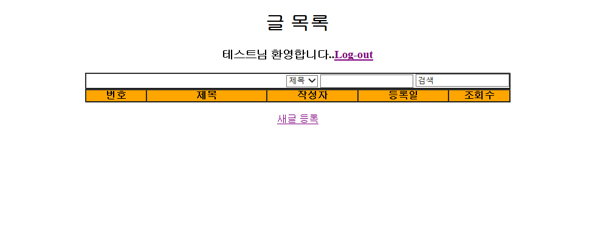

## Spring MVC 적용

### 1. Spring MVC 적용 준비

### 2. 로그인 기능 구현

### 3. 글 목록 검색 기능 구현

### 4. 글 상세 조회 기능 구현

### 5. 글 등록 기능 구현

### 6. 글 수정 기능 구현

### 7. 글 삭제 기능 구현

### 8. 로그아웃 기능 구현

### 9. ViewResolver 활용하기

##### El/JSTL 을 이용한 JSP 화면 처리

- JSP 파일에 남아있는 자바코드 걷어내기
  - JSP 에 제공하는 EL(Expression Language) 와 JSTL (JSP Tag Library )이용
  - session 에 저장되어 있는 사용자 이름을 JSP 화면에 출력할 떄, 기존에는 `<%= session.getAttribute("userName") %>` 이렇게 표현했다면 EL 을 이용하면 `${username}` 으로 표현할 수 있다.

