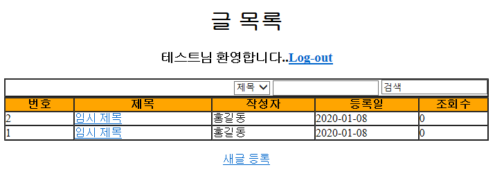
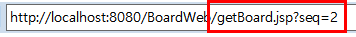
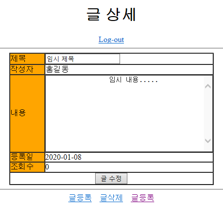
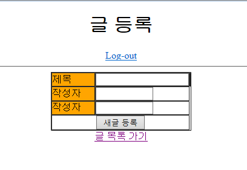
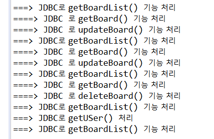

## Model 1 아키텍처로 게시판 개발

### Model 1 아키텍쳐 구조

> JSP 와 JavaBeans 만 사용하여 웹을 개발하는 것


- Model 기능의 JavaBean
  - 자바에서 Bean 은 객체를 의미한다.
  - **JavaBean** 하면 자바 객체를 의미한다 -> **데이터베이스 연동에 사용되는 자바객체**
- Model 이란
  - 데이터베이스 연동 로직을 제공하면서 DB에서 검색한 데이터가 저장되는 자바 객체
  - VO, DAO 클래스가 바로 Model 기능의 자바 객체다
- JSP 이란
  - **Controller 와 View 기능을 모두 처리한다**
    - Controller = JSP 파일에 작성된 자바 코드
      - 그 중 사용자의 요청 처리와 관련된 자바코드
  - Model 을 사용해 검색한 데이터를 사용자가 원하는 화면으로 제공하기 위해 다양한 마크업을 사용한다 
    - 대표적인 마크업 언어 : `HTML` , `CSS` ( 이 두 마크업이 View 기능 담당)
  - 결과적으로 JSP 파일에 자바코드 와 마크업 관련 코드들이 뒤섞여 있어서 역할구분이 명확하지 않고, JSP 파일에 대한 디버깅과 유지보수에 많은 어려움이 생긴다.
    - 그래서 생긴 것이 Model2 => MVC구조, Model, View, Controller 로 기능 분리


### 로그인 기능 구현

> 앞으로 작성하는 모든 JSP 파일은 src/main 폴더에 있는 webapp 폴더에 등록

#### 로그인 화면

- login.jsp

  - HTML 태그를 이용해 로그인 화면 구성

  - ```HTML
    <body>
    	<center>
    		<h1>로그인</h1>
    		<hr>
    		<form action="login_proc.jsp" method="post">
    			<table border="1" cellpadding="0" cellspacing="0">
    				<tr>
    					<td bgcolor="orange">아이디</td>
    					<td><input type="text" name="id"></td>
    				</tr>
    				<tr>
    					<td bgcolor="orange">비밀번호</td>
    					<td><input type="password" name="password"></td>
    				</tr>
    				<tr>
    					<td colspan="2 align="center"><input type="submit" value="로그인">
    					</td>
    				</tr>
    			</table>
    		</form>
    	</center>
    </body>
    ```

  - 

    - 자동으로 설정된 URL 을 보면  프로젝트 이름 대신 biz  가 컨텍스트경로로 출력된 걸 확인할 수 있다. 이 컨텍스트 경로를 변경하려면 Server환경을 변경해야 한다.
      - [Modules] > [Edit] > path 정보 수정
      - path 속성 값을 프로젝트 이름과 같게 "/BoardWeb" 으로 지정


#### 로그인 인증 처리

- login_proc.jsp

  ```jsp
  <%@page import="com.springbook.biz.user.impl.UserDAO"%>
  <%@page import="com.springbook.biz.user.UserVO"%>
  <%@page contentType="text/html; charset=UTF-8"%>
  <% 
  	// 1. 사용자 입력 정보 추출
  	String id = request.getParameter("id");
  	String password = request.getParameter("password");
  	
  	// 2. DB 연동 처리
  	UserVO vo = new UserVO();
  	vo.setId(id);
  	vo.setPassword(password);	
  	UserDAO userDAO = new UserDAO();
  	UserVO user = userDAO.getUser(vo);
  	
  	//3. 화면 네비게이션
  	if(user != null){
  		response.sendRedirect("getBoardList.jsp");			
  	}else{
  		response.sendRedirect("login.jsp");		
  	}
  %>
  ```

1. 사용자가 입력한 아이디와 비밀번호를 `request` 객체로부터 추출
2. Model 에 해당하는 UserVO 와 UserDAO 객체를 이용하여 사용자 정보를 **검색**
3. 검색결과로 `UserVO` 객체가 리턴되면 로그인 성공, `null`이 리턴되면 로그인 실패

- ##### 화면 내비게이션 방법

  - 포워드(Foward) 
    - RequestDispatcher를 이용해 응답으로 사용할 JSP화면으로 넘겨 포워드된 화면이 클아이언트에 전송되는 방식
  - 리다이렉트(Redirect)
    - 요청된 JSP에서 **일단 브라우저로 응답메세지를 보냈**다가 다시 서버로 재 요청
    - 포워드 방식과 다른 점 : 일단 응답이 브라우저로 들어간 다음 재요청

- getBoardList.jsp

  ```jsp
  <%@page import="java.util.List"%>
  <%@page import="com.springbook.biz.board.impl.BoardDAO"%>
  <%@page import="com.springbook.biz.board.BoardVO"%>
  <%@page contentType="text/html; charset=UTF-8"%>
  
  <%	// 1. 사용자 입력 정보 추출(검색 기능은 나중에 구현)
  	// 2. DB연동 처리
  	BoardVO vo = new BoardVO();
  	BoardDAO boardDAO = new BoardDAO();
  	List<BoardVO> boardList = boardDAO.getBoardList(vo);
  	// 3. 응답 화면 구성
  %>
  
  <!DOCTYPE html PUBLIC "-//W3C//DTD HTML 4.01 Transitional//EN" "http://www.w3.org/TR/html4/loose.dtd">
  <html>
  <head>
  <meta http-equiv="Content-Type" content="text/html; charest=UTF-8">
  <title>글 목록</title>
  </head>
  <body>
  <center>
  <h1>글 목록</h1>
  <h3>테스트님 환영합니다..<a href="logout_proc.jsp">Log-out</a></h3>
  
  <!-- 검색시작 -->
  <from action="getBoardList.jsp" method="post">
  <table border="1" cellpadding="0" cellspacing="0" width="700">
  <tr>
  	<td align="right">
  	<select name="searchCondition">
  	<option value="TITLE">제목
  	<option value="CONTENT">내용
  	</select>
  	<input name="searchKeyword" type="text"/>
  	<input name="submit" value="검색">
  	</td>
  </tr>
  </table>
  </from>
  <!-- 검색 종료 -->
  <table border="1" cellpadding="0" cellspacing="0" width="700">
  <tr>
  	<th bgcolor="orange" width="100">번호</th>
  	<th bgcolor="orange" width="200">제목</th>
  	<th bgcolor="orange" width="150">작성자</th>
  	<th bgcolor="orange" width="150">등록일</th>
  	<th bgcolor="orange" width="100">조회수</th>
  </tr>
  <% for(BoardVO board: boardList){ %>
  <tr>
  	<td><%= board.getSeq() %></td>
  	<td align="left"><a href="getBoard.jsp?seq=<%= board.getSeq() %>"><%= board.getTitle() %></a></td>
  	<td><%= board.getWriter() %></td>
  	<td><%= board.getRegDate() %></td>
  	<td><%= board.getCnt() %></td>
  </tr>
  <% } %>
  </table>
  <br>
  <a href="insertBoard.jsp">새글 등록</a>
  </center>
  </body>
  </html>
  ```

  - 게시글 제목에 하이퍼링크 설정

    - 이때, 사용자가 클릭한 게시글 번호를 넘기고자 getBoard.jsp 파일 뒤에 "?"를 추가하고 쿼리 문자열 정보를 넘겨주었다

    - ```html
      <a href="getBoard.jsp?seq=<% board.getSeq() %>"><%=board.getTitle() %></a>
      ```



### 글 상세 기능 구현

- getBoard.jsp

  ```jsp
  <%@page import="com.springbook.biz.board.impl.BoardDAO"%>
  <%@page import="com.springbook.biz.board.BoardVO"%>
  <%@page contentType="text/html; charset=UTF-8"%>
  
  <%
  	// 1. 검색할 게시글 번호 추출
  	String seq = request.getParameter("seq");	
  	// 2. DB연동 처리
  	BoardVO vo = new BoardVO();
  	vo.setSeq(Integer.parseInt(seq));
  
  	BoardDAO boardDAO = new BoardDAO();
  	BoardVO board = boardDAO.getBoard(vo);
  	// 3. 응답 화면 구성
  %>
  ```

  - getBoard.jsp 파일은 가장 먼저 글 목록 화면에서 사용자가 클릭한 **게시글 번호**를 추출한다.
  - **BoardDAO 객체의 getBoard() 메소드를 이용해 이 게시글 번호에 해당하는 BoardVO객체를 검색**한다.
    - try 문 안에 conn(연결) -> stmt(쿼리문 에 ?바인딩)  -> 쿼리 실행 결과값 rs을 board(VO) 객체에 set한다.
  - 마지막으로 검색된 BoardVO 객체의 값들을 화면에 적절히 출력한다



- 글 목록 화면(getBoardList.jsp) 에서 제목 링크를 클릭하면 해당 게시글의 상세 화면이 출력된다. 이 때 **URL 끝부분에 조회할 게시글의 일련번호가 쿼리 문자열 형태로 추가** 된다.




### 글 등록 기능 구현

- 글 등록 화면

  - insertBoard.jsp 

  

- 글 등록 처리

  - insertBoard_proc.jsp

    ```jsp
    <%@page import="com.springbook.biz.board.impl.BoardDAO"%>
    <%@page import="com.springbook.biz.board.BoardVO"%>
    <%@page contentType="text/html; charset=UTF-8"%>
    
    <%
    	//1. 사용자 입력 정보 추출
    	request.setCharacterEncoding("UTF-8");
    	String title = request.getParameter("title");
    	String writer =	request.getParameter("writer");
    	String content = request.getParameter("content");	
    	//2. DB연동 처리	
    	BoardVO vo = new BoardVO();
    	vo.setTitle(title);
    	vo.setWriter(writer);
    	vo.setContent(content);
    	
    	BoardDAO boardDAO = new BoardDAO();
    	boardDAO.insertBoard(vo);	
    	//3. 화면 네비게이션
    	response.sendRedirect("getBoardList.jsp");
    %>
    ```

    - 글 등록 처리 로직에서 가장 먼저 필요한 **인코딩** 관련 코드
      - 사용자 입력 데이터에 한글이 포함되어 있으면 getParameter() 메소드로 추출했을 때 한글이 깨진다
      - 따라서 반드시 setCharacterEncoding() 메소드로 한글 인코딩을 처리해야한다
    - 인코딩 처리된 입력값을 추출 후 **BoardVO 객체를 생성해 추출된 값을 셋팅**한다.
    - 그리고 **BoardDAO의 insertBoard()** 메소드를 호출할 때 **인자로 전달하면 DB연동**이된다
    - 글 등록을 마치면 글 목록 화면을 출력한다
      - **getBoardList.jsp** 화면을 **리다이렉트**한다.


### 글 수정 기능 구현

- getBoard.jsp가 글 수정에 사용

  - 글 수정 :  수정할 글의 게시글 번호를 알아야 함

    - `<form>` 태그 밑 HIDDEN 타입의 `<input>` 태그 추가해 게시글 번호도 같이 전달한다.

    - ```jsp
      <form action="updateBoard_proc.jsp" method="post">
      <input name="seq" type="hidden" value="<%= board.getSeq() %>"/>
      ```

- updateBoard_proc.jsp

  - ```jsp
    <%@page import="java.util.List"%>
    <%@page import="com.springbook.biz.board.impl.BoardDAO"%>
    <%@page import="com.springbook.biz.board.BoardVO"%>
    <%@page contentType="text/html; charset=UTF-8"%>
    <% 
    	//1. 사용자 입력 정보 추출
    	request.setCharacterEncoding("UTF-8");
    	String title = request.getParameter("title");
    	String content = request.getParameter("content");
    	String seq = request.getParameter("seq");
    	
    	//2. DB연동 처리
    	BoardVO vo = new BoardVO();
    	vo.setTitle(title);
    	vo.setContent(content);
    	vo.setSeq(Integer.parseInt(seq));
    	
    	BoardDAO boardDAO = new BoardDAO();
    	boardDAO.updateBoard(vo);	
    	//3. 화면 네비게이션
    	response.sendRedirect("getBoardList.jsp");
    %>
    ```

    - 인코딩 처리 된 입력값을 BoardVO 객체에 저장
    - BoardDAO 의 updateBoard() 메소드를 이용해 데이터 수정
    - 글 목록화면으로 리다이렉트

### 글 삭제 기능 구현

> 사용자가 상세화면에서 글 삭제 링크를 클릭하면 deleteBoard_proc.jsp 파일에서 해당 게시글을 삭제처리한다 -> 이 때 삭제할 게시글 번호를 deleteBoard_porc.jsp 파일에 알려줘야 한다
>
> - deleteBoard_proc.jsp 뒤에 seq 파라미터 정보를 추가

- deleteBoard_proc.jsp
  - 삭제 요청 된 게시글 번호를 추출하여 BoardVO 객체에 저장한다.
  - 이 때, getParameter( )메소드는 파라미터 값을 문자열로 리턴하므로 Int형 변환 필요


### 로그아웃 기능 구현

단순히 로그아웃 요청에 대해 연관된 세션을 종료하고, 메인화면으로 이동시킨다.

- logout_proc.jsp

  ```jsp
  <%@page contentType="text/html; charset=UTF-8" %>
  
  <% 
  	// 1. 브라우저와 연결된 세션 객체를 강제 종료한다.
  	session.invalidate();
  	// 2. 세션 종료 후, 메인 화면으로 이동한다.
  	response.sendRedirect("login.jsp");	
  %>
  ```

  



-끝-