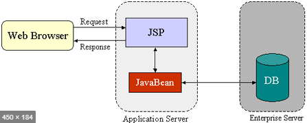
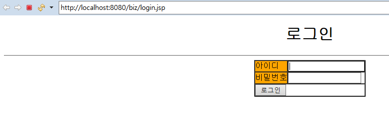

## Model 1 아키텍처로 게시판 개발

### Model 1 아키텍쳐 구조

> JSP 와 JavaBeans 만 사용하여 웹을 개발하는 것



- Model 기능의 JavaBean
  - 자바에서 Bean 은 객체를 의미한다.
  - **JavaBean** 하면 자바 객체를 의미한다 -> **데이터베이스 연동에 사용되는 자바객체**
- Model 이란
  - 데이터베이스 연동 로직을 제공하면서 DB에서 검색한 데이터가 저장되는 자바 객체
  - VO, DAO 클래스가 바로 Model 기능의 자바 객체다
- JSP 이란
  - **Controller 와 View 기능을 모두 처리한다**
    - Controller = JSP 파일에 작성된 자바 코드
      - 그 중 사용자의 요청 처리와 관련된 자바코드
  - Model 을 사용해 검색한 데이터를 사용자가 원하는 화면으로 제공하기 위해 다양한 마크업을 사용한다 
    - 대표적인 마크업 언어 : `HTML` , `CSS` ( 이 두 마크업이 View 기능 담당)
  - 결과적으로 JSP 파일에 자바코드 와 마크업 관련 코드들이 뒤섞여 있어서 역할구분이 명확하지 않고, JSP 파일에 대한 디버깅과 유지보수에 많은 어려움이 생긴다.
    - 그래서 생긴 것이 Model2 => MVC구조, Model, View, Controller 로 기능 분리


### 로그인 기능 구현

> 앞으로 작성하는 모든 JSP 파일은 src/main 폴더에 있는 webapp 폴더에 등록

#### 로그인 화면

- login.jsp

  - HTML 태그를 이용해 로그인 화면 구성

  - ```HTML
    <body>
    	<center>
    		<h1>로그인</h1>
    		<hr>
    		<form action="login_proc.jsp" method="post">
    			<table border="1" cellpadding="0" cellspacing="0">
    				<tr>
    					<td bgcolor="orange">아이디</td>
    					<td><input type="text" name="id"></td>
    				</tr>
    				<tr>
    					<td bgcolor="orange">비밀번호</td>
    					<td><input type="password" name="password"></td>
    				</tr>
    				<tr>
    					<td colspan="2 align="center"><input type="submit" value="로그인">
    					</td>
    				</tr>
    			</table>
    		</form>
    	</center>
    </body>
    ```

  - 

    - 자동으로 설정된 URL 을 보면  프로젝트 이름 대신 biz  가 컨텍스트경로로 출력된 걸 확인할 수 있다. 이 컨텍스트 경로를 변경하려면 Server환경을 변경해야 한다.
      - [Modules] > [Edit] > path 정보 수정
      - path 속성 값을 프로젝트 이름과 같게 "/BoardWeb" 으로 지정

