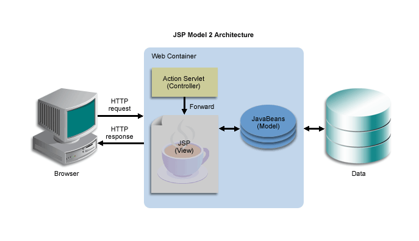
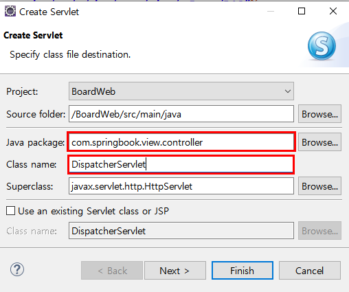
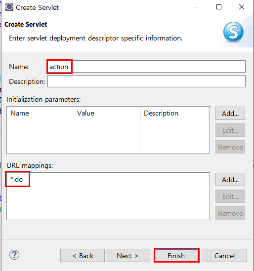
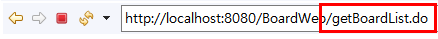
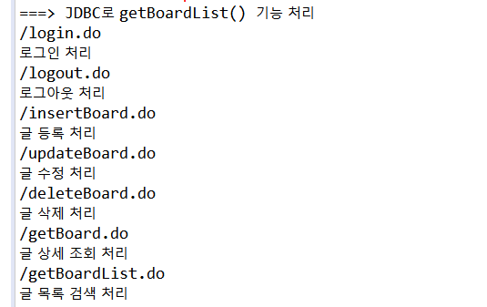
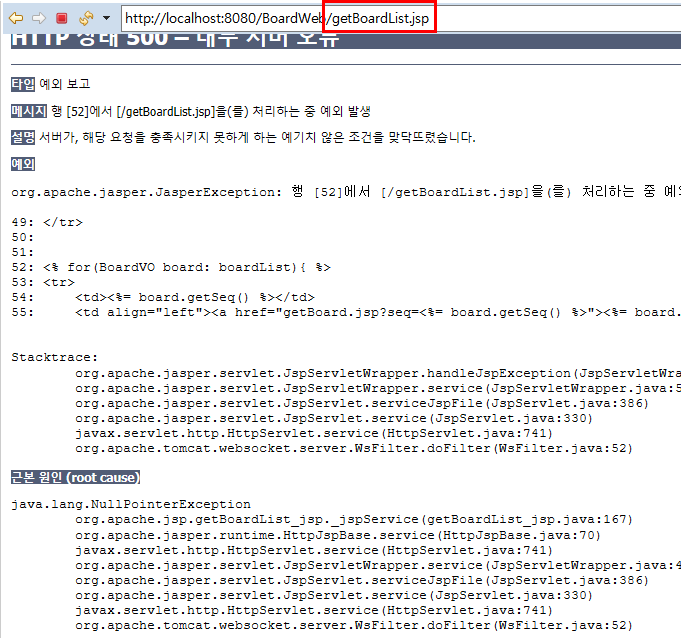

## Model 2 아키텍처로 게시판 개발

### Model2 아키텍처 구조

##### 기존의 Model 1의 한계

- 자바로직과 화면디자인이 통합되어 유지보수가 어렵다
- 이를 위해 고안된 웹 개발 모델 : Model 2 아키텍처, 즉 MVC 아키텍쳐
  - 가장 큰 특징은 Controller의 등장
  - Controller 는 서브릿 클래스를 중심으로 구현된다.
  - 
  - Model 2 
    - 기존에 JSP 가 담당했던 Controller 로직이 별도의 Controller 기능의 서블릿으로 옮겨짐
    - 결과적으로 JSP에는 View와 관련된 디자인만 남게되어 디자이너가 JSP를 관리하고
    - 자바 개발자는 Controller 와 Model 만 관리하면 된다.


### Controller 구현하기

##### 서블릿 생성 및 등록

- Controller 기능을 수행하는 서블릿 클래스 추가

  - 

    - Java package : com.springbook.view.controller
    - Class name : DispatcherServlet
    - `Next`

    

  - 

    - Name  : action
    - URL mappings : *.do
    - `Finish`

- DispatcherServlet 이란
  - DispatcherServlet 은 GET 방식 요청을 처리하는 doGet() 메소드와 POST 방식 요청을 처리하는 doPost() 메소드가 재정의 되어있다.
  - process() 메소드를 통해 클라이언트 요청을 처리하도록 하겠다.
- process() 메소드
  - 가장 먼저 클라이언트의 요청 URI 로 부터path 정보를 추출
  - 이 때 추출된 path 는 URI 문자열에서 마지막 **"/xxx.do"** 문자열이다
  - 추출된 path 문자열에 따라서 복잡한 분기 처리 로직이 실행된다.
  - 
  - 
  - 이제 기존에 작성된 JSP 파일에서 각 분기 처리 로직을 추출하여 DispatcherServlet에 추가하고 기능을 구현하면 된다.


### 로그인 기능 구현하기

- 로그인 기능을 MVC로 변환하려면  login.jsp 파일의  `<form>` 엘리먼트의 **action 속성값을 "login.do"로 수정**한다.

- login_proc.jsp 파일에 있는 모든 자바 로직을 복하새 DispatherServlet에 추가한다.


### 글 목록 검색 기능 구현하기

MVC 구조로 변경하는데 가장 중요한 기능이 바로 글 목록 검색 기능이다.

- getBoardList.jsp 파일에서 Controller로직에 해당하는 자바코드를 DispatcherServlet로 복사

  - DispatcherServlet.java

    ```java
    // 1. 사용자 입력 정보 추출(검색 기능은 나중에 구현)
    	// 2. DB연동 처리
    	BoardVO vo = new BoardVO();
    	BoardDAO boardDAO = new BoardDAO();
    	List<BoardVO> boardList = boardDAO.getBoardList(vo);
    
    	// 3. 검색 결과를 세션에 저장하고 목록 화면으로 이동한다.
    	HttpSession session = request.getSession();
    	session.setAttribute("boardList", boardList);
    	response.sendRedirect("getBoardList.jsp");
    ```

    - 위 소스는 리다이렉트되는 getBoardList.jsp 화면에서 검색 결과를 추력하기 위해 세션(HttpSession) 객체를 사용했다.
      - 세션은 브라우저당 서버 메모리에 하나씩 유지되는 객체이므로 사용자가 많을수록 많은 세션이 생성되고, 세선에 정보가 많이 저장될수록 서버에 부담이 된다
      - 따라서 검색 결과는 세션이 아닌 HttpServletRequest 객체에 저장하여 공유해야 한다.
      - HttpServletRequest 객체는 클라이언트가 서버에 요청을 전송할 때마다 매번 새롭게 생성되고 바로 삭제되는 1회성 객체이다
      - 따라서 공유할 데이터를 HttpServletRequest에 저장하면 서버에는 전혀 부담이안된다
      - 나중에 SpringMVC로 변환하면서 HttpSession 을 HttpServletRequest로 수정할 것이다.
  
 - 이제 getBoardList.jsp 파일은 글 목록을 검색하는 자바 코드 대신에 **세션에 저장된 글 목록을 꺼내서 출력하도록 수정**한다

    - getBoardList.jsp

    - ```java
      <%
      	//세션에 저장된 글 목록을 꺼낸다.
      	List<BoardVO> boardList = (List) session.getAttribute("boardList");
      %>
      ```

      - getBoardList.jsp 파일은 이제  **직접 DB연동을 처리하지 않는다**.
      - 단지 **세션에 저장된 글 목록을 꺼내 출력**하는 기능만 제공할 뿐이다.
        - 따라서 이제 getBoardList.jsp 파일을 직접 요청하거나 login.jsp파일을 실행해 로그인에 성공하면 오류화면이 출력된다.
        - 
        - getBoardList.jsp 파일에서 **세션에 저장된 글 목록**을 꺼내려면 당연히 **DispatcherServlet이 먼저 실행**되어 검색 결과를 세션에 저장해야 한다.
        - 따라서 반드시 브라우저는 "/getBoardList.do"로 요청해야 한다.
          - 다시 말해 **글 목록 화면을 출력하려면 getBoardList.jsp 파일을 직접 요청하지 않고 getBoardList.do를 요청**해야한다.

---

[게시글 목록 검색 실행 순서]

1. DispatcherServlet 이 클라이언트의 "/getBoardList.do" 요청을 받으면
2. DispatcherServlet은 BoardDAO 객체를 이용해 글 목록을 검색
3. 검색된 글 목록을 세션에 등록하고
4. getBoardList.jsp 화면을 요청하면
5. getBoardList.jsp 는 세션에 저장된 글 목록을 꺼내 목록 화면을 구성한다.
6. 마지막으로 이 응답 화면이 브라우저에 전송된다

---


### 글 상세 보기 기능 구현하기

