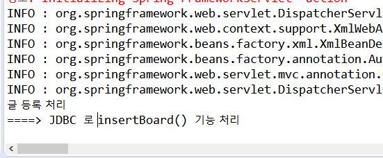
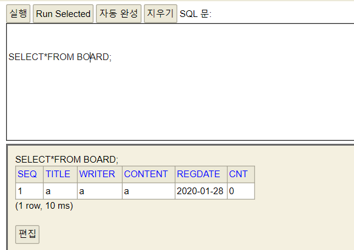

## 1. 어노테이션 기반 스프링MVC

스프링은 어노테이션 기반 설정을 제공함으로써 과도한 XML 설정으로 인한 문제를 해결한다 Spring MVC 도 스프링 설정 파일에 HandlerMapping, Controller, ViewResolver 같은 여러 클래스를 등록해야 하므로 어노테이션 설정을 최대한 활용하여 XML설정을 최소화 할 필요가 있다.

### 1. 어노테이션 기반 MVC 개발

##### 1.1 어노테이션 관련 설정

- 스프링 MVC 에서 어노테이션을 사용하려면 먼저 `<beans>` 루트 엘리먼트에 context 네임스페이스를 추가한다.
- 그리고 HandlerMapping, Controller, ViewResolver 클래스에 대한 `<bean>`등록을 모두 삭제하고 `<context:component-scan>` 엘리먼트로 대체한다.
  - Controller 클래스가 스캔 범위에 포함되도록 `<context:component-scan>` 엘리먼트의 base-package 속성에 Controller 클래스들이 있는 가장 상위 패키지 'com.springbook.view'를 등록한다.
  - getBoard.jsp 와 getBoardList.jsp 파일의 위치도 원래대로 src/main/webapp 폴더 밑으로 되돌린다.

##### 1.2 @Controller 사용하기

- 기존 : 스프링 컨테이너가 Controller 클래스를 생성하게 하기 위해 Controller 클래스들을 스프링 설정파일에 `<bean>` 등록 한다.
- 어노테이션 : 컨트롤러 클래스 모두를 일일이 `<bean>` 등록 하지 않고, 선언부 위에 @Controller 를 붙인다
  - 이는 스프링 설정파일에 `<context:component-scan>` 으로 스프링 컨테이너가 컨트롤러 객체들을 자동으로 생성하기 때문:computer:
  - @Component 를 상속한 @Controller 는 @Controller 가 붙은 클래스의 객체를 메모리에 생성하는 기능 제공
    - 단순히 객체를 생성하는것에 그치지 않고, DispatcherServlet 이 인식하는 Controller 객체로 만듬

```java
@Controller
public class InsertBoardController  {
}
```

- 만일 @Controller 를 사용하지 않는다면, 모든 컨트롤러 클래스는 반드시 스프링에서 제공하는 Controller 인터페이스를 구현해야 한다. 그리고 handleRequest() 메소드를 반드시 재정의하여 DispatcherServlet 이 모든 Controller 의 handleRequest() 메소드를 호출할 수 있도록 해야한다

  - ```java
    public class InsertBoardController implements Controller{
        @Override
    	public ModelAndView handleRequest(HttpServletRequest request, 			                                   HttpServletResponse response) {
    		System.out.println("글 등록 처리");
            return null;
        }
    }    
    ```

  - 하지만 이렇게 구현한 Controller 는 스프링 프레임워크가 지향하는 POJO 스타일의 클래스가 아니다. 

    - Controller 를 POJO 클래스로 구현하려면 우선 클래스 선언부에 있는 "implements Controller"를 제거하고 **클래스 위에 "@Controller"를 선언해야 한다**

    - ```java
      @Controller
      public class InsertBoardController  {
          public void insertBoard(HttpServletRequest request) {
      		System.out.println("글 등록 처리");
          }
      }
      ```

    - InsertBoardController 클래스 객체는 스프링 컨테이너가 자동으로 생성하고, Controller 객체로 인식한다. 그리고 InsertBoardController 가 POJO 클래스로 변경되었으므로 메소드 이름을 insertBoard, 리턴타입을 void, 매개변수를 HttpServletRequest로 변경할 수 있다.

##### 1.3 @RequestMapping 사용하기

> 앞에서 @Controller를 클래스 위에 추가함으로써 InsertBoardController 객체를 생성하고 Controller 로 인식하게 할 수 있지만, 클라이언트의 "/insertBoard.do" 요청에 대해서 insertBoard() 메소드가 실행되도록 할 수 없다.

- 기존 : HandlerMapping 을 이용하여 클라이언트의 요청을 매핑했었다.
- 스프링 : @RequestMapping 을 이용하여 HandlerMapping 설정을 대체한다.
  - @RequestMapping 을 insertBoard() 메소드 위에 설정한다.

```java
@Controller
public class InsertBoardController  {

	@RequestMapping(value="/insertBoard.do")
	public void insertBoard(HttpServletRequest request) {
		System.out.println("글 등록 처리");
```

- 여기에서 @RequestMapping 의 value 속성은 생략할 수 있으며, 특별한 경우가 아니면 대부분 생략한다.



- 안되면 [File] - [Restart] 



- DELETE BOARD 이후에 데이터가 사라진것을 확인 후 insertBoard.jsp 의 내용을 입력하고 등록하면 DB로 데이터가 들어온 것을 확인할 수 있다.

##### 1.4 클라이언트 요청 처리

대부분 Controller 는 사용자의 입력 정보를 추출하여 VO(Value Object) 객체에 저장한다. 그리고 비즈니스 컴포넌트의 메소드를 호출할 때 VO 객체를 인자로 전달한다.

사용자 입력 정보는 HttpServletRequest 의 getParameter() 메소드를 사용해 추출한다.

 - 따라서 InsertBoardController 를 위와 같이 작성해도 글 등록작업은 정상으로 처리한다.
   	- 만약 사용자가 입력하는 정보가 많거나 변경되는 상황에는 그만큼 자바코드가 필요하고, 입력정보가 변경될 떄마다 Controller 클래스가 수정되어야 한다.
    - 하지만 이를 Command 객체를 이용하면 이런 문제를 해결할 수 있다. Command 객체는 Controller 메소드 매개변수로 받은 VO 객체라고 보면 된다. 
      	- InsertBoardController 클래스의 insertBoard() 메소드를 Command 객체를 이용해 구현한다.
      	- insertBoard() 메소드의 매개변수로 사용자가 입력한 값을 매핑할 BoardVO 클래스를 선언하면, 스프링 컨테이너가 insertBoard() 메소드를 실행할 때 Command 객체를 생성하여 넘겨준다
      	- 이 때 사용자가 입력한 값들을 Command 객체에 세팅까지 해서 넘겨준다

#### [서블릿 객체의 service() 메소드가 호출되는 과정]

1. 서블릿 컨테이너는 클라이언트의 HTTP 요청이 서버에 전달되는 순간
2. HttpSErvletRequest 객체를 생성하고 프로토콜에 설정된 모든 정보를 추출하여 HttpServletRequest 객체에 저장한다.
3. 그리고 이 HttpServletRequest 객체를 service() 메소드를 호출할 때, 인자로 전달해준다


- 서블릿 객체는 서블릿 컨테이너가 생성한다
- service(), doGet(), doPost() 메소드도 서블릿 컨테이너가 호출한다.
- 이 때, service(), doGet(), doPost() 메소드가 정상으로 호출되려면 HttpServletRequest 와 HttpServletResponse 객체가 필요한데, 이 객체들도 서블릿 컨테이너가 생성해서 넘겨준다.
- 결국, **service() 메소드는 매개변수로 받은 HttpServletRequest 객체를 통해 다양한 요청 처리를 구현할 수 있다.**


- 스프링 컨테이너
  - 클라이언트가 글 등록정보를 적절하게 입력하고, 서버에 "insertBoard.do" 요청 전달
  - 스프링 컨테이너는 @Controller 가 붙은 모든 컨트롤러 객체를 생성하고, InsertBoardController 가 가지고 있는 insertBoard() 메소드를 실행한다.
  - 이 때, 매개변수에 해당하는 BoardVO 객체를 스프링 컨테이너가 생성하여 전달한다.


#### [Controller 객체의 메소드가 호출되는 과정]

> 클라이언트가 글 등록을 요청하면 스프링 컨테이너는 InsertBoardController 객체의 insertBoard() 메소드를 호출한다 이때

1. 매개변수에 해당하는 BoardVO 객체를 생성하고
2. 사용자가 입력한 파라미터(title, writer, content) 값 들을 추출하여  BoardVO 객체에 저장한다. 이 때 BoardVO 클래스의 Setter 메소드들이 호출된다
3. insertBoard() 메소드를 호출할 때, 사용자 입력값들이 설정된 BoardVO 객체가 인자로 전달된다

여기서 중요한 것은 **Form 태그 안의 파라미터 이름과 Command 객체의 Setter 메소드 이름이 반드시 일치** 해야 한다. 즉, 각 파라미터 이름에 해당하는 setTitle(), setWriter(), setContent() 메소드가 있어야 Setter 인젝션에 의해 자동으로 사용자 입력값이 저장된다.