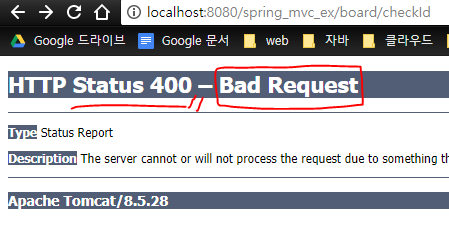
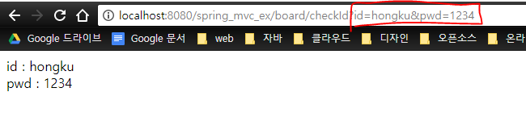

 **@ReuqestParam 을 이용한 값 받아오기**

@ReuqestParam 어노테이션은 HttpServletRequest 객체와 같은 역할을 한다.

 

HttpServletRequest에서는 getParameter() 메소드를 이용했지만,

@RequestParam을 이용해서 받아오는 방법도 있다.

 

메소드의 파라미터값으로 @RequestParam을 넣어주면된다.

코드를 통해 예를들어보면

 

HomeController.java

```
@Controller
public class HomeController {    
    @RequestMapping("/board/checkId")
    public String checkId(@RequestParam("id") String id, @RequestParam("pwd") String pwd, Model model) {
        model.addAttribute("id", id);
        model.addAttribute("pwd", pwd);
        return "/board/checkId";
    }
}

```

 

checkId 메소드의 인자값으로 @RequestParam() 어노테이션을 넣어서 값을 받아온다.

 

@RequestParam("가져올 데이터의 이름") [데이터타입] [가져온데이터를 담을 변수]

위와 같은 형식으로 사용한다.

 

그리고 Model 객체를 이용해서, 뷰로 값을 넘겨준다.

 

실행해보자





값을 안넘겨주면 400에러가 발생한다.

 





 

도메인 주소창에 값을 넘겨서 확인하자

