# Spring MVC

스프링이 유명하게 된 계기는 아마도 웹 어플리케이션 제작에 적용되면서,

웹 프레임워크로서 우수성이 인정되었기 때문이다.

심지어는 스프링 = web 이다.

라고 할 정도로 우수한 평가를 받고 있다.

**Spring MVC 기초**

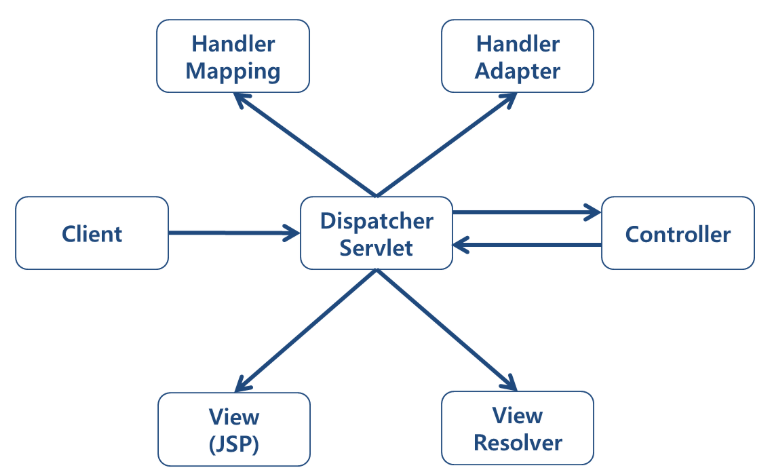

스프링의 흐름은 위와 같다.

client가 요청을 한다.

DispatcherServlet 이 요청을 받는다.

DispatcherServlet이 Controller에게 요청을 하고, 응답을 받는다.(ModelAndView를 이용)

ViewResolver와 View(JSP)를 통해 사용자에게 페이지를 띄어준다.

(보통 제작 과정에서 Controller와 View 부분을 많이 건드리게 된다.)

**스프링MVC 프로젝트 만들기**

마우스 오른쪽 버튼을 눌러

New >> Spring Legacy Project를 누른다.

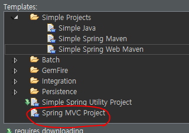

스프링 MVC 프로젝트를 누르고,

Next를 누른다.

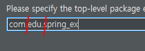

스프링MVC 프로젝트를 만들때는

2개이상의 디레토리 구조를 가지게 만들어야 한다.

예를들어, com.edu.spring_ex로 만들게 된다면,

spring_ex가 기본적인 context 명이 된다.

스프링 MVC 프로젝트를 만들었다면...

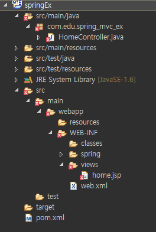

엑스표시가 떠있다.

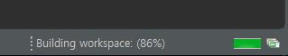

화면의 우측 하단을 보면... 무엇인가 로딩하고 있는것을 알 수 있다.

메이븐을 통해, 스프링MVC에 필요한 디펜더시를 설치중이므로 조금만 기다리면

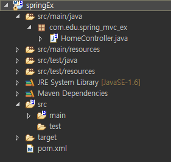

엑스표시는 사라진다.

스프링 MVC 프로젝트를 만들면, 자동으로 HomeController가 생성 된다.

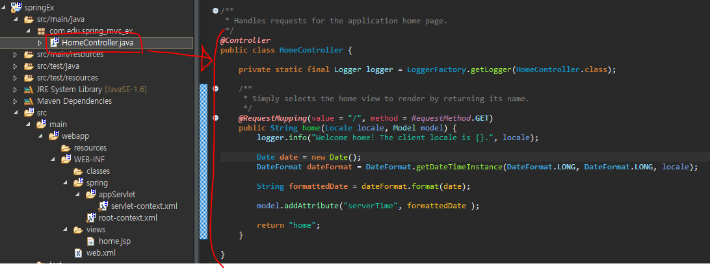

이 부분이 Controller 부분이다.

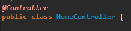

여기서, HomeController를 Controller라고 인식하는 이유는

@Controller 어노테이션 때문이다.

**디스패처(Dispatcher)가 뷰(View)를 찾는 방법**

servlet-context.xml은 보통 빈 설정 내용들을 적게 된다.

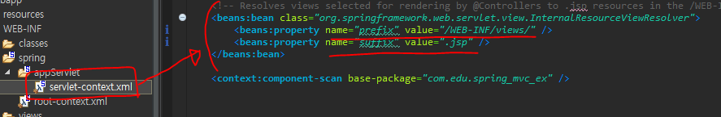

servlet-context.xml파일에 들어가보면, prefix와 suffix가 있다.

prefix와 suffix를 정해주면,

디스패쳐는 알아서 view를 찾을 수 있다.

위의 경우는

/WEB-INF/views/ + 뷰의 이름 + .jsp

즉, /WEB-INF/views/ 디렉토리 안에 있는 뷰의 파일이라는것을 알려주는 것이다.

**페이지 화면이 띄어지는 과정**

DispatcherServlet은 web.xml에서 설정을 해준다.

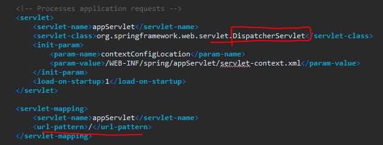

servlet mapping의 url-pattern을 보면 / 으로 url이 설정되어 있다.

그래서, / 라는 url이 들어오면 디스패쳐가 가로챈다.

그럼 디스패처는 controller를 찾아야하는데,

어느 패키지에서 찾아야 하는지 모른다.

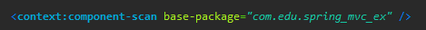

그렇기 때문에, servlet-context.xml의 <context:component-scan>에 의해서 컨트롤러의 패키지를 알려준다.

그러면 그 안의 파일들을 검색하기 시작한다.

@Controller를 만나면 그 클래스가 Controller라는 것으로 인식한다.

그리고 디스패처는

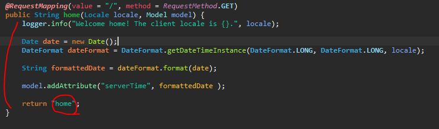

@RequestMapping을 보고, (여기서는 /로 설정되어 있다.)

그 어노테이션이 붙어있는 메소드의 로직을 수행한다.

그리고 return값으로 view의 이름을 알려준다.

여기서는 home 이라고 되어 있으므로,

ViewResolver를 통해

/WEB-INF/views/ + home + .jsp

/WEB-INF/views/home.jsp 를 찾아 화면에 띄어준다.

위와 같은 이유로

그래서 주소창에 context명을 쓰고 / 를 붙이면, (여기서는 spring_mvc_ex/)

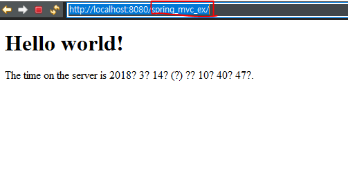

위와 같은 페이지가 화면에 띄어진다.

