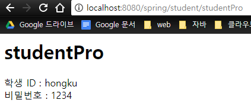
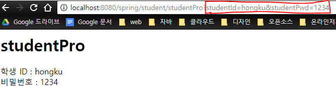

**@RequestMapping의 GET방식 요청과 POST방식 요청**

Request요청을 보낼때 GET방식으로 하는방법과

POST 방식으로 하는 방법이 있다.

 

 

**GET** **방식으로 요청**

 

뷰 페이지에서

form 태그 속성에 method 값을 GET으로 설정한 뒤,

 

**loginForm.jsp**

```
<%
    String context = request.getContextPath();
%>
    <form action="<%=context%>/student/studentPro" method="get">
        ID : <input type="text" name="studentId"><br>
        비밀번호 : <input type="password" name="studentPwd"><br>
        <input type="submit" value="Send">
    </form>

```

 

Controller의 @RequestMapping을 아래와 같이 설정한다.

@RequestMapping(value="경로", method=RequestMethod.GET)

 

**Controller.java**

```
    @RequestMapping(value="/student/studentForm", method=RequestMethod.GET)
    public String studentForm() {
        // get 방식만 가능
        return "student/studentForm";
    }
```

 

이와같이 설정을 하면, GET방식으로 왔을때만

로직을 수행한다.

 

POST 방식 또한 간단하다.

 

 

**POST 방식으로 요청**

GET을 POST로 바꿔서 사용하면 된다.

 

**loginForm.jsp**

```
<%
    String context = request.getContextPath();
%>
    <form action="<%=context%>/student/studentPro" method="post">
        ID : <input type="text" name="studentId"><br>
        비밀번호 : <input type="password" name="studentPwd"><br>
        <input type="submit" value="Send">
    </form>

```


**Controller.java**

```
    @RequestMapping(value="/student/studentPro", method=RequestMethod.POST)
    public String studentPro(StudentVO studentVO) {
        // post 방식만 가능
        System.out.println(studentVO.toString());
        return "student/studentPro";
    }

```

 

 

 

**참고 1**

만약 GET, POST 상관없이 Controller의 로직을 수행하게 하고 싶다면,

@RequestMapping의 method 부분을 지우면 된다.

 

```
    @RequestMapping(value="index")
    public String index() {
        // get, post 방식 모두 가능 
        return "index";
    }
```

 

 

 

**참고 2. GET과 POST의 차이**

**POST**

POST방식을 사용할 경우, 패킷안에 숨겨져서 전송이 된다.





 

 

**GET**

GET방식의 경우는 헤더에 붙어서 전송이 되기 때문에, 도메인주소를 보면

내가 입력한 값이 노출되는 것을 알 수 있다.





 

 

만약 내가 로그인을 했는데, 주소창에 내 ID와 비밀번호가 노출되면..

말 안해도 보안적인 문제가 크다는 것을 알 수 있다.

 

숨겨서 보낼 데이터는 POST 방식으로 해야한다.


