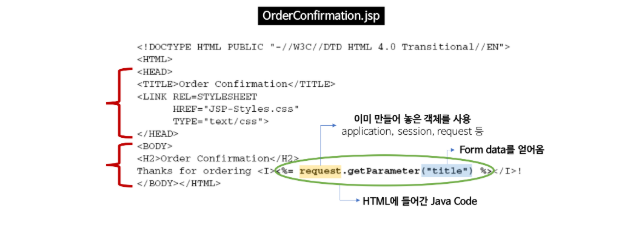

# Java Script

- 자바스크립트의 원시 타입(Primitive Data Type)은 몇가지이며, 전부 말해달라
  Number, String, Boolean, Null, Undefined, (Symbol)

- 자바스크립트의 Number Type은 다른 언어들과 차이점이 무엇인가, 왜 하나만 존재하는가

- 실행 컨텍스트(Execution Context)에 대해 설명해달라

- 자바스크립트의 호이스팅(Hoisting)은 어떻게 이루어져 있는가

- 클로저(Closure)란 무엇이며, 왜 이러한 패턴을 사용하는가

- This
  - 자바스크립트에서 This는 몇가지로 추론 될수 있는가, 아는대로 말해달라
  - Call, Apply, Bind 함수에 대해 설명해달라

- ES6
  - 크롬 정도의 브라우저를 제외하곤 ES6 스펙에 대한 지원이 완벽하지 않다. 해결방법은 무엇인가
  - Babel의 기능을 한 단어로 말해달라
  - ES6 에서 추가된 스펙에 대해 아는대로 다 말해달라(let, const, rest parameter, class, arrow function...)
  - var 와 let, const의 가장 큰 차이점은 무엇인가 (function scope와 block scope의 개념에서)
  - Class 는 무엇이고, Prototype, fucntion의 ES5 스펙만으로 Class를 구현할수 있는가

 


# JSP

## JSP (Java Server Pages) 란

Java 언어를 기반으로 하는 Server Side 스크립트 언어

- HTML 코드에 Java 코드를 넣어 동적인 웹 페이지를 생성하는 웹 어플리케이션 도구
  JSP를 통해 정적인 HTML과 동적으로 생성된 contents(HTTP 요청 파라미터)를 혼합하여 사용할 수 있다.
  즉, 사용자가 입력한 contents에 맞게 동적인 웹 페이지를 생성한다.
- 

- Servlet 기술의 확장
  - Servlet를 보완한 스크립트 방식 표준
  - Servlet의 모든 기능 + 추가적인 기능


## JSP 의 내부적인 동작 과정

JSP 문서는 백그라운드에서 Servlet 으로 자동으로 변환된다

1. JSP가 실행되면 WAS는 내부적으로 JSP 파일을 Java Servlet(.java)으로 변환한다.
2. WAS는 이 변환한 Servlet을 동작하여 필요한 기능을 수행한다.
   - Servlet의 동작 (Servlet 이란 참고)
     1) WAS는 사용자 요청에 맞는 적절한 Servlet 파일을 컴파일(.class 파일 생성)한다.
     2) .class 파일을 메모리에 올려 Servlet 객체를 만든다.
     3) 메모리에 로드될 때 Servlet 객체를 초기화하는 init() 메서드가 실행된다.
     4) WAS는 Request가 올 때마다 thread를 생성하여 처리한다.
     5) 각 thread는 Servlet의 단일 객체에 대한 service() 메서드를 실행한다.
     6) service() 메서드는 요청에 맞는 적절한 메서드(doGet, doPost 등)를 호출한다.
     수행 완료 후 생성된 데이터를 웹 페이지와 함께 클라이언트로 응답한다.

## JSP의 특징

- 스크립트 언어이기 때문에 자바 기능을 그대로 사용할 수 있다.
- Tomcat(WAS)이 이미 만들어놓은 객체(predefined values)를 사용한다.
  - Ex. request, response, session 등
 - 사용자 정의 태그(custom tags)를 사용하여, 보다 효율적으로 웹 사이트를 구성할 수 있다.
    - JSTL(JSP Standard Tag Library, JSP 표준 태그 라이브러리)사용
  - HTML 코드 안에 Java 코드가 있기 때문에 HTML 코드를 작성하기 쉽다.
  -      Servlet과 다르게 JSP는 수정된 경우 재배포할 필요 없이 Tomcat(WAS)이 알아서 처리해준다.


- 미리 정의된 객체로, WAS 가 제공하는 객체를 의미한다.
  - request : the HttpServletRequest Object
  - response : the HttpServletRespone Object
  - session : the HttpSession Object
  - out : the PrintWriter Object
  - application : the ServletContext Object


### JSP EL (Expression Language)

- EL 을 사용하면 Java Beans 구성 요소에 저장된 응용 프로그램 데이터에 쉽게 접근할 수 있다

  - 객체 접근 : ${Object Name}
  - property에 접근 : ${ObjectName.property}

- ```java
  <%-- JSP 2.0(Preferred)  --%>
  <ul>
    <li>Name: ${customer.name}</li>
    <li>Email: ${customer.email}</li>  
    <li>ID: ${customer.id}</li>
  </ul> 
  https://gmlwjd9405.github.io/2018/11/03/jsp.html
  ```

- 