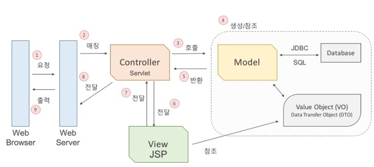

# Java

## 상속 캡슐화


## Generic

제네릭은 자바에서 안정성을 맡고 있다고 할 수 있다. 다양한 타입의 객체들을 다루는 메서드나 컬렉션 클래스에서 사용하는 것으로, **컴파일 과정에서 타입체크를 해주는 기능**이다. 객체의 타입을 컴파일 시에 체크하기 때문에 **객체의 타입 안전성을 높이고 형변환의 번거로움을 줄여준다**. 자연스럽게 코드도 더 간결해진다. 예를 들면, Collection 에 특정 객체만 추가될 수 있도록, 또는 특정한 클래스의 특징을 갖고 있는 경우에만 추가될 수 있도록 하는 것이 제네릭이다. 이로 인한 장점은 **collection 내부에서 들어온 값이 내가 원하는 값인지 별도의 로직처리를 구현할 필요가 없어진다. 또한 api 를 설계하는데 있어서 보다 명확한 의사전달이 가능**해진다.


## Overriding vs Overloading

- 오버라이딩(Overriding)
  상위 클래스에 존재하는 메소드를 하위 클래스에서 필요에 맞게 재정의하는 것을 의미한다.

- 오버로딩(Overloading) 상위 클래스의 메소드와 이름, return 값은 동일하지만, 매개변수만 다른 메소드를 만드는 것을 의미한다. 다양한 상황에서 메소드가 호출될 수 있도록 한다.


## Access Modifier

변수 또는 메소드의 접근 범위를 설정해주기 위해서 사용하는 Java 의 예약어를 의미하며 총 네 가지 종류가 존재한다.

- public
  어떤 클래스에서라도 접근이 가능하다.
- protected
  클래스가 정의되어 있는 해당 패키지 내 그리고 해당 클래스를 상속받은 외부 패키지의 클래스에서 접근이 가능하다.
- (default)
  클래스가 정의되어 있는 해당 패키지 내에서만 접근이 가능하도록 접근 범위를 제한한다.
- private
  정의된 해당 클래스에서만 접근이 가능하도록 접근 범위를 제한한다.

  

## 메소드

### 메소드

###### 필드가 물체의 상태라면, 물체의 행동에 해당하는게 메소드다. car에 이름과 번호가 있기도 하지만, car는 앞으로 전진할수도 있고 후진하는 행동도 할 수 있다.

- 메소드는 입력값이 있고, 그 입력값을 받아서 무언가 한 다음 결과를 도출해 내는 수학의 함수와 비슷한 개념이다.
- 이때 입력값을 매개변수라고 하고,결과값을 리턴값이라고 합니다.
  - 인자( Argument ) 는 어떤 함수를 호출시에 전달되는 값을 의미한다.
  - 매개 변수( Parameter ) 는 그 전달된 인자를 받아들이는 변수를 의미한다.
- 메소드란 클래스가 가지고 있는 기능이다. 클래스 안에 선언됩니다.


## 다형성

다형성(Polymorphism) - 하나의 메소드나 클래스가 있을 때 이것들이 다양한 방법으로 동작하는 것.

> Ex. 키보드의 키 : 키보드의 키를 사용하는 방법은 ' 누른다 ' 이다. 하지만 똑같은 동작 방법의 키라고 하더라도, ESC는 취소를, ENTER는 실행의 목적을 가지고 있다. 다형성이란 동일한 조작 방법으로 동작시키지만 동작 방법은 다른것을 의힘한다.

오버로딩은 가장 이해하기 쉬운 다형성의 예라고 할 수 있다.

```java
package org.opentutorials.javatutorials.polymorphism;

class O{
    public void a(int param){
        System.out.println("숫자출력");
        System.out.println(param);
    }
    public void a(String param){
        System.out.println("문자출력");
        System.out.println(param);
    }
}

public class PolymorphismOverloadingDemo {
    public static void main(String[] args) {
        O o = new O();
        o.a(1);;
        o.a("one");
    }
}
```

클래스 O의 메소드 a는 두개의 본체를 갖고 있다. 동시에 두개의 본체는 하나의 이름인 a를 공유하고 있따. 같은 이름이지만 서로 다른 동작 방법을 갖고 있기 때문에 오버로딩은 다형성의 한 예라고 볼 수 있다.


```java
package org.opentutorials.javatutorials.polymorphism;
abstract class Calculator{
    int left, right;
    public void setOprands(int left, int right){
        this.left = left;
        this.right = right;
    } 
    int _sum() {
        return this.left + this.right;
    }
    public abstract void sum();  
    public abstract void avg();
    public void run(){
        sum();
        avg();
    }
}
class CalculatorDecoPlus extends Calculator {
    public void sum(){
        System.out.println("+ sum :"+_sum());
    }
    public void avg(){
        System.out.println("+ avg :"+(this.left+this.right)/2);
    }
} 
class CalculatorDecoMinus extends Calculator {
    public void sum(){
        System.out.println("- sum :"+_sum());
    }
    public void avg(){
        System.out.println("- avg :"+(this.left+this.right)/2);
    }
} 
public class CalculatorDemo {
    public static void execute(Calculator cal){
        System.out.println("실행결과");
        cal.run();
    }
    public static void main(String[] args) { 
        Calculator c1 = new CalculatorDecoPlus();
        c1.setOprands(10, 20);
         
        Calculator c2 = new CalculatorDecoMinus();
        c2.setOprands(10, 20);
         
        execute(c1);
        execute(c2);
    }
}
```

클래스 CalculatorDemo 의 excute 의 메소드는 CalculatorDecoPlus 와 CalculatorDecoMinus 클래스의 메소드 run 을 호출하면서 그것이 실행결과라는 사실을 화면에 표시하는 기능을 가지고 있다. 이 때 메소드 execute 내부에서는 매개변수로 전달된 객체의 메소드 run 을 호출하고 있다. 

만약 메소드 execute의 매개변수 데이터타입이 Calculator 가 아니라면 어떻게 할까? 위와 같은 로직을 처리할 수 없을 것이다. 메소드 execute 입장에서는 매개변수로 전달된 값이 Calculator이거나 그 자식이라면 메소드 run을 가지고 있다는 것을 보장받을 수 있게 되는 것이다.

이 맥락에서의 다형성이란 하나의 클래스(Calculator) 가 다양한 동작방법 (CalculatorDecoPlus, CalculatorDecoMinus)를 가지고 있는데 이것을 다형성이라고 할 수 있다.


### 인터페이스와 다형성

위의 예제는 클래스의 상속 관계를 통해서 다형성을 설명하고 있는데, 다형성의 세계에서는 인터페이스도 중요한 수단이다. 인터페이스 수업에서는 언급하지 않은 것이 있다. 특정한 인터페이스를 구현하고 있는 클래스가 있을 때 이 클래스의 데이터 타입으로 인터페이스를 지정 할 수 있다. 말이 어렵다면 코드를 통해서 무슨 말인지 알아보자.

```java
package org.opentutorials.javatutorials.polymorphism;
interface I{}
class C implements I{}
public class PolymorphismDemo2 {
    public static void main(String[] args) {
        I obj = new C();
    }
}
```

위의 코드를 통해서 알 수 있는 것은 클래스 C의 데이터 타입으로 인터페이스 I가 될 수 있다는 점이다. 이것은 다중 상속이 지원되는 인터페이스의 특징과 결합해서 상속과는 다른 양상의 효과를 만들어낸다. 아래 코드를 보자.

```java
package org.opentutorials.javatutorials.polymorphism;
interface I2{
    public String A();
}
interface I3{
    public String B();
}
class D implements I2, I3{
    public String A(){
        return "A";
    }
    public String B(){
        return "B";
    }
}
public class PolymorphismDemo3 {
    public static void main(String[] args) {
        D obj = new D();
        I2 objI2 = new D();
        I3 objI3 = new D();
         
        obj.A();
        obj.B();
         
        objI2.A();
        //objI2.B();
         
        //objI3.A();
        objI3.B();
    }
}
```

주석처리된 메소드 호출은 오류가 발생하는 것들이다. objI2.b()에서 오류가 발생하는 이유는 objI2의 데이터 타입이 인터페이스 I이기 때문이다. 인터페이스 I는 메소드 A만을 정의하고 있고 I를 데이터 타입으로 하는 인스턴스는 마치 메소드 A만을 가지고 있는 것처럼 동작하기 때문이다.

이것은 인터페이스의 매우 중요한 특징 중의 하나를 보여준다. 인스턴스 objI2의 데이터 타입을 I2로 한다는 것은 인스턴스를 외부에서 제어할 수 있는 조작 장치를 인스턴스 I2의 맴버로 제한한다는 의미가 된다. 인스턴스 I2와 I3로 인해서 하나의 클래스가 다양한 형태를 띄게 되는 것이다.


### 비유

사람은 다면적인 존재다. Steve라는 사람이 있다. 이 사람은 집에서는 아버지이고 직업적으로는 프로그래머이고 또 종교단체 내에서는 신도(believer)가 될 수 있다. 하나의 사람이지만 그가 어디에 있는가? 누구와 관계하는가에 따라서 아버지이면서 프로그래머이고 또 신도인 것이다.

Rachel는 집에서는 엄마고 직장에서는 프로그래머다.

Steve와 Rachel이 같은 직장(Workspace)에 다니고 있다고 한다면 직장 입장에서는 두사람이 프로그래머라는 점이 중요할 뿐 이들의 가족관계나 종교성향에는 관심이 없다. 직장 입장에서 두사람은 프로그래머이고 프로그래머는 코딩을 통해서 무엇인가를 창조하는 사람들이다. 따라서 이들에게 업무를 요청할 때는 코딩을 요청하면 된다. 하지만 두 사람의 실력이나 성향에 따라서 코딩의 결과물은 달라질 것이다. 이러한 관계를 굳이 코드로 만들면 아래와 같다.

```java
package org.opentutorials.javatutorials.polymorphism;
 
interface father{}
interface mother{}
interface programmer{
    public void coding();
}
interface believer{}

class Steve implements father, programmer, believer{
    public void coding(){
        System.out.println("fast");
    }
}
class Rachel implements mother, programmer{
    public void coding(){
        System.out.println("elegance");
    }
}
public class Workspace{
    public static void main(String[] args){
        programmer employee1 = new Steve();
        programmer employee2 = new Rachel();
         
        employee1.coding();
        employee2.coding();
    }
}
```

위의 코드를 보면 알겠지만 Steve와 Rachel의 사용자인 직장에서는 Steve와 Rachel의 인터페이스인 programmer를 통해서 두사람과 관계하게 된다. 두 사람이 어떤 종교나 가족관계를 가졌건 인터페이스 programmer을 가지고 있다면 고용할 수 있다. 회사에서는 코딩을 할 수 있는 사람이 필요하고 어떤 사람이 programmer라는 인터페이스를 구현하고 있다면 그 사람은 반드시 coding이라는 메소드를 구현하고 있을 것이기 때문이다. 또 두 사람에게 업무를 요청 할 때는 programmer라는 인터페이스의 메소드인 coding을 통해서 요청하면 된다. 하지만 두 사람의 성향이나 능력에 따라서 그 업무를 수행한 결과는 다른데 Steve는 빠르게 코딩하고 Rachel은 우아하게 코딩하고 있다.


## 객체지향( Object Oriented Programming )

- 객체지향 프로그래밍이란 인간 중심적 프로그래밍. 즉 현실세계를 프로그래밍으로 옮겨와 프로그래밍 하는 것. 

- 현실 세계의 사물들을 객체라고 보고 그 객체로부터 개발하고자 하는 애플리케이션에 필요한 특징들을 뽑아와 프로그래밍 하는 것. (이것을 추상화라고 한다)

- OOP로 코드를 작성하면 이미 작성한 코드에 대한 재사용성이 높다.

- 자주 사용되는 로직을 라이브러리로 만들어 놓으면 계속해서 사용할 수 있으며 그 신뢰성을 확보할 수 있다. 

- 라이브러리를 각종 예외상황에 맞게 잘 만들어 놓으면 실수를 하더라도 그 에러를 컴파일 단계에서 잡아낼 수 있으므로 버그발생이 줄어든다.

- 개발자는 라이브러리가 제공하는 기능들을 사용할 수 있기 때문에 생산성이 높아지게 된다.

- 객체 단위로 코드가 나뉘기 때문에 디버깅이 쉽고 유지보수에 용이하다.

- 데이터 모델링을 할 때 객체와 매핑하는것이 수월하기 떄문에 요구사항을 보다 명확하게 파악하여 프로그래밍 할 수 있다.

  


## MVC 아키텍쳐

MVC 아키텍쳐는 모델2에 해당. M, V, C 가 나뉘어 서버를 구성한다


### MVC 의 각 컴포넌트의 역할

#### Controller(컨트롤러)

조정자. 클라이언트의 요청을 받았을 때, 그 요청에 대해 실제 업무를 수행하는 모델 컴포넌트를 호출한다. 또한 클라이언트가 보낸 데이터가 있다면 모델에 전달하기 쉽게 데이터를 가공한다. 모델이 업무를 마치면 그 결과를 뷰에게 전달한다.

#### Model (모델)

컨트롤러가 호출할 때, 요청에 맞는 역할을 수행한다. 비즈니스 로직을 구현하는 영역으로 응용프로그램에서 데이터를 처리하는 부분이다. 비즈니스로직이란 업무에 필요한 데이터처리를 수행하는 응용프로그램의 일부다. DB에 연결하고 데이터를 추출하거나 저장, 삭제, 업데이트, 변환 등의 작업을 수행한다. 상태의 변화가 있을 때 컨트롤러와 뷰에 통보해 후속 조치 명령을 받을 수 있게 한다

#### View (뷰)

컨트롤러로 부터 받은 모델의 결과값을 가지고 사용자에게 출력할 화면을 만든다. 만들어진 화면을 웹브라우저에 전송하여 웹브라우저가 출력하게 하는 것이다. 화면에 표시되는 부분으로 추출한 데이터나 일반적인 텍스트 데이터를 표시하거나 입력 폼 또는 사용자와의 상호작용을 위한 인터페이스를  표시하는 영역이다


### MVC 구동 원리




C/S ( Client -Server )구조로 요청을 하면 그에 맞는 응답을 하는 구조를 기본으로 함

1. 웹 브라우저가 웹 서버에 웹 애플리케이션 실행을 요청한다
2. 웹 서버는 들어온 요청을 처리할 수 있는 서블릿을 찾아서 요청을 전달한다.(Matching)
3. 서블릿은 모델 자바 객체의 메서드를 호출한다
4. 데이터를 가공하여 값 객체를 생성하거나, JDBC를 사용하여 데이터베이스인 인터렉션을 통해 값 객체를 생성한다
5. 업무 수행을 마친 결과값을 컨트롤러에게 반환한다
6. 컨트롤러는 모델로부터 받은 결과값을 View에게 전달한다
7. JSP는 전달받은 값을 참조하여 출력할 결과 화면을 만들고 컨트롤러에게 전달한다.
8. 뷰로부터 받은 화면을 웹 서버에게 전달한다.
9. 웹 브라우저는 웹 서버로부터 요청한 결과값을 응답받으면 그 값을 화면에 출력한다