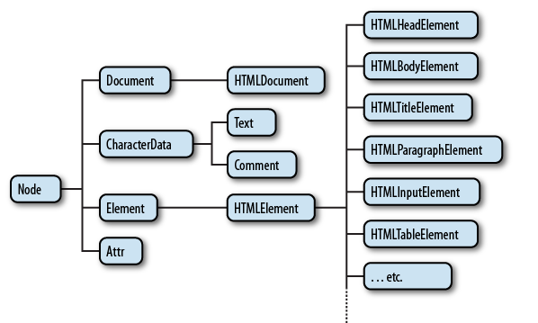

# DOM 

Document Object Model 로 웹 페이지를 자바스크립트로 제어하기 위한 객체 모델을 의미한다. window 객체의 document 프로퍼티를 통해서 사용할 수 있다. Window 객체가 창을 의미한다면 Document 객체는 윈도우에 로드된 문서를 의미한다고 할 수 있다. DOM 하위 수업에서는 문서를 제어하는 방법을 다룬다.


## 제어 대상을 찾기

문서를 자바스크립트로 제어하려면 제어의 대상에 해당되는 객체를 찾는 것이 제일 먼저 할 일이다. 문서 내에서 객체를 찾는 방법은 document 객체의 메소드를 이용한다.


### document.getElementsByTagName

문서 내에서 특정 태그에 해당되는 객체를 찾는 방법은 여러가지가 있다. getElementsByTagName은 인자로 전달된 태그명에 해당하는 객체들을 찾아서 그 리스트를 `NodeList`라는 유사 배열에 담아서 반환한다. NodeList는 배열은 아니지만 length와 배열접근연산자를 사용해서 엘리먼트를 조회할 수 있다.

```javascript
<!DOCTYPE html>
<html>
<body>
<ul>
    <li>HTML</li>
    <li>CSS</li>
    <li>JavaScript</li>
</ul>
<script>
    var lis = document.getElementsByTagName('li');
    for(var i=0; i < lis.length; i++){
        lis[i].style.color='red';   
    }
</script>
</body>
</html>
```

만일 조회의 대상을 좁히려면 아래와 같이 특정 객체를 지정하면 된다.

```javascript
<!DOCTYPE html>
<html>
<body>
<ul>
    <li>HTML</li>
    <li>CSS</li>
    <li>JavaScript</li>
</ul>
<ol>
    <li>HTML</li>
    <li>CSS</li>
    <li>JavaScript</li>
</ol>
<script>
    var ul = document.getElementsByTagName('ul')[0];
    var lis = ul.getElementsByTagName('li');
    for(var i=0; lis.length; i++){
        lis[i].style.color='red';   
    }
</script>
</body>
</html>
```


### document.getElementsByClassName

class 속성의 값을 기준으로 객체를 조회할 수도 있다.

```javascript
<!DOCTYPE html>
<html>
<body>
<ul>
    <li>HTML</li>
    <li class="active">CSS</li>
    <li class="active">JavaScript</li>
</ul>
<script>
    var lis = document.getElementsByClassName('active');
    for(var i=0; i < lis.length; i++){
        lis[i].style.color='red';   
    }
</script>
</body>
</html>
```


### document.getElementById

id 값을 기준으로 객체를 조회한다. 성능 면에서 가장 우수하다.

```javascript
<!DOCTYPE html>
<html>
<body>
<ul>
    <li>HTML</li>
    <li id="active">CSS</li>
    <li>JavaScript</li>
</ul>
<script>
    var li = document.getElementById('active');
    li.style.color='red';
</script>
</body>
</html>
```


### document.querySelector

css 선택자의 문법을 이용해서 객체를 조회할수도 있다. 단 하나

```javascript
<!DOCTYPE html>
<html>
<body>
<ul>
    <li>HTML</li>
    <li>CSS</li>
    <li>JavaScript</li>
</ul>
<ol>
    <li>HTML</li>
    <li class="active">CSS</li>
    <li>JavaScript</li>
</ol>
 
<script>
    var li = document.querySelector('li');
    li.style.color='red';
    var li = document.querySelector('.active');
    li.style.color='blue';
</script>
</body>
</html>
```


### document.querySelectorAll

querySelector 와 기본적인 동작 방법은 같지만 모든 객체를 조회한다는 점이 다르다.

```javascript
<!DOCTYPE html>
<html>
<body>
<ul>
    <li>HTML</li>
    <li>CSS</li>
    <li>JavaScript</li>
</ul>
<ol>
    <li>HTML</li>
    <li class="active">CSS</li>
    <li>JavaScript</li>
</ol>
 
<script>
    var lis = document.querySelectorAll('li');
    for(var name in lis){
        lis[name].style.color = 'blue';
    }
</script>
</body>
</html>
```


## jQuery

### 라이브러리

자주 사용하는 로직을 재사용할 수 있도록 고안된 소프트웨어를 라이브러리라고 한다.

###  jQuery

> 자바스크립트 라이브러리 - 훨씬더 적은 코드로 많은일이 가능해짐 : 가독성 좋아짐

jQuery 는 DOM 을 내부에 감추고 보다 쉽게 웹페이지를 조작할 수 있도록 돕는 도구이다. 


### jQuery의 사용

jQuery 를 사용하기 위해서는 jQuery 를 HTML 로 로드해야 한다. 

jQuery를 로드하는 방법

```javascript
<!DOCTYPE html>
<html>
<body>
<script src="//code.jquery.com/jquery-1.11.0.min.js"></script>
    <script>
    jQuery( document ).ready(function( $ ) {
      $('body').prepend('<h1>Hello world</h1>');
    });
    </script>
</body>
</html>
```

결과는 Body 태그 아래에  <h1>Hello world</h1> 코드가 만들어진다.

아래와 같이 jQuery( document ).ready(function($)){} 로 감싸는 것이 이상적이다.

```javascript
jQuery( document ).ready(function( $ ) {
  $('body').prepend('<h1>Hello world</h1>');
});
```

예제코드만 작성하기

```javascript
$('body').prepend('<h1>Hello world</h1>');
```


## 제어 대상을 찾기 (jQuery)

jQuery 를 사용하면 DOM 을 사용하는 것 보다 훨씬 효율적으로 필요한 객체를 조회할 수 있다. jQuery 는 객체를 조회할 때 CSS 선택자를 이용한다


### jQuery 의 기본 문법

jQuery 의 기본 문법은 단순하고 강력하다.

`$('li').css('color', 'red');`

$() 는 jQuery 의 함수이다. 이 함수의 인자로 CSS 선택자 (li) 를 전달하면 jQuery 객체라는것을 리턴한다. 이 객체는 선택자에 해당하는 엘리먼트를 제어하는 다양한 메소드를 가지고 있다. 위의 그림에서 css는 선택자에 해당하는 객체들의 style에 color:red 로 변경한다


### jQuery 사용 예제

```javascript
$('li').css('color', 'red')
```

li  엘리먼트로 반환되는 객체 중 css 의 color 를 red로 바꾼다

```javascript
$('.activate').css('color', 'red')
```

active 란 classname 을 갖는 엘리먼트 중 css color 를 red로 바꾼다

```javascript
$('#active').css('color', 'red').css('textDecoration', 'underline')
```

active 란 id 값을 갖는 엘리먼트의  css color 를 red로 바꾸고 css textDecoration 을 밑줄을 줘라


# HTMLElement

### HTML Element

getElement 메소드를 통해서 원하는 객체를 조회했다면 이 객체들을 대상으로 구체적인 작업을 처리해야한다. 이를 위해서는 획득한 객체가 무엇인지 알아야한다. 그래야 적절한 메소드나 프로퍼티를 사용할 수 있다.

밑의 코드는 getElement의 리턴 값을 보여준다

```javascript
<ul>
    <li>HTML</li>
    <li>CSS</li>
    <li id="active">JavaScript</li>
</ul>
<script>
    var li = document.getElementById('active');
    console.log(li.constructor.name);
    var lis = document.getElementsByTagName('li');
    console.log(lis.constructor.name);
</script>
```

실행결과

```javascript
HTMLLIElement 
HTMLCollection
```

- document.getElementById : 리턴 데이터 타입은 HTMLElement
- document.getElementByTagName: 리턴 데이터 타입은 HTMLCollection

즉 실행결과가 하나인 경우 HTMLElement, 복수인 경우 HTMLCollection을 리턴하고 있다.


조금더 살펴보자면

```javascript
<a id="anchor" href="http://opentutorials.org">opentutorials</a>
<ul>
    <li>HTML</li>
    <li>CSS</li>
    <li id="list">JavaScript</li>
</ul>
<input type="button" id="button" value="button" />
<script>
    var target = document.getElementById('list');
    console.log(target.constructor.name);
 
    var target = document.getElementById('anchor');
    console.log(target.constructor.name);
 
    var target = document.getElementById('button');
    console.log(target.constructor.name);
 
</script>
```

결과

```javascript
HTMLLIElement
HTMLAnchorElement
HTMLInputElement
```

위를통해 알수 있는 것은 엘리먼트의 종류에 따라서 리턴되는 객체가 조금씩 다르다는 것이다. 각각의 객체의 차이점을 알아보자.

##### HTML Element

```javascript
interface HTMLLIElement : HTMLElement {
           attribute DOMString       type;
           attribute long            value;
};
```

##### HTMLAnchroElement

```javascript
interface HTMLAnchorElement : HTMLElement {
           attribute DOMString       accessKey;
           attribute DOMString       charset;
           attribute DOMString       coords;
           attribute DOMString       href;
           attribute DOMString       hreflang;
           attribute DOMString       name;
           attribute DOMString       rel;
           attribute DOMString       rev;
           attribute DOMString       shape;
           attribute long            tabIndex;
           attribute DOMString       target;
           attribute DOMString       type;
  void               blur();
  void               focus();
};
```

즉 엘리먼트 객체에 따라서 프로퍼티가 다르다는 것을 알 수 있다. 하지만 모든 엘리먼트들은 HTMLElement를 상속받고 있다.

interface HTMLElement: HTMLElement{

interface HTMLAnchorElement: HTMLElement{


### DOM Tree

모든 엘리먼트들은 HTMLElement의 자식이다. 따라서 HTMLElement의 프로퍼티를 똑같이 가지고 있다. 동시에 엘리먼트 성격에 따라서 자신만의 프로퍼티를 가지고 있는데 이것은 엘리먼트의 성격에 따라서 달라진다. 

HTMLElement 는 Element 의 자식이고 Element 는 Node의 자식이다.  Node는 Object 의 자식이다. 이러한 관계를 DOM Tree 라 한다




### HTML Collection

HTML Collection 은 리턴 결과가 복수인 경우에 사용하게 되는 객체다. 유사배열로 배열과 비슷한 사용방법을 가지고 있지만 배열은 아니다.

```javascript
<!DOCTYPE html>
<html>
<body>
<ul>
    <li>HTML</li>
    <li>CSS</li>
    <li id="active">JavaScript</li>
</ul>
<script>
console.group('before');
var lis = document.getElementsByTagName('li');
for(var i = 0; i < lis.length; i++){
    console.log(lis[i]);
}
console.groupEnd();
console.group('after');
lis[1].parentNode.removeChild(lis[1]);
for(var i = 0; i < lis.length; i++){
    console.log(lis[i]);
}
console.groupEnd();
</script>
</body>
</html>
```


## jQuery객체

### jQuery  객체란?

jQuery 함수의 리턴값으로 jQuery 함수를 이용해서 선택한 엘리먼트들에 대해서 처리할 작업을 프로퍼티로 가지고 있는 객체다.


### 암시적 반복

jQuery 객체의 가장 중요한 특성은 암시적인 반복을 수행한다는 것이다. DOM 과 다르게,  jQuery 객체의 메소드를 실행하면 선택된 엘리먼트 전체에 대해서 동시에 작업이 처리된다.

암시적 반복은 값을 설정할 때만 동작한다. 값을 가져올 때는 선택된 엘리먼트 중 첫번째에 대한 값만 반환한다.

### 체이닝

chaining 이란 선택된 엘리먼트에 대해서 연속적으로 작업을 처리할 수 있는 방법이다

### 조회결과

jQuery 객체에는 조회된 엘리먼트가 담겨있다. jQuery 객체는 일종의 유사배열의 형태로 조회된 엘리먼트를 가지고 있기 때문에 배열처럼 사용해서 엘리먼트를 가져올 수 있다.

```javascript
<ul>
    <li>html</li>
    <li>css</li>
    <li>JavaScript</li>
</ul>
<script src="http://code.jquery.com/jquery-1.11.0.min.js"></script>
<script>
    console.log($('li').length);
    console.log($('li')[0]);
    var li = $('li');
    for(var i=0; i<li.length; i++){
        console.log(li[i]);
    }
</script>
```


한가지 주의할 것은 li[i]의 값은 해당 엘리먼트에 대한 jQuery객체가 아니라 DOM 객체라는 것이다. 따라서 jQuery 의기능을 이용해서 이 객체를 제어하려면 jQuery 함수를 이용해야한다.

```javascript
for(var i=0; i<li.length; i++){
    $(li[i]).css('color', 'red');
}
```


map은 jQuery 객체의 엘리먼트를 하나씩 순회한다. 이 때 첫번째 인자로 전달된 함수가 호출되는에 첫번째 인자로 엘리먼트의 인덱스, 두번째 인자로 엘리먼트 객체(DOM) 이 전달된다

```javascript
<ul>
    <li>html</li>
    <li>css</li>
    <li>JavaScript</li>
</ul>
<script src="http://code.jquery.com/jquery-1.11.0.min.js"></script>
<script>
    var li = $('li');
    li.map(function(index, elem){
        console.log(index, elem);
        $(elem).css('color', 'red');
    })
</script>
```


### jQuery 객체 API

제어할 대상을 선택한 후에는 대상에 대한 연산을 해야한다. .css와 .attr은 jQuery 객체가 가지고 있는 메소드 중의 하나인데, jQuery는 그 외에도 많은 API를 제공하고 있다. 이에 대한 내용은 jQuery API를 참고하자.