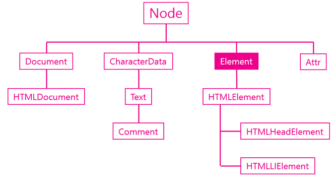

## Element 객체

### 소개

Element 객체는 엘리먼트를 추상화한 객체다. HTMLElement 객체와의 관계를 이해하기 위해서는 DOM 의 취지에 대한 이해가 선행되어야 한다. DOM 은 HTML 만을 제어하기 위한 모델이 아니다. HTML 이나 XML, SVG, XUL 과 같이 **마크업 형태의 언어를 제어**하기 위한 규격이기 때문에 Elemenet는 마크업 언어의 일반적인 규격에 대한 속성을 정의하고 있고, 각각의 구체적인 언어 (HTML, XML, SVG)를 위한 기능은 HTMLElement, SVGElement, XULElement와 같은 객체를 통해서 추가해서 사용하고 있다.



### 주요기능

#### 식별자

문서 내에서 특정한 엘리먼트를 식별하기 위한 용도로 사용되는 API

- Element classList
- Element.className
- Element.id
- Element.tagName

#### 조회

엘리먼트의 하위 엘리먼트를 조회하는 API

- Element.getElementsByClassName
- Element.getElementsByTagName
- Element.querySelector
- Element.querySelectorAll

#### 속성

엘리먼트의 속성을 알아내고 변경하는  API

- Element.getAttribute(name)
- Element.setAttribute(name, value)
- Element.hasAttribute(name)
- Element.removeAttribute(name)


## 식별자 API

엘리먼트를 제어하기 위해서는 그 엘리먼트를 조회하기 위한 식별자가 필요하다. 

HTML에서 엘리먼트의 이름과 id 그리고 class는 식별자로 사용된다. 식별자 API 는 이 식별자를 가져오고 변경하는 역할을 한다.

### Element.tagName

해당 엘리먼트의 태그 이름을 알아낸다. 

```javascript
<ul>
    <li>html</li>
    <li>css</li>
    <li id="active" class="important current">JavaScript</li>
</ul>
<script>
console.log(document.getElementById('active').tagName)
</script>
```


### Element.id

문서에서 id는 단 하나만 등장할 수 있는 식별자다.

```javascript
<ul>
    <li>html</li>
    <li>css</li>
    <li id="active">JavaScript</li>
</ul>
<script>
var active = document.getElementById('active');
console.log(active.id);
active.id = 'deactive';
console.log(active.id);
</script>
```


### Element.className

클래스는 여러개의 엘리먼트를 그룹핑 할때 사용한다.

```javascript
<ul>
    <li>html</li>
    <li>css</li>
    <li id="active">JavaScript</li>
</ul>
<script>
var active = document.getElementById('active');
// class 값을 변경할 때는 프로퍼티의 이름으로 className을 사용한다.
active.className = "important current";
console.log(active.className);
// 클래스를 추가할 때는 아래와 같이 문자열의 더한다.
active.className += " readed"
</script>
```


### Element.classList

className에 비해서 훨씬 편리한 사용성을 제공한다

```javascript
<ul>
    <li>html</li>
    <li>css</li>
    <li id="active" class="important current">JavaScript</li>
</ul>
<script>
function loop(){
    for(var i=0; i<active.classList.length; i++){
        console.log(i, active.classList[i]);
    }
}
// 클래스를 추가
</script>
<input type="button" value="DOMTokenList" onclick="console.log(active.classList);" />
<input type="button" value="조회" onclick="loop();" />
<input type="button" value="추가" onclick="active.classList.add('marked');" />
<input type="button" value="제거" onclick="active.classList.remove('important');" />
<input type="button" value="토글" onclick="active.classList.toggle('current');" />

```


###  조회 API

조회 API 는 엘리먼트를 조회하는 기능이다. 여기서는 조회 대상을 제한하는 방법에 집중. 

지금까지 document.getElementsBy* 메소드를 통해서 엘리먼트를 조회했다. document 객체는 문서 전체를 의미하는 엘리먼트이기 때문에 document의 조회 메소드는 문서 전체를 대상을로 엘리먼트를 조회한다. Element 객체 역시도 getElementsBy* 엘리먼트를 가지고 있는데 Element 객체의 조회 메소드는 해당 엘리먼트의 하위 엘리먼트를 대상으로 조회를 수행한다.

```javascript
<ul>
    <li class="marked">html</li>
    <li>css</li>
    <li id="active">JavaScript
        <ul>
            <li>JavaScript Core</li>
            <li class="marked">DOM</li>
            <li class="marked">BOM</li>
        </ul>
    </li>
</ul>
<script>
    var list = document.getElementsByClassName('marked');
    console.group('document');
    for(var i=0; i<list.length; i++){
        console.log(list[i].textContent);
    }
    console.groupEnd();
     
    console.group('active');
    var active = document.getElementById('active');     
    var list = active.getElementsByClassName('marked');
    for(var i=0; i<list.length; i++){
        console.log(list[i].textContent);
    }
    console.groupEnd();
</script>
```


## 속성 API

속성은 HTML 에서 태그명 만으로는 부족한 부가적인 정보다. 

속성을 제어하는 API

- Element.getAttribute(name)
- Element.setAttribute(name, value)
- Element.hasAttribute(name)
- Element.removeAttribute(name)

```javascript
<a id="target" href="http://opentutorials.org">opentutorials</a>
<script>
var t = document.getElementById('target');
console.log(t.getAttribute('href'));  //http://opentutorials.org
t.setAttribute('title', 'opentutorials.org'); // title 속성의 값을 설정한다.
console.log(t.hasAttribute('title')); // true, title 속성의 존재여부를 확인한다.
t.removeAttribute('title'); // title 속성을 제거한다.
console.log(t.hasAttribute('title')); // false, title 속성의 존재여부를 확인한다.
</script>
```


모든 엘리먼트의 (HTML) 속성은 (JavaScript 객체의) 속성과 프로퍼티로 제어가 가능하다.

```javascript
<p id="target">
    Hello world
</p>
<script>
    var target = document.getElementById('target');
    // attribute 방식
    target.setAttribute('class', 'important');
    // property 방식
    target.className = 'important';
</script>
```


setAttribute('class', 'important') 와 className= 'important'는 같은 결과를 만든다. 하지만 전자는 attribute 방식(속성이라 부르자) 이고 후자는 property 방식이다. property 방식은 좀 더 간편하고 속도도 빠르지만 실제 html 속성의 이름과 다른 이름을 갖는 경우가 있다. 그것은 javascript 의 이름 규칙때문이다.


class -> className

readonly -> readOnly

rowspan -> rowSpan

colspan -> colSpan

usemap -> userMap

frameborder -> frameBorder

for -> htmlFor

maxlength -> maxLength


심지어 속성과 프로퍼티는 값이 다를 수도 있다

```javascript
<a id="target" href="./demo1.html">ot</a>
<script>
//현재 웹페이지가 http://localhost/webjs/Element/attribute_api/demo3.html 일 때 
var target = document.getElementById('target');
// http://localhost/webjs/Element/attribute_api/demo1.html 
console.log('target.href', target.href);
// ./demo1.html 
console.log('target.getAttribute("href")', target.getAttribute("href"));
</script>
```


## jQuery 속성 제어 API

지금까지 본 Element 의 API 에 해당하는 기능을 jQuery 에서는 어떻게 구사할까

### 속성제어

jQuery 객체의 메소드 중 setAttribute, getAttribute 에 대응되는 메소드는 attr 이다. 또한 removeAttribute에 대응되는 메소드로는 removeAttr 이 있다.

```javascript
<a id="target" href="http://opentutorials.org">opentutorials</a>
<script src="//code.jquery.com/jquery-1.11.0.min.js"></script>
<script>
var t = $('#target');
console.log(t.attr('href')); //http://opentutorials.org
t.attr('title', 'opentutorials.org'); // title 속성의 값을 설정한다.
t.removeAttr('title'); // title 속성을 제거한다.
</script>
```


### attribute 와 property

DOM 과 마찬가지로 jQuery 도 속성(attribute)와 프로퍼티를 구분한다. 속성은 attr, 프로퍼티는 prop 메소드를 사용한다.

```javascript
<a id="t1" href="./demo.html">opentutorials</a>
<input id="t2" type="checkbox" checked="checked" />
<script src="//code.jquery.com/jquery-1.11.0.min.js"></script>
<script>
// 현재 문서의 URL이 아래와 같다고 했을 때
// http://localhost/jQuery_attribute_api/demo2.html
var t1 = $('#t1');
console.log(t1.attr('href')); // ./demo.html 
console.log(t1.prop('href')); // http://localhost/jQuery_attribute_api/demo.html 
 
var t2 = $('#t2');
console.log(t2.attr('checked')); // checked
console.log(t2.prop('checked')); // true
</script>
```

jQuery 를 이용하면 프로퍼티의 이름으로 어떤 것을 사용하건 올바른 것으로 교정해준다. 이것이 라이브러리를 사용하는 이유다

```javascript
<div id="t1">opentutorials</div>
<div id="t2">opentutorials</div>
<script src="//code.jquery.com/jquery-1.11.0.min.js"></script>
<script>
$('#t1').prop('className', 'important'); 
$('#t2').prop('class', 'current');  
</script>
```


### jQuery 조회 범위 제한

이전에 Element 객체에서 getElementsBy* 메소드를 실행하면 조회의 범위가 그 객체의 하위 엘리먼트로 제한되는 것을 알았다. jQuery 에서는 어떻게 이러한 작업을 할 수 있을까?


### selector context

가장 간편한 방법 - 조회 범위를 제한하는 것.

제한된 범위를 jQuery 에서는 selector context라고 한다

```javascript
<ul>
    <li class="marked">html</li>
    <li>css</li>
    <li id="active">JavaScript
        <ul>
            <li>JavaScript Core</li>
            <li class="marked">DOM</li>
            <li class="marked">BOM</li>
        </ul>
    </li>
</ul>
<script src="//code.jquery.com/jquery-1.11.0.min.js"></script>
<script>
    $( ".marked", "#active").css( "background-color", "red" );
</script>
```


### .find()

find는 jQuery 객체 내에서 엘리먼트를 조회하는 기능을 제공한다.

```javascript
$( "#active").find('.marked').css( "background-color", "red" );
```

find를 쓰는 이유는 체인을 끊지 않고 작업의 대상을 변경하고 싶을 때 사용한다.

```javascript
$('#active').css('color', 'blue').find('.marked').css('background-color', 'red')
```

즉, li.item-li 엘리먼트에 해당하는 모든 엘리먼트의 전경색을 파란색으로 변경한 후에 li 엘리먼트만을 조회해서 배경색을 붉은색으로 지정하고있다

> find를 너무 복잡하게 사용하면 코드를 유지보수하기 어렵게 된다.

