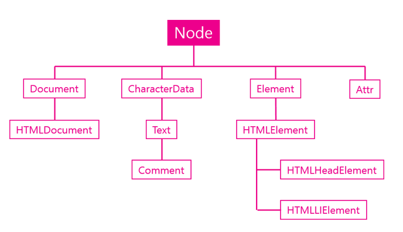
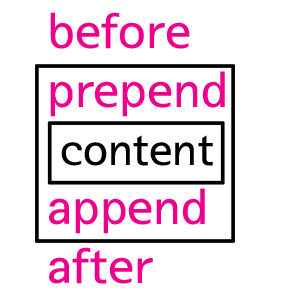

## Node객체

Node 객체는 DOM 에서 시조와 같은 역할을 한다. 다시말해 모든 DOM 객체는 Node 객체를 상속받는다. 



### 주요 기능

#### 관계

엘리먼트는 서로 부모, 자식, 혹은 형제자매 관계로 연결되어 있다. 각각의 Node 가 다른 Node 와 연결된 정보를 보여주는 API 를 통해서 문서를 프로그램밍 적으로 탐색할 수 있다.

- Node.childNodes
- Node.firstChild
- Node.lastChild
- Node.nextSibling
- Node.previousSibling
- Node.contains()
- Node.hasChildNodes()


#### 노드의 종류

Node 객체는 모든 구성요소를 대표하는 객체이기 때문에 각각의 구성요소가 어떤 카테고리에 속하는 것인지를 알려주는 식별자를 제공한다.

- Node.nodeType
- Node.nodeName


#### 값

Node 객체의 값을 제공하는 API

- Node.nodeValue
- Node.textContent


#### 자식관리

Node 객체의 자식을 추가하는 방법에 대한 API

- Node.appendChild()
- Node.removeChild()


## Node 관계 API

Node 객체는 Node 간의 관계를 담고 잇는 일련의 API 를 갖고 있다. 다음은 관계와 관련된 프로퍼티들이다

-  Node.childNodes

  자식 노드들을 유사배열에 담아서 리턴한다

- Node.firstChild

  첫번째 자식노드

- Node.lastChild

  마지막 자식 노드

- Node.nextSibling

  다음 형제 노드

- Node.previousSibling

  이전 형제 노드

  

```javascript
<body id="start">
<ul>
    <li><a href="./532">html</a></li> 
    <li><a href="./533">css</a></li>
    <li><a href="./534">JavaScript</a>
        <ul>
            <li><a href="./535">JavaScript Core</a></li>
            <li><a href="./536">DOM</a></li>
            <li><a href="./537">BOM</a></li>
        </ul>
    </li>
</ul>
<script>
var s = document.getElementById('start');
console.log(1, s.firstChild); // #text
var ul = s.firstChild.nextSibling
console.log(2, ul); // ul
console.log(3, ul.nextSibling); // #text
console.log(4, ul.nextSibling.nextSibling); // script
console.log(5, ul.childNodes); //text, li, text, li, text, li, text
console.log(6, ul.childNodes[1]); // li(html)
console.log(7, ul.parentNode); // body
</script>
</body>
```


## 노드 종류 API

노드 작업을 하게 되면 현재 선택된 노드가 어떤 타입인지를 판단해야 하는 경우가 있다. 이런 경우에 사용할 수 있는 API 가 nodeType.nodeName 이다

- Node.nodeType

  노드의 타입을 의미한다

- Node.nodeName

  노드의 이름( 태그명 을 의미한다 )


#### Node Type

노드의 종류에 따라서 정해진 상수가 존재한다. 아래는 모든 노드의 종류와 종류에 따른 값을 출력하는 코드다

```javascript
for(var name in Node){
   console.log(name, Node[name]);
}
```

#### 결과

```javascript
ELEMENT_NODE 1 
ATTRIBUTE_NODE 2 
TEXT_NODE 3 
CDATA_SECTION_NODE 4 
ENTITY_REFERENCE_NODE 5 
ENTITY_NODE 6 
PROCESSING_INSTRUCTION_NODE 7 
COMMENT_NODE 8 
DOCUMENT_NODE 9 
DOCUMENT_TYPE_NODE 10 
DOCUMENT_FRAGMENT_NODE 11 
NOTATION_NODE 12 
DOCUMENT_POSITION_DISCONNECTED 1 
DOCUMENT_POSITION_PRECEDING 2 
DOCUMENT_POSITION_FOLLOWING 4 
DOCUMENT_POSITION_CONTAINS 8 
DOCUMENT_POSITION_CONTAINED_BY 16 
DOCUMENT_POSITION_IMPLEMENTATION_SPECIFIC 32
```


#### 재귀함수

````javascript
<!DOCTYPE html>
<html>
<body id="start">
<ul>
    <li><a href="./532">html</a></li> 
    <li><a href="./533">css</a></li>
    <li><a href="./534">JavaScript</a>
        <ul>
            <li><a href="./535">JavaScript Core</a></li>
            <li><a href="./536">DOM</a></li>
            <li><a href="./537">BOM</a></li>
        </ul>
    </li>
</ul>
<script>
function traverse(target, callback){
    if(target.nodeType === 1){
        //if(target.nodeName === 'A')
        callback(target);
        var c = target.childNodes;
        for(var i=0; i<c.length; i++){
            traverse(c[i], callback);       
        }   
    }
}
traverse(document.getElementById('start'), function(elem){
    console.log(elem);
});
</script>
</body>
</html>
````


## 노드 변경 API

노드의 추가와 관련된 API

- appendChild(child)

  노드의 마지막 자식으로 주어진 엘리먼트 추가

- insertBefore(newElement, referenceElement)

  appendChild 와 동작 방법은 같으나 두번째 인자로 엘리먼트를 전달 했을 때 이것 앞에 엘리먼트가 추가된다

노드를 추가하기 위해서는 추가할 엘리먼트를 생성해야 하는데 이것은 document 객체의 기능이다. 아래 코드는 노드를 생성하는 API

- document.createElement(tagname)

  엘리먼트 노드를 추가한다

- document.createTextNode(Data)

  텍스트 노드를 추가한다.


```javascript
<ul id="target">
    <li>HTML</li>
    <li>CSS</li>
</ul>
<input type="button" onclick="callAppendChild();" value="appendChild()" />
<input type="button" onclick="callInsertBefore();" value="insertBefore()" />
<script>
    function callAppendChild(){
        var target = document.getElementById('target');
        var li = document.createElement('li');
        var text = document.createTextNode('JavaScript');
        li.appendChild(text);
        target.appendChild(li);
    }
 
    function callInsertBefore(){
        var target = document.getElementById('target');
        var li = document.createElement('li');
        var text = document.createTextNode('jQuery');
        li.appendChild(text);
        target.insertBefore(li, target.firstChild);
    }
</script>
```


  

### 노드 제거

노드 제거. 이 때 이 메소드는 삭제 대상의 부모 노드 객체의 것을 실행해야 한다는 점에 유의하자

- removeChild(child)

```javascript
<ul>
    <li>HTML</li>
    <li>CSS</li>
    <li id="target">JavaScript</li>
</ul>
<input type="button" onclick="callRemoveChild();" value="removeChild()" />
<script>
    function callRemoveChild(){
        var target = document.getElementById('target');
        target.parentNode.removeChild(target);
    }
</script>
```


### 노드 바꾸기

노드 바꾸기

- replaceChild(newChild, oldChild)

```javascript
<ul>
    <li>HTML</li>
    <li>CSS</li>
    <li id="target">JavaScript</li>
</ul>
<input type="button" onclick="callReplaceChild();" value="replaceChild()" />
<script>
    function callReplaceChild(){
        var a = document.createElement('a');
        a.setAttribute('href', 'http://opentutorials.org/module/904/6701');
        a.appendChild(document.createTextNode('Web browser JavaScript'));
 
        var target = document.getElementById('target');
        target.replaceChild(a,target.firstChild);
    }
</script>
```


## jQuery 노드 변경  API

jQuery 를 이용해서 노드를 제어하는 기능은 주로 Manipulation 카테고리에 속해있다.

### 추가

추가와 관련된 주요한 메소드는 4가지이다.



위의 API를 통해서 문서의 구조를 변경한 예

```javascript
<div class="target">
    content1
</div>
 
<div class="target">
    content2
</div>
 
<script src="//code.jquery.com/jquery-1.11.0.min.js"></script>
<script>
    $('.target').before('<div>before</div>');
    $('.target').after('<div>after</div>');
    $('.target').prepend('<div>prepend</div>');
    $('.target').append('<div>append</div>');
</script>
```

### 제거

제거와 관련된 API 는 remove 와 empty 가있다. 

remove 는 선택된 엘리먼트를 제거하는 것이고, empty 는 선택된 엘리먼트의 텍스트 노드를 제거하는것이다. 

```javascript
<div class="target" id="target1">
    target 1
</div>
 
<div class="target" id="target2">
    target 2
</div>
 
<input type="button" value="remove target 1" id="btn1" />
<input type="button" value="empty target 2" id="btn2" />
<script src="//code.jquery.com/jquery-1.11.0.min.js"></script>
<script>
    $('#btn1').click(function(){
        $('#target1').remove();
    })
    $('#btn2').click(function(){
        $('#target2').empty();
    })
</script>
```


### 바꾸기

replaceAll 과 replaceWith 는 모두 노드의 내용을 교체하는 API 이다.

replaceWith 가 제어 대상을 먼저 지정하는것에 반해 replaceAll 은 제어 대상을 인자로 전달한다.

```javascript
<div class="target" id="target1">
    target 1
</div>
 
<div class="target" id="target2">
    target 2
</div>
 
<input type="button" value="replaceAll target 1" id="btn1" />
<input type="button" value="replaceWith target 2" id="btn2" />
<script src="//code.jquery.com/jquery-1.11.0.min.js"></script>
<script>
    $('#btn1').click(function(){
        $('<div>replaceAll</div>').replaceAll('#target1');
    })
    $('#btn2').click(function(){
        $('#target2').replaceWith('<div>replaceWith</div>');
    })
</script>
```

### 복사

```javascript
<div class="target" id="target1">
    target 1
</div>
 
<div class="target" id="target2">
    target 2
</div>
 
<div id="source">source</div>
 
<input type="button" value="clone replaceAll target 1" id="btn1" />
<input type="button" value="clone replaceWith target 2" id="btn2" />
<script src="//code.jquery.com/jquery-1.11.0.min.js"></script>
<script>
    $('#btn1').click(function(){
        $('#source').clone().replaceAll('#target1');
    })
    $('#btn2').click(function(){
        $('#target2').replaceWith($('#source').clone());
    })
</script>
```

### 이동

dom manipulation API 인자로 특정 노드를 선택하면 이동의 효과가 난다.

```javascript
<div class="target" id="target1">
    target 1
</div>
 
<div id="source">source</div>
 
<input type="button" value="append source to target 1" id="btn1" />
<script src="//code.jquery.com/jquery-1.11.0.min.js"></script>
<script>
    $('#btn1').click(function(){
        $('#target1').append($('#source'));
    })
</script>
```

