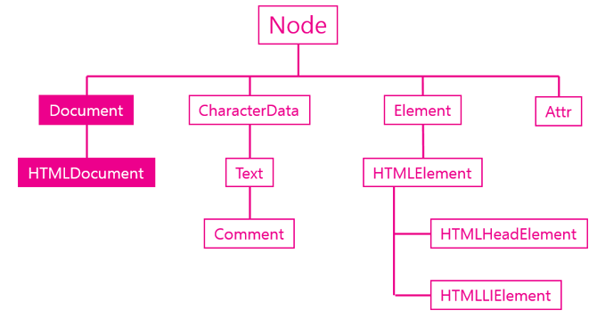
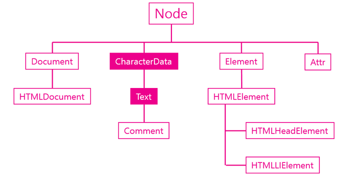

## Document 객체




### 소개

Document 객체는 DOM 의 스펙이고 이것이 웹 브라우저에서는 HTML Document 객체로 사용된다.

HTMLDocument 객체는 문서 전체를 대표하는 객체라고 할 수 있다.

```javascript
<script>
//document 객체는 window 객체의 소속이다.
console.log(window.document);
//document 객체의 자식으로는 Doctype과 html이 있다. 
console.log(window.document.childNodes[0]);
console.log(window.document.childNodes[1]);
</script>
```

### 주요 API

#### 노드 생성 API

document 객체의 주요 임무는 새로운 노드를 생성해주는 역할이다. 

- createElement()
- createTextNode()

#### 문서 정보 API

- title
- URL
- referer
- lastModified


## TEXT 객체



### 소개 

텍스트 객체는 텍스트 노드에 대한 DOM 객체로 CharacterData를 상속받는다.

아래 예제는 텍스트 노드를 찾는 예제다. 주목할 것은 DOM 에서 공백이나 줄바꿈도 텍스트 노드라는점이다.

```javascript
<p id="target1"><span>Hello world</span></p>
<p id="target2">
    <span>Hello world</span>
</p>
<script>
var t1 = document.getElementById('target1').firstChild;
var t2 = document.getElementById('target2').firstChild;
 
console.log(t1.firstChild.nodeValue);
try{
    console.log(t2.firstChild.nodeValue);   
} catch(e){
    console.log(e);
}
console.log(t2.nextSibling.firstChild.nodeValue);
 
</script>
```


### 주요 기능

#### 값

텍스트 노드의 값을 가져오는 API

- data
- nodeValue

#### 조작

- appendData()
- deleteData()
- insertData()
- subStringData()

#### 생성

- document.createTextNode()


## 값 API

텍스트 노드는 DOM 에서 실질적인 데이터가 저장되는 객체다. 따라서 **텍스트 노드**에서는 **값**과 관련된 여러 기능들이 있는데 이번 시간에는 값을 가져오는 두개의 API 를 알아본다

- nodeValue
- data

```javascript
<ul>
    <li id="target">html</li> 
    <li>css</li>
    <li>JavaScript</li>
</ul>
<script>
    var t = document.getElementById('target').firstChild;
    console.log(t.nodeValue);
    console.log(t.data);
</script>
```


## 조작 API

텍스트 노드가 상속 받은 CharacterData 객체는 문자를 제어할 수 있는 다양한 API 를 제공한다.

아래는 조작과 관련된 API 목록이다

- appendData()
- deleteData()
- insertData()
- replaceData()
- substringData()

```javascript
<!DOCTYPE html>
<html>
<head>
    <style>
    #target{
        font-size:77px;
        font-family: georgia;
        border-bottom:1px solid black;
        padding-bottom:10px;
    }
    p{
        margin:5px;
    }
    </style>
</head>
<body>
<p id="target">Cording everybody!</p>
<p> data : <input type="text" id="datasource" value="JavaScript" /></p>
<p>   start :<input type="text" id="start" value="5" /></p>
<p> end : <input type="text" id="end" value="5" /></p>
<p><input type="button" value="appendData(data)" onclick="callAppendData()" />
<input type="button" value="deleteData(start,end)" onclick="callDeleteData()" />
<input type="button" value="insertData(start,data)" onclick="callInsertData()" />
<input type="button" value="replaceData(start,end,data)" onclick="callReplaceData()" />
<input type="button" value="substringData(start,end)" onclick="callSubstringData()" /></p>
<script>
    var target = document.getElementById('target').firstChild;
    var data = document.getElementById('datasource');
    var start = document.getElementById('start');
    var end = document.getElementById('end');
    function callAppendData(){
        target.appendData(data.value);
    }
    function callDeleteData(){
        target.deleteData(start.value, end.value);
    }
    function callInsertData(){
        target.insertData(start.value, data.value); 
    }
    function callReplaceData(){
        target.replaceData(start.value, end.value, data.value);
    }
    function callSubstringData(){
        alert(target.substringData(start.value, end.value));
    }
</script>
</body>
</html>
```

