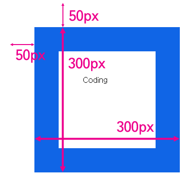
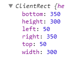
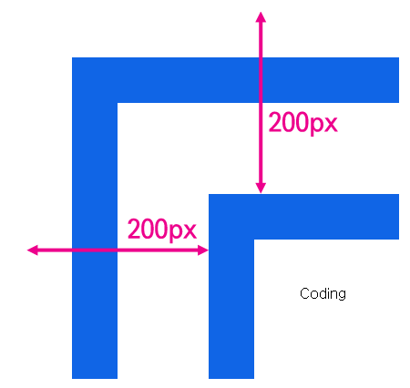

## 문서의 기하학적 특성

요소들의 위치와 크기를 알아내는 방법


### 요소의 크기와 위치

우선 엘리먼트의 크기를 알아내는 방법을 알아보자

```javascript
<style>
    body{
        padding:0;
        margin:0;
    }
    #target{
        width:100px;
        height:100px;
        border:50px solid #1065e6;
        padding:50px;
        margin:50px;
    }
</style>
<div id="target">
    Coding
</div>
<script>
var t = document.getElementById('target');
console.log(t.getBoundingClientRect());
</script>
```



즉 엘리먼트의 테두리와 body 태그 사이의 거리가 50px 이다 그리고 테두리를 포함한 엘리먼트의 크기는 300px 다. 이 값을 알아내고 싶을 때 사용하는 API 가 getBoundingClientReact 이다.

이를 콘솔에서 실행하면 다음과 같다



즉 엘리먼트의 크기와 위치를 알고 싶을 때는 getBoundingClientReact를 사용하면 된다.

만약 엘리먼트가 중첩되어 있다면?



위처럼 엘리먼트를 중첩했을 때 coding 엘리먼트와 문서와의 거리는 200px이다. getboundingClientReact를 호출하면

```javascript
<style>
    body{
        padding:0;
        margin:0;
    }
    div{
        border:50px solid #1065e6;
        padding:50px;
        margin:50px;
    }
    #target{
        width:100px;
        height:100px;
    }
</style>
<div>
    <div id="target">
        Coding
    </div>
</div>
<script>
var t = document.getElementById('target');
console.log(t.getBoundingClientRect());
console.log(t.offsetParent);
</script>
```

즉 엘리먼트의 위치를 의미하는 top, right 의 값을 통해서 기준이 그 부모가 아니라 body라는 것을 알 수 있다. 그리고 이를 명시적으로 확인할수 있는 방법은 offsetParent 속성을 호출하는것이다. 만약 부모 중 CSS position의 값이 static 인 td, th, table 엘리먼트가 있다면 이 엘리먼트가 offsetParent 가 된다.


테두리를 제외한 엘리먼트의 크기를 알고 싶다면 ClientWidth, ClientHeight 를 사용한다ㅣ

```javascript
<script>
var t = document.getElementById('target');
console.log('clientWidth:', t.clientWidth, 'clientHeight:', t.clientHeight);
</script>
```


### Viewport

요소의 위치를 생각할 때는 좀더 복잡하다.

문서가 브라우저의 크기보다 큰 경우는 스크롤이 만들어지는데 스크롤에 따라서 위치의 값이 달라지기 때문이다. 이를 이해하기 위해 viewport 를 먼저 알아야한다.

