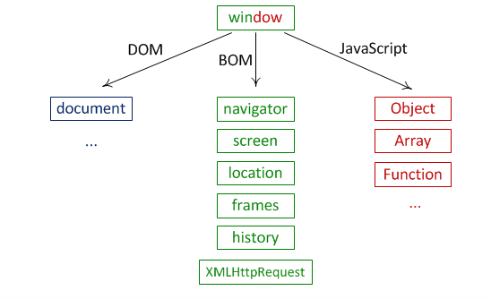
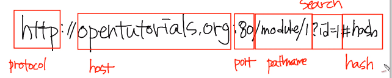

## 학습목표

순수한 자바스크립트 기술을 이용해서 웹 브라우저를 제어하는 방법 -> jQuery 


## 웹 브라우저와 JavaScript

HTML  -  정보를 표현한다

CSS - 정보를 꾸며준다

JavaScript  - HTML 을 프로그래밍 적으로 제어한다


## HTML 에서 JavaScript 로드하기

### inline

inline 방식은 태그에 직접 자바스크립트를 기술하는 방식이다. 장점은 태그에 연관된 스크립트가 분명히 드러난다는 점이다. 하지만 정보와 제어가 섞여있기 때문에 정보로서의 가치가 떨어진다.

```javascript
<!DOCTYPE html>
<html>
<body>
    <input type="button" onclick="alert('Hello world')" value="Hello world" />
</body>
</html>
```

### script

<script></script> 태그를 만들어서 여기에 자바 스크립트 코드를 삽입하는 방식이다. 장점은 html 태그와 js 코드를 분리할 수 있다는 점이다

```javascript
<!DOCTYPE html>
<html>
<body>
    <input type="button" id="hw" value="Hello world" />
    <script>
        var hw = document.getElementById('hw');
        hw.addEventListener('click', function(){
            alert('Hello world');
        })
    </script>
</body>
</html>
```

### 외부 파일로 분리

js를 별도의 파일로 분리할 수도 있다. 엄격하게 정보와 제어를 분리할 수 있다. 하나의 js파일을 여러 웹 페이지에서 로드함으로서 js의 재활용성을 높일 수있다. 캐시를 통해 속도의 향상, 전송량의 경량화를 도모할 수 있다.

```javascript
<!DOCTYPE html>
<html>
<body>
    <input type="button" id="hw" value="Hello world" />
    <script type="text/javascript" src="script2.js"></script>
</body>
</html>
```

**script2.js**

```javascript
var hw = document.getElementById('hw');
hw.addEventListener('click', function(){
    alert('Hello world');
})
```


### Script 파일의 위치

script를 head 태그에 위치시킬 수도 있다. 하지만 이는 오류가 발생한다

```javascript
<!DOCTYPE html>
<html>
<head>
    <script src="script2.js"></script>
</head>
<body>
    <input type="button" id="hw" value="Hello world" />
</body>
</html>
```

아래와 같이 script2.js 의 코드를 수정해야 한다

```javascript
window.onload = function(){
    var hw = document.getElementById('hw');
    hw.addEventListener('click', function(){
        alert('Hello world');
    })
}
```

window.onload = function(){} 함수는 웹 브라우저의 모든 구성요소에 대한 로드가 끝났을 때 브라우저에 의해서 호출되는 함수다. 이러한 것을 이벤트라고 한다.

**script 파일은 head 태그보다 페이지의 하단에 위치시키는 것이 더 좋은 방법이다**


## Object Model

웹 브라우저의 구성 요소들은 하나하나가 객체화 되어 있다. 자바스크립트로 이 객체를 제어해서 웹 브라우저를 제어할 수 있게 된다. 이 객체들은 서로 계층적인 관계로 구조화 되어 있다. BOM 과 DOM 은 이 구조를 구성하고 있는 가장 큰 틀의 분류라고 할 수 있다.



## JavaScript Core

JavaScript 언어 자체에 정의되어 있는 객체들.


## BOM

Browser Object Model. 웹 페이지의 내용을 제외한 브라우저의 각종 요소들을 객체화 시킨 것이다. 전역객체 Window 의 프로퍼티에 속한 객체들이 이에 속한다.

```javascript
<!DOCTYPE html>
<html>
<body>
    <input type="button" onclick="alert(window.location)" value="alert(window.location)" />
    <input type="button" onclick="window.open('bom.html')" value="window.open('bom.html')" />
</body>
</html>
```


## DOM

Document Object Model. 웹페이지의 내용을 제어한다. window 의 프로퍼티인 document 프로퍼터에 할당된 Document 객체가 이러한 작업을 담당한다.

Document 객체의 프로퍼티는 문서 내의 주요 엘리먼트에 접근할 수 있는 객체를 제공한다.

```javascript
<!DOCTYPE html>
<html>
<body>
    
    
    
    
    
    <script>
        // body 객체
        console.log(document.body);
        // 이미지 객체들의 리스트
        console.log(document.images);
    </script>
</body>
</html>
```

또한 특정한 엘리먼트의 객체를 획득할 수 있는 메소드도 제공한다.

```javascript
<!DOCTYPE html>
<html>
<body>
    
    
    
    
    
    <script type="text/javascript">
        // body 객체
        console.log(document.getElementsByTagName('body')[0]);
        // 이미지 객체들의 리스트
        console.log(document.getElementsByTagName('body'));
    </script>
</body>
</html>
```


## BOM

BOM(Browser Object Model) 이란 웹 브라우저의 창이나 프레임을 추상화해서 프로그래밍적으로 제어할 수 있도록 제어하는 수단이다. BOM 은 전역객체인 Window 의 프로퍼티와 메소드들을 통해서 제어할 수 있다. 따라서 BOM 에 대한 수업은 Window 객체의 프로퍼티와 메소드의 사용법을 배우는 것이라고 해도 과언이 아니다. 이제부터 Window 객체의 사용법을 알아볼 것이다.


## 전역객체 window


### window 객체

Window 객체는 모든 객체가  소속된 객체이고, 전역객체이면서, 창이나 프레임을 의미한다.


### 전역객체

Window 객체는 식별자 window 를 통해서 얻을 수 있다. 또한 생략 가능하다. Window 객체의 메소드인 alert 을 호출하는 방법은 아래와 같다.

```javascript
<!DOCTYPE html>
<html>
<script>
    alert('Hello world');
    window.alert('Hello world');
</script>
<body>
 
</body>
</html>
```

아래는 전역변수 a에 접근하는 방법이다

```javascript
<!DOCTYPE html>
<html>
<script>
    var a = 1;
    alert(a);
    alert(window.a);
</script>
<body>
 
</body>
</html>
```

객체를 만든다는 것은 결국 window 객체의 프로퍼티를 만드는 것과 같다

```javascript
<!DOCTYPE html>
<html>
<script>
    var a = {id:1};
    alert(a.id);
    alert(window.a.id);
</script>
<body>
 
</body>
</html>
```

예제를 통해서 알 수 있는 것은 전역변수와 함수가 사실은 window 객체의 프로퍼티와 메소드라는 것이다. 또한 모든 객체는 사실 window의 자식이라는 것도 알 수 있다. 이러한 특성을 ECMAScript에서는 Global 객체라고 부른다. ECMAScript의 Global 객체는 호스트 환경에 따라서 이름이 다르고 하는 역할이 조금씩 다르다. 웹브라우저 자바스크립트에서 Window 객체는 ECMAScript의 전역객체이면서 동시에 웹브라우저의 창이나 프레임을 제어하는 역할을 한다.


## 사용자와 커뮤니케이션 하기

HTML 은 form 을 통해서 사용자와 커뮤니케이션 할 수 있는 기능을 제공한다. 자바스크립트에서는 사용자와 정보를 주고받을 수 있는 간편한 수단을 제공한다


### alert

경고창이라고 부른다. 사용자에게 정보를 제공하거나 디버깅 등의 용도로 많이 사용한다.

```javascript
<!DOCTYPE html>
<html>
    <body>
        <input type="button" value="alert" onclick="alert('hello world');" />
    </body>
</html>
```


### confirm

확인을 누르면 true, 취소를 누르면 false 를 리턴한다

```javascript
<!DOCTYPE html>
<html>
    <body>
        <input type="button" value="confirm" onclick="func_confirm()" />
        <script>
            function func_confirm(){
                if(confirm('ok?')){
                    alert('ok');
                } else {
                    alert('cancel');
                }
            }
        </script>
    </body>
</html>
```


### prompt

사용자로부터 어떠한 값을 입력 받아낼 수 있음.

```javascript
<!DOCTYPE html>
<html>
    <body>
        <input type="button" value="prompt" onclick="func_prompt()" />
        <script>
            function func_prompt(){
                if(prompt('id?') === 'egoing'){
                    alert('welcome');
                } else {
                    alert('fail');
                }
            }
        </script>
    </body>
</html>
```


## Location 객체

Location 객체는 문서의 주소와 관련된 객체로 Window 객체의 프로퍼티이다. 이 객체를 이용해서 윈도우의 문서 URL 을 변경할 수 있고, 문서의 위치와 관련해서 다양한 정보를 얻을 수 있다.


### 현재 윈도우의 URL 알아내기

아래는 현재 윈도우의 문서가 위치하는 URL 을 알아내는 방법이다.

```javascript
console.log(location.toString(), location.href)
```


### URL Parcing

location 객체는 URL을 의미에 따라서 별도의 프로퍼티로 제공하고 있다.

```javascript
console.log(location.protocol, location.host, location.port, location.pathname, location.search, location.hash)
```

아래 코드는 현재 문서를 http://egoing.net으로 이동한다.

```
location.href = 'http://egoing.net';
```

아래와 같은 방법도 같은 효과를 낸다.

```
location = 'http://egoing.net';
```

아래는 현재 문서를 리로드하는 간편한 방법을 제공한다.

```
location.reload();
```

 




## Navigator 객체

브라우저의 정보를 제공하는 객체다 주로 호환성 문제들을 위해서 사용한다.


아래 명령을 통해서 이 객체의 모든 프로퍼티를 열람할 수 있다

```javascript
console.dir(navigator);
```

주요한 프로퍼티를 알아보자.

### appName

웹브라우저의 이름이다. IE는 Microsoft Internet Explorer, 파이어폭스, 크롬등은 Nescape로 표시한다.

### appVersion

브라우저의 버전을 의미한다. 필자의 현재 브라우저 정보는 아래와 같다.

```
"5.0 (Windows NT 6.3; WOW64) AppleWebKit/537.36 (KHTML, like Gecko) Chrome/34.0.1847.116 Safari/537.36"
```

### userAgent

브라우저가 서버측으로 전송하는 USER-AGENT HTTP 헤더의 내용이다. appVersion과 비슷하다.

```
"5.0 (Windows NT 6.3; WOW64) AppleWebKit/537.36 (KHTML, like Gecko) Chrome/34.0.1847.116 Safari/537.36"
```

### platform

브라우저가 동작하고 있는 운영체제에 대한 정보다.

```
"Win32"
```


### 기능테스트

Navigator 객체는 브라우저 호환성을 위해서 주로 사용하지만 모든 브라우저에 대응하는 것은 쉬운 일이 아니므로 아래와 같이 기능 테스트를 사용하는 것이 더 선호되는 방법이다. 

예를 들어 Object.keys라는 메소드는 객체의 key 값을 배열로 리턴하는 Object의 메소드다. 이 메소드는 ECMAScript5에 추가되었기 때문에 오래된 자바스크립트와는 호환되지 않는다. 아래의 코드를 통해서 호환성을 맞출 수 있다.

```javascript
// From https://developer.mozilla.org/en-US/docs/Web/JavaScript/Reference/Global_Objects/Object/keys
if (!Object.keys) {
  Object.keys = (function () {
    'use strict';
    var hasOwnProperty = Object.prototype.hasOwnProperty,
        hasDontEnumBug = !({toString: null}).propertyIsEnumerable('toString'),
        dontEnums = [
          'toString',
          'toLocaleString',
          'valueOf',
          'hasOwnProperty',
          'isPrototypeOf',
          'propertyIsEnumerable',
          'constructor'
        ],
        dontEnumsLength = dontEnums.length;
 
    return function (obj) {
      if (typeof obj !== 'object' && (typeof obj !== 'function' || obj === null)) {
        throw new TypeError('Object.keys called on non-object');
      }
 
      var result = [], prop, i;
 
      for (prop in obj) {
        if (hasOwnProperty.call(obj, prop)) {
          result.push(prop);
        }
      }
 
      if (hasDontEnumBug) {
        for (i = 0; i < dontEnumsLength; i++) {
          if (hasOwnProperty.call(obj, dontEnums[i])) {
            result.push(dontEnums[i]);
          }
        }
      }
      return result;
    };
  }());
}
```


## 창 제어

window.open  메소드는 새 창을 생성한다. 현대의 브라우저는 대부분 탭을 지원하기 때문에 window.open 은 새 창을 만든다. 

```javascript
<!DOCTYPE html>
<html>
<style>li {padding:10px; list-style: none}</style>
<body>
<ul>
    <li>
        첫번째 인자는 새 창에 로드할 문서의 URL이다. 인자를 생략하면 이름이 붙지 않은 새 창이 만들어진다.<br />
        <input type="button" onclick="open1()" value="window.open('demo2.html');" />
    </li>
    <li>
        두번째 인자는 새 창의 이름이다. _self는 스크립트가 실행되는 창을 의미한다.<br />
        <input type="button" onclick="open2()" value="window.open('demo2.html', '_self');" />
    </li>
    <li>
        _blank는 새 창을 의미한다. <br />
        <input type="button" onclick="open3()" value="window.open('demo2.html', '_blank');" />
    </li>
    <li>
        창에 이름을 붙일 수 있다. open을 재실행 했을 때 동일한 이름의 창이 있다면 그곳으로 문서가 로드된다.<br />
        <input type="button" onclick="open4()" value="window.open('demo2.html', 'ot');" />
    </li>
    <li>
        세번재 인자는 새 창의 모양과 관련된 속성이 온다.<br />
        <input type="button" onclick="open5()" value="window.open('demo2.html', '_blank', 'width=200, height=200, resizable=yes');" />
    </li>
</ul>
 
<script>
function open1(){
    window.open('demo2.html');
}
function open2(){
    window.open('demo2.html', '_self');
}
function open3(){
    window.open('demo2.html', '_blank');
}
function open4(){
    window.open('demo2.html', 'ot');
}
function open5(){
    window.open('demo2.html', '_blank', 'width=200, height=200, resizable=no');
}
</script>
</body>
</html>
```

### 새 창에 접근

아래 코드는 보안상의 이유로 실제 서버에서만 동작하고, 같은 도메인의 창에 대해서만 작동한다

```javascript
<!DOCTYPE html>
<html>
<body>
    <input type="button" value="open" onclick="winopen();" />
    <input type="text" onkeypress="winmessage(this.value)" />
    <input type="button" value="close" onclick="winclose()" />
    <script>
    function winopen(){
        win = window.open('demo2.html', 'ot', 'width=300px, height=500px');
    }
    function winmessage(msg){
        win.document.getElementById('message').innerText=msg;
    }
    function winclose(){
        win.close();
    }
    </script>
</body>
</html>
```

### 팝업 차단

```javascript
<!DOCTYPE html>
<html>
<body>
    <script>
    window.open('demo2.html');
    </script>
</body>
</html>
```

