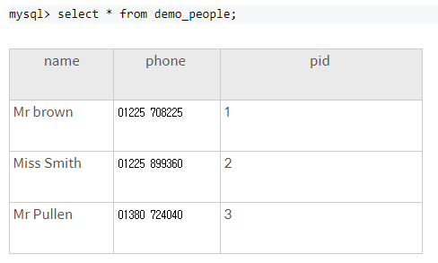
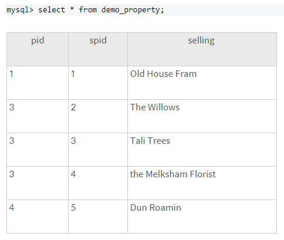

# JOIN

## JOIN 개념 정리

### 예제 테이블






### 1. 기본 JOIN (= INNER JOIN )

- 기본적으로 JOIN 은 교집합이다.

```sql
select name, phone, selling 
from demo_people 
join demo_property 
on demo_people.pid = demo_property.pid;
```

```sql
+-----------+--------------+----------------------+ 
| name | phone | selling | 
+-----------+--------------+----------------------+ 
| Mr Brown | 01225 708225 | Old House Farm |
| Mr Pullen | 01380 724040 | The Willows |
| Mr Pullen | 01380 724040 | Tall Trees | 
| Mr Pullen | 01380 724040 | The Melksham Florist | 
+-----------+--------------+----------------------+
```


### 2. LEFT JOIN

- 왼쪽 테이블을 중심으로 오른쪽의 테이블을 매치시킨다
- 왼쪽 테이블의 한 개의 레코드에 여러개의 오른쪽 테이블 레코드가 일치할 경우, 해당 왼쪽 레코드를 여러번 표시하게 된다.
- 왼쪽은 무조건 표시하고, 매치되는 레코드가 오른쪽에 없으면 NULL 을 표시한다.

```sql
select name, phone, selling 
from demo_people 
left join demo_property
on demo_people.pid = demo_property.pid;
```

```sql
+------------+--------------+----------------------+
| name | phone | selling | 
+------------+--------------+----------------------+ 
| Mr Brown | 01225 708225 | Old House Farm |
| Miss Smith | 01225 899360 | NULL | 
| Mr Pullen | 01380 724040 | The Willows |
| Mr Pullen | 01380 724040 | Tall Trees |
| Mr Pullen | 01380 724040 | The Melksham Florist | 
+------------+--------------+----------------------+
```


### 3. RIGHT JOIN

- 오른쪽 테이블을 중심으로 왼쪽 테이블을 매치시킨다

- LEFT JOIN 에서 방향을 오른쪽으로 바꾼것으로, 역시 해당 레코드가 여러번 표시되거나, NULL 이 표시된다.

```sql
select name, phone, selling
from demo_people
right join demo_property
on demo_people.pid = demo_property.pid;
```

```sql
+-----------+--------------+----------------------+
| name      | phone        | selling              |
+-----------+--------------+----------------------+
| Mr Brown  | 01225 708225 | Old House Farm       |
| Mr Pullen | 01380 724040 | The Willows          |
| Mr Pullen | 01380 724040 | Tall Trees           |
| Mr Pullen | 01380 724040 | The Melksham Florist |
| NULL      | NULL         | Dun Roamin           |
+-----------+--------------+----------------------+
```


### 4. OUTER JOIN 

>  조건에 부합하지 않는 행 까지도 포함시켜 결합하는 것

- 기본적으로 LEFT, RIGHT 또는 FULL 이 OUTER JOIN 이다
- FULL JOIN 은 사용할 일이 없으며, ODBC에 따라 지원하지 않는 경우도 있다


## JOIN

### 없어진 기록 찾기

- 천재 지변으로 인해 입양 간 데이터는 있으나, 보호소에 들어온 기록은 없는 동물의 ID와 이름을 ID 순으로 조회하는 SQL문 작성

```sql
SELECT A.ANIMAL_ID, A.NAME
FROM ANIMAL_OUTS AS A
LEFT JOIN ANIMAL_INS AS B
ON A.ANIMAL_ID = B.ANIMAL_ID
WHERE B.ANIMAL_ID IS NULL
ORDER BY A.ANIMAL_ID ASC
```


### 있었는데요 없었습니다

- 관리자의 실수로 일부 동물의 입양일이 잘못 입력 되었다.
- 보호 시작일보다 입양일이 더 빠른 동물의 아이디와 이름을 조회하는 SQL문 작성
- 보호 시작일이 더 빠른 순으로 조회하자

```sql
SELECT A.ANIMAL_ID, A.NAME
FROM ANIMAL_INS AS A
INNER JOIN ANIMAL_OUTS AS B
ON A.ANIMAL_ID = B.ANIMAL_ID
WHERE A.DATETIME >B.DATETIME
ORDER BY A.DATETIME 
```


### 오랜 기간 보호한 동물(1)

- 아직 입양을 못 간 동물 중, 가장 오래 보호소에 있었던 동물 3마리의 이름과 보호 시작일을 조회하는 SQL문 작성
- 보호 시작일 순으로 조회하자

> 아직 입양을 못간 동물?
>
> 보호시작일은 있으나 입양일이 없는 동물 !

```sql
SELECT A.NAME, A.DATETIME
FROM ANIMAL_INS AS A
LEFT JOIN ANIMAL_OUTS AS B
ON A.ANIMAL_ID = B.ANIMAL_ID
WHERE B.ANIMAL_ID IS NULL
ORDER BY A.DATETIME
LIMIT 3
```


### 보호소에서 중성화 한 동물

- 보호소에 들어올 당시에는 중성화 되지 않았지만, 보호소를 나갈 당시에는 중성화된 동물의 아이디와 생물 종, 이름을 조회하는 아이디 순으로 조회하는 SQL 문 작성

```sql
SELECT A.ANIMAL_ID, A.ANIMAL_TYPE, A.NAME
FROM ANIMAL_INS A
JOIN ANIMAL_OUTS B
ON A.ANIMAL_ID = B.ANIMAL_ID
WHERE A.SEX_UPON_INTAKE != B.SEX_UPON_OUTCOME
ORDER BY A.ANIMAL_ID
```

#### 다른 풀이

```sql
SELECT ANIMAL_OUTS.ANIMAL_ID, ANIMAL_OUTS.ANIMAL_TYPE, ANIMAL_OUTS.NAME 
FROM ANIMAL_OUTS 
LEFT JOIN ANIMAL_INS 
ON ANIMAL_OUTS.ANIMAL_ID=ANIMAL_INS.ANIMAL_ID 
WHERE ANIMAL_INS.SEX_UPON_INTAKE LIKE 'Intact%' AND (ANIMAL_OUTS.SEX_UPON_OUTCOME LIKE 'Spayed%' OR ANIMAL_OUTS.SEX_UPON_OUTCOME LIKE 'Neutered%')
```

#### 해설

- `ANIMAL_IN`에서 `SEX_UPON_INTAKE` 가 `INTACT` 즉 중성화 되지 않은 애들을 찾는다

  - WHERE ANIMAL_INS.SEX_UPON_INTAKE LIKE 'Intact%'

- 그다음 `ANIMAL_OUT` 에서 중성화 된 애들을 찾는다

  중성화된 애들은 `Sprayed` 혹은 `Neutered`  로 시작한다

  - AND (ANIMAL_OUTS>SEX_UPON_OUTCOME LIKE 'Sprayed%' OR ANIMAL_OUTS.SEX_UPON_OUTCOME LIKE 'Neutered%' )

